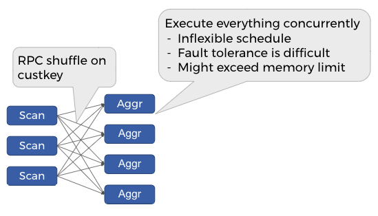
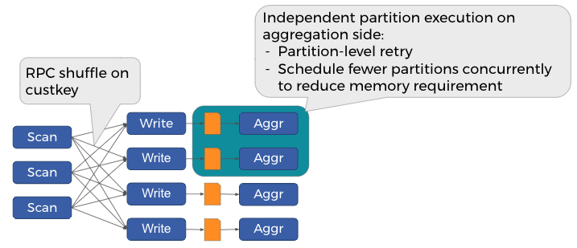

========================
Exchange Materialization
========================

Presto allows exchange materialization to support memory intensive queries.
This mechanism brings MapReduce-style execution to Presto's MPP architecture runtime,
and can be applied together with :doc:`/admin/spill`.

Introduction
------------

As with other MPP databases, Presto leverages RPC shuffle to achieve efficient and
low-latency query execution for join and aggregation. However, RPC shuffle
also requires all the producers and consumers to be executed concurrently until the
query is finished.

To illustrates this, consider the aggregation query:

.. code-block:: sql

    SELECT custkey, SUM(totalprice)
    FROM orders
    GROUP BY custkey

The following figure demonstrates how this query executes in Presto classic mode:

With exchange materialization, the intermediate shuffle data is written to disk (currently,
it is always a temporary Hive bucketed table). This opens the opportunity for flexible scheduling policies
on the aggregation side, as only a subset of aggregation data needs to be held in memory at the
same time -- this execution strategy is called "grouped execution" in Presto.

Using Exchange Materialization
------------------------------

Exchange materialization can be enabled on per-query basis by setting the following 3 session properties:
``exchange_materialization_strategy``, ``partitioning_provider_catalog`` and ``hash_partition_count``:

.. code-block:: sql

    SET SESSION exchange_materialization_strategy='ALL';

    -- Set partitioning_provider_catalog to the Hive connector catalog
    SET SESSION partitioning_provider_catalog='hive';

    -- We recommend setting hash_partition_count to be at least 5X-10X about the cluster size
    -- when exchange materialization is enabled.
    SET SESSION hash_partition_count = 4096;

To make it easy for user to use exchange materialization, the admin can leverage :doc:`/admin/session-property-managers`
to set the session properties automatically based on client tags. The example in :doc:`/admin/session-property-managers`
demonstrates how to automatically enable exchange materialization for queries with ``high_mem_etl`` tag.

