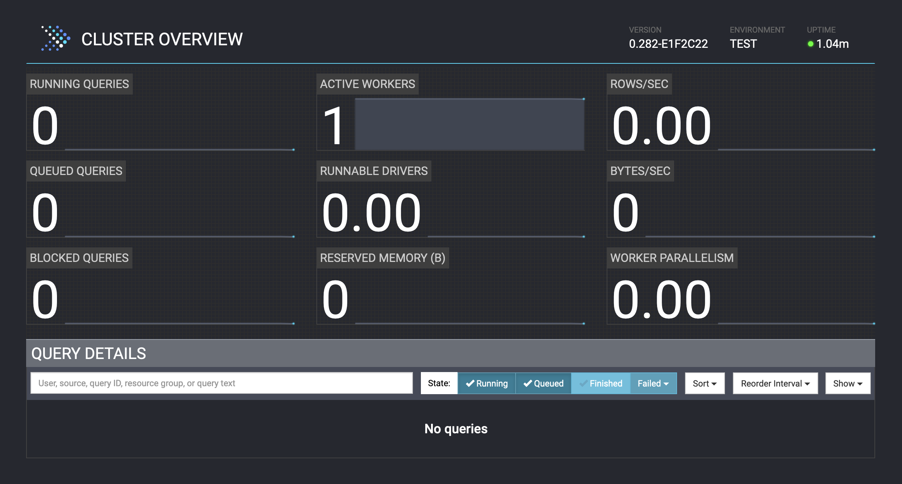

==============
Presto Console
==============

.. contents::
    :local:
    :backlinks: none
    :depth: 1

Overview
========

The Presto Console is a web-based UI that is included as part of a Presto server 
installation. To install Presto, see 
`Installing Presto <../installation/deployment.html#installing-presto>`_.
For information about developing the Presto Console, see :doc:`/develop/presto-console`.

Configuration
=============

The default port is 8080. To configure the Presto service to use a 
different port, edit the Presto coordinator node's ``config.properties`` 
file and change the configuration property ``http-server.http.port`` to 
use a different port number. For more information, see 
`Config Properties <../installation/deployment.html#config-properties>`_.

Open the Presto Console
=======================

After starting Presto, you can access the web UI at the default port 
``8080`` using the following link in a browser:

.. code-block:: none

    http://localhost:8080

Query Viewer
=======================

Query Viewer displays a query's details on the Presto Console, including
overview, query plans, stage performance, and splits.
To access the Query Viewer using a web browser, add the path ``/ui/dev/index.html``
to your server IP and port number. For example:

.. code-block:: none

    http://localhost:8080/ui/dev/index.html

Use the ``JSON`` tab on the ``Query Details`` page to export and save a query in JSON format.

*Note:* When a Presto server restarts, all the query information is reset.

With the JSON files, you can use the Query Viewer to view the query details.

1. Access the Query Viewer page. For example: ``http://localhost:8080/ui/dev/index.html``
2. Select the ``Browse`` button and select the JSON file you want to examine.
   The query information is displayed.
3. Select the ``Browse`` button to view other JSON files if needed.