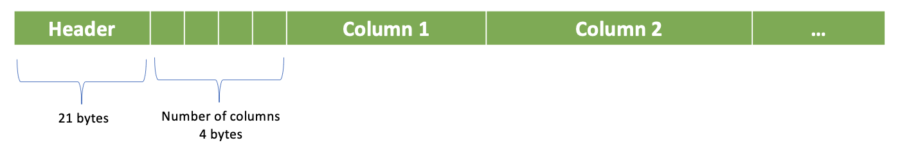
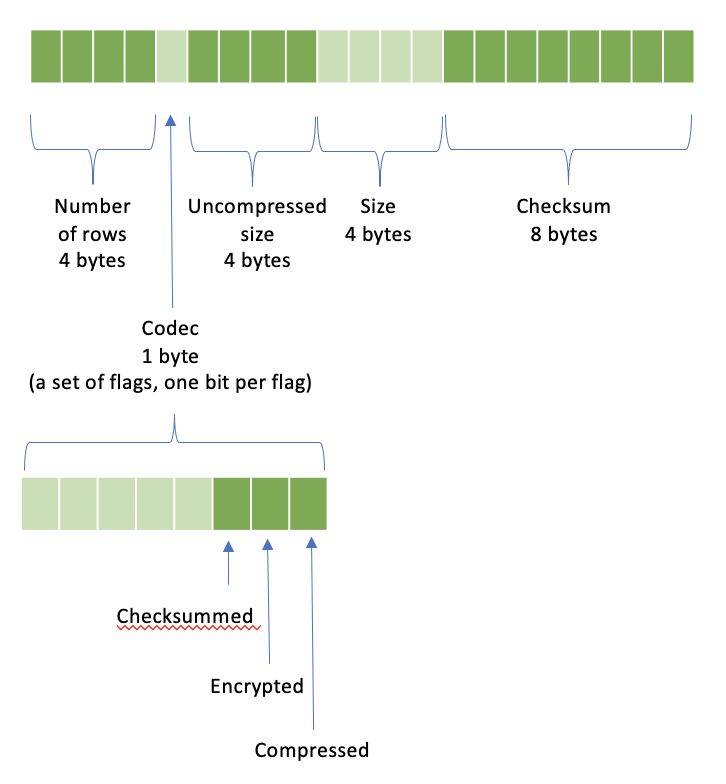
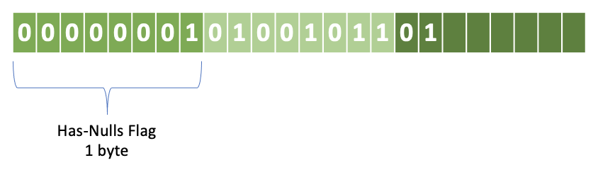
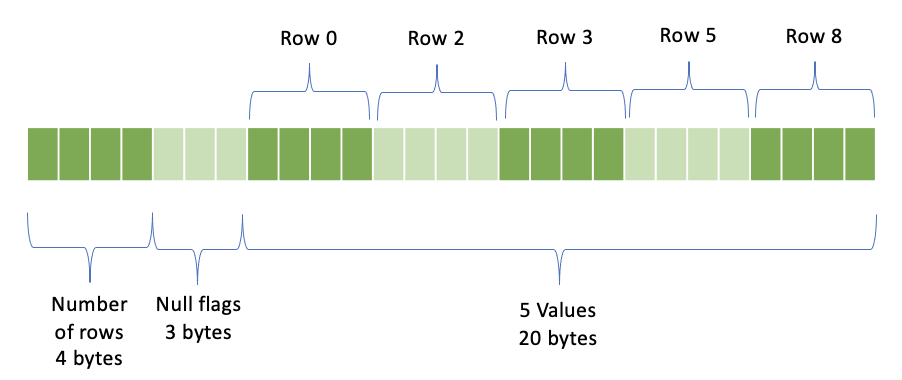
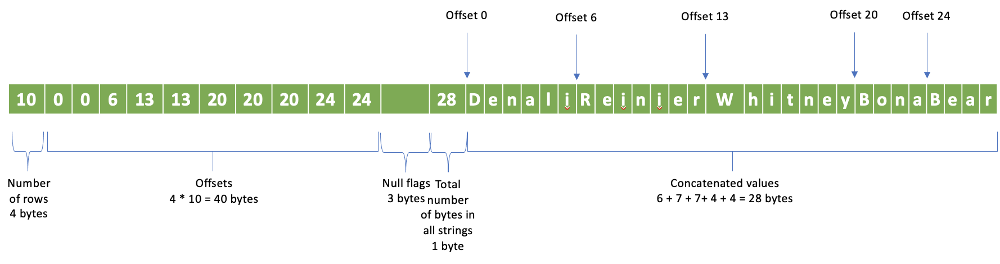
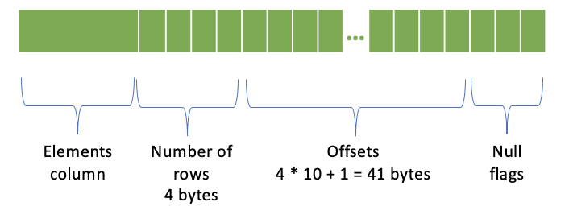
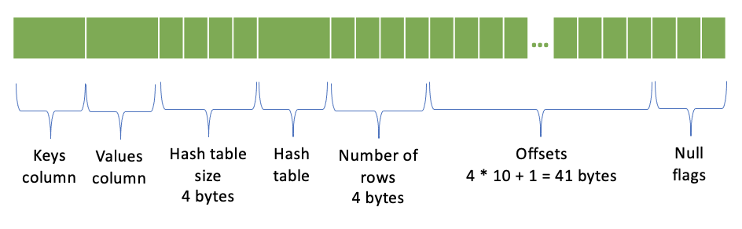
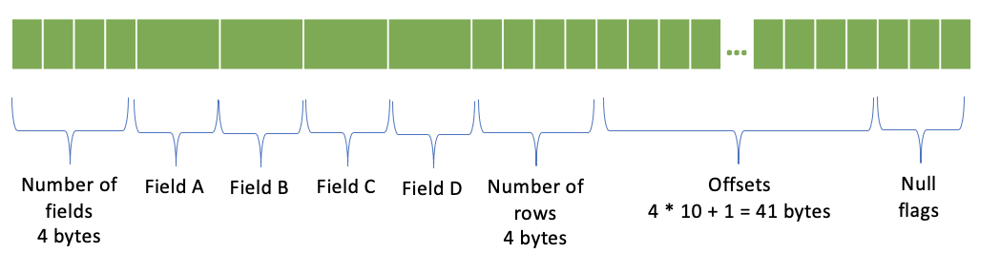

=================================
SerializedPage Wire Format
=================================

Presto uses SerializedPage binary columnar format for exchanging data between
stages.

The data can be compressed, encrypted and include a checksum. The layout is a
header followed by a number of columns, followed by individual columns.

Header
------

The header includes:

=======================   =======
Field                     Size
=======================   =======
Number of rows            4 bytes
Codec                     1 byte
Uncompressed size         4 bytes
Size                      4 bytes
Checksum                  8 bytes
=======================   =======

Codec is a set of flags, one bit per flag.
* 1st bit set if data is compressed
* 2nd bit set if data is encrypted
* 3rd bit set if checksum is included

Size is the size of the payload after the header. If data is not compressed,
size and uncompressed size are the same. If data is compressed, size is the
size of the compressed data and uncompressed size is the size of the data
before compression.

Checksum is an CRC32 computed over the following bytes in the specified order:
* Data after the header
* Codec (1 byte)
* Number of rows (4 bytes)
* Uncompressed size (4 bytes)
Checksum must be zero if codec doesn't have Checksummed bit set.

Note: Number of columns is not part of the header. It is stored in 4 bytes
directly after the header.

Columns
-------

Each column starts with a header. The data follows.

Column Header
-------------

The column header specifies the encoding of the column.

* Length of the encoding name - 4 bytes
* Name of the encoding

The supported encodings and mappings for Presto types are:

===============     ===========
Encoding Name       Presto Types
===============     ===========
BYTE_ARRAY          BOOLEAN, TINYINT, UNKNOWN
SHORT_ARRAY         SMALLINT
INT_ARRAY           INTEGER, REAL
LONG_ARRAY          BIGINT, DOUBLE, TIMESTAMP
INT128_ARRAY        Not used
VARIABLE_WIDTH      VARCHAR, VARBINARY
ARRAY               ARRAY
MAP                 MAP
MAP_ELEMENT         n/a
ROW                 ROW
DICTIONARY          n/a
RLE                 n/a
===============     ===========

See presto-common/src/main/java/com/facebook/presto/common/block/BlockEncodingManager.java

For example, the header for an INTEGER column describes INT_ARRAY encoding.
The length of the encoding name is 9, hence, the first 4 bytes will be 0 0 0 9.
The following 9 bytes store the INT_ARRAY string.

Null Flags
----------
All columns include the 1-byte has-nulls flag. 0 means no nulls. 1 means may have nulls.
If has-nulls byte is 1, individual null flags are specified in the following bytes using
1 bit per flag. 0 means the value is not null. 1 means the value is null.

* Has-nulls flag - 1 byte
* [optional] Null flags - number of rows / 8 bytes; 1 bit per flag; the bits are stored in bytes in reverse order; the first flag in each byte is the high bit.

Let’s say we have 10 rows with nulls in zero-based rows 1, 4, 6, 7, 9. The null flags
will be represented with 3 bytes. First byte stores the has-null flag: 1. Second byte
stores null flags for the first 8 rows. Third byte stores null flags for the last 2 rows.

XXX_ARRAY Encodings
-------------------

BYTE_ARRAY, INT_ARRAY, SHORT_ARRAY, LONG_ARRAY and INT128_ARRAY encodings differ
only by the number of bytes used per value.

The data layout is:

* Number of rows - 4 bytes
* Null flags
* Values - (number of rows - number of nulls) * <number of bytes per value> bytes; only rows with non-null values are represented

The number of bytes per value is:

=============   =========================
Encoding Name   Number of bytes per value
=============   =========================
BYTE_ARRAY      1
SHORT_ARRAY     2
INT_ARRAY       4
LONG_ARRAY      8
INT128_ARRAY    16
=============   =========================

Let’s take the example from the Null Flags section and say that we have an
integer column with 10 rows with nulls in zero-based rows 1, 4, 6, 7, 9.
We’ll have 4 bytes storing the number of rows: 10, followed by 3 bytes of
null flags, followed by 20 bytes representing 5 non-null integer values for
rows 0, 2, 3, 5, 8..

VARIABLE_WIDTH Encoding
-----------------------

* Number of rows - 4 bytes
* Offsets - number of rows * 4 bytes; 4 bytes per offset
* Null flags
* Total number of bytes in all values - 4 bytes
* Concatenated values

Let’s again take the example from the Null Flags section and say that we
have a string column with 10 rows with nulls in zero-based rows 1, 4, 6, 7, 9.
The non-null rows will have values: 0 - Denali, 2 - Reinier, 3 - Whitney,
5 - Bona, 8 - Bear. We’ll have 4 bytes storing the number of rows: 10, followed
by 40 bytes of offsets, followed by 3 bytes of null flags, followed by 1 bytes
storing total size of all strings: 28, followed by the concatenated string values.
Notice that we have offsets for all rows, not just the non-null rows.

ARRAY Encoding
--------------

* Elements column
* Number of rows - 4 bytes
* Offsets - (number of rows + 1) * 4 bytes; 4 bytes per offset
* Null flags

An array column with 10 rows is represented like this:

MAP Encoding
------------

* Keys column
* Values column
* Hash table size - 4 bytes
* [optional] Hash table
* Number of rows - 4 bytes
* Offsets - (number of rows + 1) * 4 bytes; 4 bytes per offset
* Null flags

A map column with 10 rows is represented like this:

ROW Encoding
------------

* Number of fields - 4 bytes
* One column per field
* Number of rows - 4 bytes
* Offsets - (number of rows + 1) * 4 bytes; 4 bytes per offset
* Null flags

Nested columns are serialized only for non-null rows. In the presence of
null rows, the row numbers of the nested columns don’t match the top-level
row numbers. Offsets are specifying the row numbers of the nested columns.

Let’s again take the example from the Null Flags section and say that we
have a column of type ROW(a, b, c, d) with 10 rows with nulls in zero-based
rows 1, 4, 6, 7, 9. Nested columns will have only 5 rows and offsets will
be: 0, 0, 1, 2, 0, 3, 0, 0, 4, 0. Offsets for null rows are zero.

Note: Offsets are redundant information as they can be reconstructed
from the null flags.

Additional Usage
----------------

SerializedPage format is also used to specify constant values in the plan
fragment sent from the coordinator to the workers. In this case, the binary
representation is converted to an ASCII string using base64 encoding.

For example, the plan for the SELECT array[1, 23, 456] query includes a Project
node with array[1, 23, 456] value represented as base64 encoded binary of the
SerializedPage format.

.. code-block:: text

    - Project[projectLocality = LOCAL] => [expr:array(integer)]
            Estimates: {rows: 1 (51B), cpu: 51.00, memory: 0.00, network: 0.00}
            expr := [Block: position count: 3; size: 92 bytes]

Also, this format is used to store intermediate data when session property
exchange_materialization_strategy is ALL and temporary_table_storage_format
is PAGEFILE.