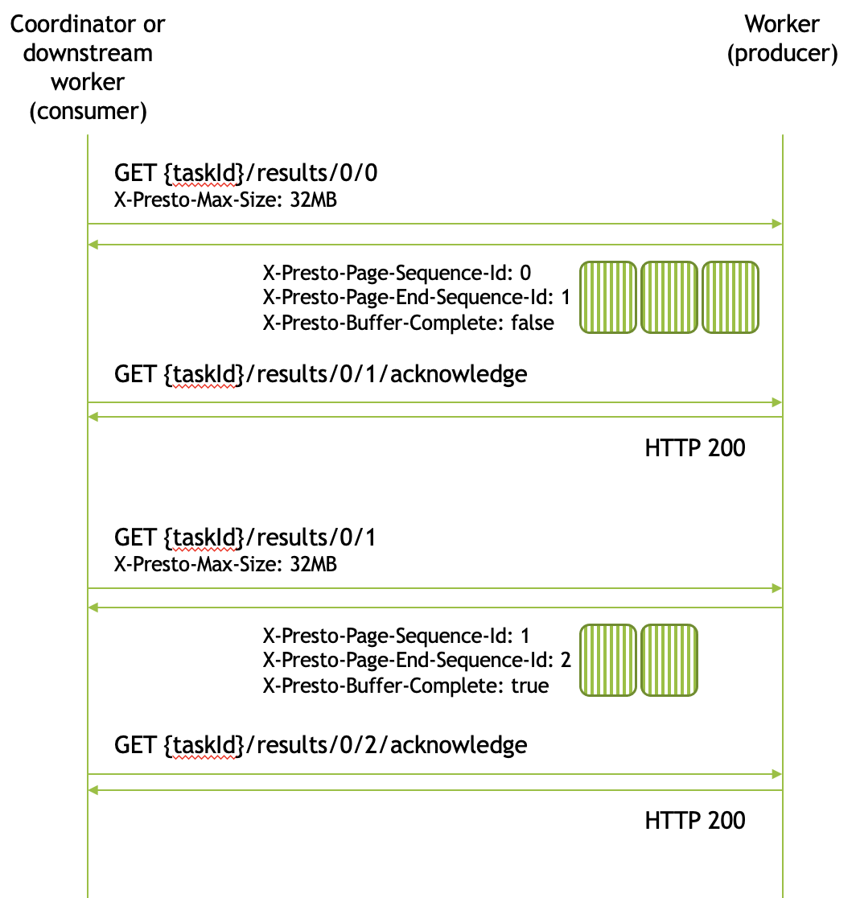
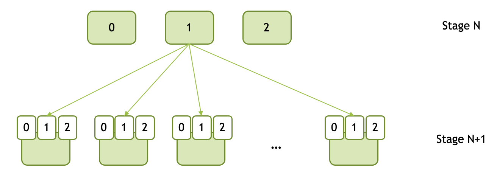

======================
Presto Worker REST API
======================

Presto's coordinator communicates with Presto workers to execute query fragments
and fetch query results. Presto workers communicate with each other to exchange
intermediate results. This chapter documents the REST API used in these
communications.

Task resource is used to start execution of a query fragment, track status, and
fetch results.

Control Plane
-------------

The following HTTP methods are used by the coordinator to start execution of a
query fragment and track execution status.

* A ``POST`` to ``/v1/task/{taskId}`` starts execution of the query fragment
  specified in the ``POST`` body. The request optionally includes a set of
  initial splits to process. The request also specifies how to partition results,
  e.g. hash partition using specified output columns into specified number of
  output buffers or combine all results into a single output buffer or broadcast
  combined results into multiple output buffers.
* A subsequent ``POST`` to ``/v1/task/{taskId}`` may provide additional splits
  for processing and eventually specify that no more splits will be coming.
* A ``GET`` on ``/v1/task/{taskId}/status`` returns a ``TaskStatus`` JSON document
  describing the current execution status.
* A ``GET`` on ``/v1/task/{taskId}`` returns a ``TaskInfo`` JSON document containing
  extended information about the execution status.
* A ``DELETE`` on ``/v1/task/{taskId}`` deletes a finished task or cancels a task
  in-progress.
* A ``GET`` on ``/v1/task`` returns JSON document containing the list of
  ``TaskInfo`` for all tasks.

A status request from the coordinator includes two HTTP headers:
``X-Presto-Current-State`` and ``X-Presto-Max-Wait``.
``X-Presto-Current-State`` specifies the task state known to the coordinator. If
the task state on the worker is different, the worker will reply immediately.
IF the task state on the worker is the same as on coordinator, the worker will
wait for the task state to change before replying. ``X-Presto-Max-Wait`` HTTP
header specifies the maximum wait time. The worker will reply after that much
time even if the task state stays the same.

The design ensures that coordinator receives task state changes in a timely
manner without polling the worker in a tight loop.

The same design applies to requests for extended task information via a ``GET``
on ``/v1/task/{taskId}``.

Data Plane
----------

The following HTTP methods are used by the coordinator to fetch final query
results or by a downstream worker to fetch intermediate results from the
upstream worker.

* A ``GET`` on ``{taskId}/results/{bufferId}/{token}`` returns the next batch
  of results from the specified output buffer.
* A ``GET`` on ``{taskId}/results/{bufferId}/{token}/acknowledge`` acknowledges
  the receipt of the results and allows the worker to delete them.
* A ``DELETE`` on ``{taskId}/results/{bufferId}`` deletes all results from the
  specified output buffer in case of an error.

Coordinator and workers fetch results in chunks. They specify the maximum size
in bytes for the chunk using ``X-Presto-Max-Size`` HTTP header. Each chunk is
identified by a monotonically increasing sequence number sometimes referred to
as a token. The first request for results specifies sequence number zero. The
response includes:

* The requested sequence number as ``X-Presto-Page-Sequence-Id`` HTTP header,
* The sequence number to use to acknowledge the receipt of the chunk and to
  request the next chunk as ``X-Presto-Page-End-Sequence-Id`` HTTP header,
* An indication that there are no more results as ``X-Presto-Buffer-Complete``
  HTTP header with the value of "true".

The body of the response contains a list of pages in :doc:`SerializedPage wire format <serialized-page>`.

After receiving the first chunk of results, the client sends an ack via a GET
on ``{taskId}/results/{bufferId}/{token}/acknowledge`` with the token set to
the value of the ``X-Presto-Page-End-Sequence-Id`` HTTP header received earlier
along with the results. Then, the client uses that sequence number to request
the next chunk of results. The client keeps fetching results until it receives
``X-Presto-Buffer-Complete`` HTTP header with the value of "true".

If the client missed a response it can repeat the request and the worker will
send the results again. Upon receiving an ack for a sequence number, the worker
deletes all results with the sequence number less than that and the client can
no longer re-fetch these.

Here is a sample message passing diagram for fetching two-chunk result from the
output buffer zero.

Output Buffers
~~~~~~~~~~~~~~

Data shuffle involves workers in a downstream stage fetching results from the
workers in an upstream stage. Each producing upstream worker sets up as many output
buffers as there are workers in the downstream stage. Output buffers are identified
by a sequential numbers starting with zero. Each downstream worker is assigned a
single output buffer and it uses it to fetch results from all the upstream workers.

The following diagram shows 3 downstream workers. These are assigned output
buffer numbers 0, 1, and 2. Each upstream worker has 3 output buffers. The
downstream worker #0 fetches results from all the upstream workers using buffer
number 0. The downstream worker #1 fetches results from all the upstream workers
using buffer number 1. The downstream worker #2 fetches results from all the
upstream workers using buffer number 2.

