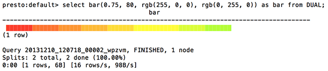

================
Color Functions
================

.. function:: color(color) -> bigint

    Returns a bigint capturing a decoded RGB value from a 4-character
    color string of the format "#000".  For example the string value
    "#CDE" is converted to a bigint with the hexadecimal value
    0xCCDDEE.

.. function:: rgb(red, green, blue) -> bigint

    Returns a bigint capturing the RGB value of three component color
    values supplied as int parameters ranging from 0 to 255: red,
    green, blue.  For example the inputs of red 0xFF, green 0xCC, and
    blue 0xAA produce a bigint value of 0xFFCCAA.

.. function:: color(value, low, high, low_color, high_color) -> bigint

    Returns a bigint color interpolated between low_color and
    high_color.

.. function:: color(fraction, low_color, high_color) -> bigint

    Returns a bigint color interpolated between low_color and
    high_color according to the double argument fraction between 0 and
    1.0.  If fraction falls outside of this range its value is
    truncated.

.. function:: render(value, color) -> slice

    Renders a value using the specific RGB bigint color using ANSI
    color codes.

.. function:: render(boolean) -> slice

    Renders a green true or a red false using ANSI color codes.

.. function:: bar(percent, width) -> slice

    Renders a single bar in an ANSI bar chart using a default
    low_color of red and a high_color of green.  For example, if
    percent of 25% and width of 40 are passed to this function. A
    10-character red bar will be drawn followed by 30 spaces to create
    a bar of 40 characters.

.. function:: bar(percent, width, low_color, high_color) -> slice

    Renders a single line in an ANSI bar chart of the specified
    width. The parameter percent is a value between [0,1] and the
    low_color and high_color capture the bigint color to use for
    either end of the horizontal bar chart.  For example, if percent
    of 0.5, width of 80, low_color of 0xFF0000, and high_color of
    0x00FF00 are pased to this function a 40 character bar will be
    drawn that varies from red (0xFF0000) and yellow (0xFFFF00) and
    the remainder of the 80 character bar will be padded with spaces..

   Example Output of the ``bar`` function  