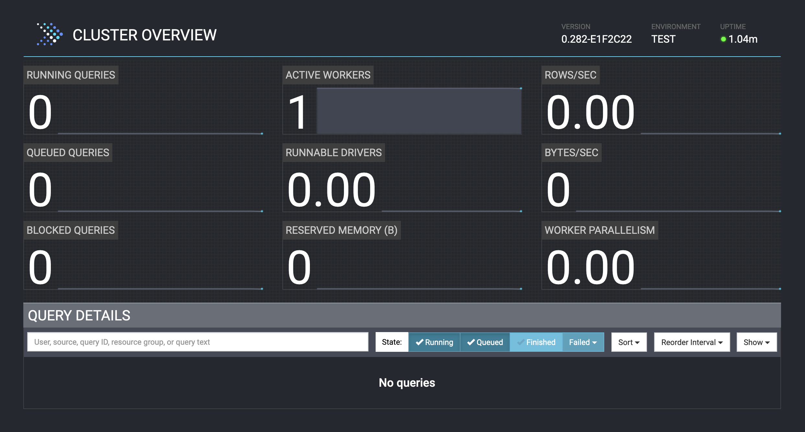

============================
Deploy Presto using Homebrew
============================

This guide explains how to install and get started with Presto on macOS, Linux or WSL2 using the Homebrew package manager.

Prerequisites
-------------

`Homebrew <https://brew.sh/>`_ installed.

Install Presto
--------------

Run the following command to install the latest version of Presto using the `Homebrew Formulae <https://formulae.brew.sh/formula/prestodb>`_:

.. code-block:: none

   brew install prestodb

Homebrew installs packages in the ``Cellar`` directory, which can be found with this command:

.. code-block:: none

   brew --cellar

The directory ``$(brew --cellar)/prestodb/<version>/libexec`` contains the Presto files used to run and configure the service.
For example, the ``etc`` directory within the Presto installation contains the following default configuration files:

- node.properties
- jvm.config
- config.properties
- log.properties
- catalog/jmx.properties

Start and Stop Presto
---------------------

Presto is installed with the ``presto-server`` helper script, which simplifies managing the cluster.
For example, run the following command to start the Presto service in the foreground:

.. code-block:: none

   presto-server run

To stop Presto from running in the foreground, press ``Ctrl + C`` until the terminal prompt appears, or close the terminal.

For more available commands and options, use help:

.. code-block:: none

   presto-server --help

Open the Presto Console
-----------------------

After starting the service, Presto Console can be accessible at the default port ``8080`` using the following link in a browser:

.. code-block:: none

    http://localhost:8080

For more information about the Presto Console, see :doc:`/clients/presto-console`.

Start the Presto CLI
--------------------

The Presto CLI is a terminal-based interactive shell for running queries, and is a
`self-executing <http://skife.org/java/unix/2011/06/20/really_executable_jars.html>`_
JAR file that acts like a normal UNIX executable.

The Presto CLI is installed in the directory ``$(brew --cellar)/prestodb/<version>/bin``.
To run the Presto CLI, use the following command:

.. code-block:: none

   presto

The Presto CLI starts and displays its prompt:

.. code-block:: none

   presto>

For more information, see :doc:`/clients/presto-cli`.
