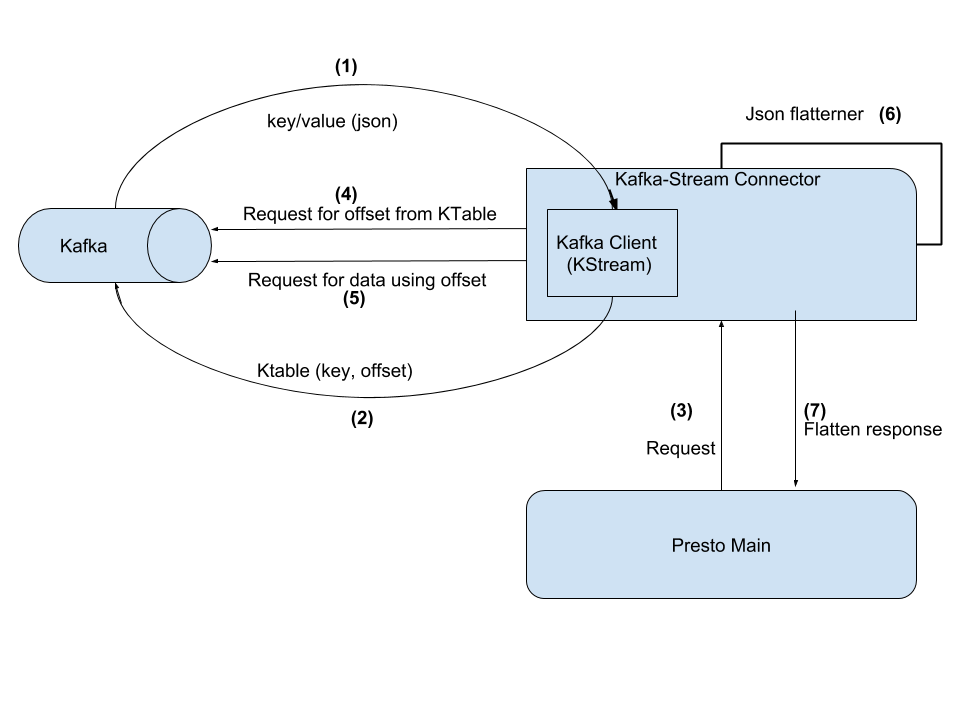

Kafka-Stream Connector
======================

## Overview #######

KafkaStream Connector provide kafka as a data source for presto. 
It uses kafka kstream client library which introduce two new functionalities 1- KStream 2- KTable.

### KStream - It listen data from kafaka as a continues stream.
### KTable - It provide a table view from kafka content. This is efficient way to use kafka as a datastore.

For more please go through the link - https://kafka.apache.org/documentation/streams/

## How it works #####

Connector implemented json flattner in order to provide table view from json content from kafka.
By Using KTable we identify offset for a key.
Json flattener retrieved the data as a resultset from json as per schema.

## High level design ######

### Flow:

    (1) Kafka client start listening all topic specified in schema and start getting kafka record (Key-Value)
    (2) Kafka client create ktable and store key as a id and offset as a value.
    (3) On query recieve, presto main query deligate request to connector with key/id.
    (4) Kafka client retrieve offeset from Ktable.
    (5) Kafka client retrieve json data using offset.
    (6) Json flattener flatten json data.
    (7) Send flatten response back to presto main.  

### Example ######

example schema can be found in /src/main/resources/metadata.json.
Below are the steps to run :

    * Start kafka broker.
    * Create a topic with name sample_topic.
    * Insert data (you can use kafka command line producer).
        sample data for command line kafkaproducer: efdbce1e-fed2-4e44-ad22-d4ef1fc26f3f:{"data":[{"Id":"efdbce1e-fed2-4e44-ad22-d4ef1fc26f3f","UniqueName":"testName123","Name":"test","Age":"22","TimeCreated":"15678900000"}]}
    * Execute a query using presto client - select * from ktable.sample_topic as st where st.id='efdbce1e-fed2-4e44-ad22-d4ef1fc26f3f';

### Upcoming feature :

    1. Multi partition support.
    2. Support for csv, xml format.
    2. Multiple options for KTable storage (local, centralize, GlobalKTable...).
