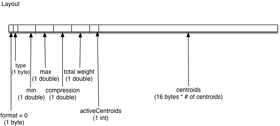
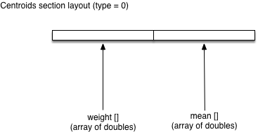

# T-Digest

## Background

The implementation of t-digest in this library is based on [t-digest [Dunning '19]](https://arxiv.org/abs/1902.04023). It has been modified to support Slice serialization.

## Format

_Unless otherwise noted, all values are little-endian._

### T-Digest Layout

The t-digest algorithm uses a set of centroids to store a distribution of values. A centroid is a data structure that has an associated mean and weight. In this format, the centroids that make up the t-digest are serialized by storing the two metrics mentioned.

* format: byte value which represents the format used for serialization (currently just one format exists, `0`)
* type: byte value which represents the data type of the values in the distribution
* min: represents the minimum value of the distribution represented as a double
* max: represents the maximum value of the distribution represented as a double
* compression: the compression factor used when creating the t-digest
* total weight: the total number of values in the t-digest
* activeCentroids: the number of centroids used by the t-digest
* centroids: the sequence of centroids which represent the t-digest, ordered by ascending mean

#### Centroid Layout

The centroids section in the t-digest consists of two arrays of length `activeCentroids`:

* weight[]: an array with the number of values contained in each centroid
* mean[]: an array with the average value of each centroid