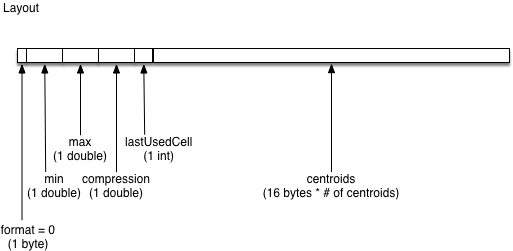
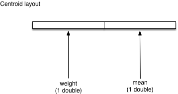

# T-Digest

## Background

The implementation of t-digest in this library is based on [t-digest [Dunning '19]](https://arxiv.org/abs/1902.04023). It has been modified to support Slice serialization.

## Format

_Unless otherwise noted, all values are little-endian._

### T-Digest Layout

The t-digest algorithm uses a set of centroids to store a distribution of doubles. A centroid is a data structure that has an associated mean and weight. In this format, the centroids that make up the t-digest are serialized by storing the two metrics mentioned.

* format: byte value which represents the format used for serialization (currently just one format exists, `0`)
* min: represents the minimum value of the distribution represented as a double
* max: represents the maximum value of the distribution represented as a double
* publicCompression: the compression factor used when creating the t-digest
* lastUsedCell: the number of centroids used by the t-digest
* centroids: the sequence of centroids which represent the t-digest, ordered by ascending mean

#### Node layout

Each centroid in the t-digest consists of:

* weight: the number of values contained in the centroid
* mean: the sum of the values in the current centroid divided by the total number of values in the centroid