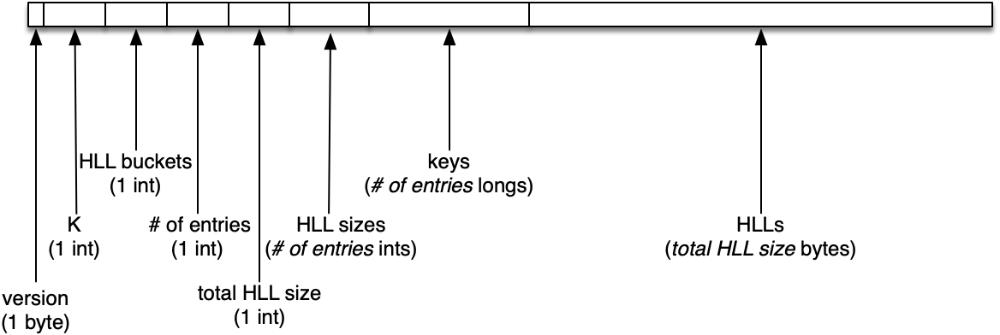

# KHyperLogLog

## Background

This implementation meets the specifications detailed in  
[KHyperLogLog [Chia et al. ’19]](https://storage.googleapis.com/pub-tools-public-publication-data/pdf/40bc2804cbd3e41ed28dc8991316361eca48630c.pdf).

## Format

_Unless otherwise noted, all values are little-endian._

### KHyperLogLog serialization layout

KHyperLogLog maintains a k-sized MinHash structure whose entries map a _long_ key to a HyperLogLog sketch. HyperLogLog (HLL) sketches are serialized according to [its documentation](https://github.com/airlift/airlift/blob/master/stats/docs/hll.md).

* format: byte value which represents the format used for serialization (currently
just one format exists, `0`)
* K: the maximum amount of entries that can be stored in the MinHash struct
* HLL buckets: the amount of buckets the HLL sketches are composed of
* \# of entries: the number of entries currently in the MinHash struct (can be at most K)
* total HLL size: the sum of all the serialized HLL sketches' size, in bytes
* HLL sizes: sequence of _ints_ specifying the size, in bytes, of each serialized HLL sketch
* keys: sequence of entries present in the MinHash struct, in ascending order
* HLLs: sequence of serialized HLL sketches corresponding to each key, in the same order the keys are serialized

