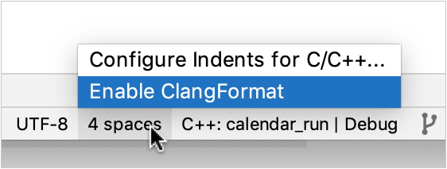

# presto.cpp

## Build Notes

### Dependencies

* [cmake](https://cmake.org/)
* [Boost](https://www.boost.org/) 1.72.0 is required and expected to be found in /usr/local/include/boost.
* [folly](https://github.com/facebook/folly)
* [double-conversion](https://github.com/google/double-conversion)
* [fmt](https://github.com/fmtlib/fmt)
* [Apache Arrow](https://arrow.apache.org/)
* [Google Test/Mock](https://github.com/google/googletest)
* [GFlags](https://github.com/gflags/gflags)
* [GLog](https://github.com/google/glog)
* [libuuid](https://sourceforge.net/projects/libuuid/)


## Building
Run `make` in the root directory to compile the sources. For development, use
`make debug` to build a non-optimized debug version.  Use `make unittest` to build
and run tests.

### Makefile targets
A reminder of the available Makefile targets can be obtained using `make help`
```
    make help
    all                     Build the release version
    clean                   Delete all build artifacts
    cmake                   Use CMake to create a Makefile build system
    build                   Build the software based in BUILD_DIR and BUILD_TYPE variables
    debug                   Build with debugging symbols
    release                 Build the release version
    unittest                Build with debugging and run unit tests
    format-fix              Fix formatting issues in the current branch
    format-check            Check for formatting issues on the current branch
    header-fix              Fix license header issues in the current branch
    header-check            Check for license header issues on the current branch
    tidy-fix                Fix clang-tidy issues in the current branch
    tidy-check              Check clang-tidy issues in the current branch
    linux-container         Build the CircleCi linux container from scratch
    help                    Show the help messages
```

## Code formatting, headers and clang-tidy

### Showing, Fixing and Passing Checks

Makefile targets exist for showing, fixing and checking formatting, license
headers and clang-tidy warnings.  These targets are shortcuts for calling
`./scripts/check.py`.  

GitHub Actions run `make format-check`, `make header-check` and
`make tidy-check` as part of our continuous integration.  Pull requests should
pass linux-build, format-check, header-check and other jobs without errors
before being accepted.  

Formatting issues found on the changed lines in the current commit can be
displayed using `make format-show`.  These issues can be fixed by using `make
format-fix`.  This will apply formatting changes to changed lines in the
current commit.

Header issues found on the changed files in the current commit can be displayed
using `make header-show`.  These issues can be fixed by using `make
header-fix`.  This will apply license header updates to the files in the current
commit.

Similar commands `make tidy-show`, `make-tidy-fix`, `make tidy-check` exist for
running clang-tidy, but these checks are currently advisory only.

An entire directory tree of files can be formatted and have license headers added 
using the `tree` variant of the format.sh commands:
```
    ./scripts/check.py format tree 
    ./scripts/check.py format tree --fix

    ./scripts/check.py header tree 
    ./scripts/check.py header tree --fix
```

All the available formatting commands can be displayed by using
`./scripts/check.py help`.

There is not currently a mechanism to *opt out* files or directories from the
checks.  When we need one it can be added.

## Development Env.

### Basic setup on MacOS

* Clone the whole Presto repository.
* Run `presto/presto-native-execution/scripts/setup-macos.sh`.
* Add the cmake-format bin to your $PATH, maybe something like this
  in your ~/.profile:
```
export PATH=$HOME/bin:$HOME/Library/Python/3.7/bin:$PATH
```
* It is recommended to use some sort of IDE on MacOS.
  [CLion](https://www.jetbrains.com/clion/) is an option.

### Basic setup on Linux (CentOs 8 or later)

* Clone the whole Presto repository.
* Run `presto/presto-native-execution/scripts/setup-linux.sh`

### Setting up local Presto environment on MacOS (with optional IntelliJ and CLion) 
Clone the whole Presto repository.

Close IntelliJ and CLion

In local Presto repo
* `git fetch upstream`
* `git co upstream/master`
* `mvn clean install -DskipTests -T1C -pl -presto-docs`

Run IntelliJ
* Edit/Create `HiveQueryRunnerExternal` Application Run/Debug Configuration (alter paths accordingly).
  * Main class: `com.facebook.presto.hive.HiveExternalWorkerQueryRunner`.
  * VM options: `-ea -Xmx5G -XX:+ExitOnOutOfMemoryError -Duser.timezone=America/Bahia_Banderas -Dhive.security=legacy`.
  * Working directory: `$MODULE_DIR$`
  * Environment variables: `PRESTO_SERVER=/Users/<user>/git/presto/presto-native-execution/cmake-build-debug/presto_cpp/main/presto_server;DATA_DIR=/Users/<user>/Desktop/data;WORKER_COUNT=0`
  * Use classpath of module: choose `presto-native-execution` module.
* Edit/Create `TestHiveQueriesUsingJSON` Test Run/Debug Configuration (alter paths accordingly).
  * Class: `com.facebook.presto.nativeworker.TestHiveQueriesUsingJSON`
  * VM Options: `-ea -DPRESTO_SERVER=/Users/<user>/git/presto_cpp/cmake-build-debug/presto_cpp/main/presto_server -DDATA_DIR=/Users/<user>/Desktop/data`
  * Working directory: `$MODULE_WORKING_DIR$`
* Edit/Create `Presto Client` Application Run/Debug Configuration (alter paths accordingly).
  * Main class: `com.facebook.presto.cli.Presto`
  * Program arguments: `--catalog hive --schema tpch`
  * Use classpath of module: choose `presto-cli` module.


In "presto/presto-native-execution" run:
* `make -C presto-native-execution submodules`
* `git/presto/presto-native-execution % sudo chown -R $(whoami) /usr/local/bin /usr/local/lib /usr/local/sbin; sudo chown -R $(whoami) /usr/local/bin /usr/local/lib /usr/local/bin; sudo chown -R $(whoami) /usr/local/bin /usr/local/lib /usr/local/lib; chmod u+w /usr/local/bin /usr/local/lib /usr/local/sbin; chmod u+w /usr/local/bin /usr/local/lib /usr/local/bin; chmod u+w /usr/local/bin /usr/local/lib /usr/local/lib; ./scripts/setup-macos.sh`
  
Run CLion:
* File->Close Project if any is open.
* Open `presto/presto-native-execution` folder as CMake project and wait till CLion loads/generates cmake files, symbols, etc.
* Edit configuration for `presto_server` module (alter paths accordingly).
  * Program arguments: `--logtostderr=1 --v=1 --etc_dir=/Users/<user>/git/presto/presto-native-execution/etc`
  * Working directory: `/Users/<user>/git/presto/presto-native-execution`
* Edit menu CLion->Preferences->Build, Execution, Deployment->CMake
  * CMake options: `-DVELOX_BUILD_TESTING=ON -DCMAKE_BUILD_TYPE=Debug`
  * Build options: `-- -j 12`
* Edit menu CLion->Preferences->Editor->Code Style->C/C++
  * Scheme: `Project`
* To enable clang format you need
  * Open any h or cpp file in the editor and select `Enable ClangFormat` by clicking `4 spaces` rectangle in the status bar (bottom right) which is next to `UTF-8` bar.

    

### Using local Presto environment on MacOS (with optional IntelliJ and CLion)
Running Presto Coordinator + Worker on MacOS
* Note that everything below can be done w/o using IDEs by running command line commands (not in this readme).
* Run 'HiveQueryRunnerExternal' from IntelliJ and wait until it started (`======== SERVER STARTED ========` in the log output).
* Scroll up the log output and find `Discovery URL http://127.0.0.1:50555`. The port is 'random' with every start.
* Copy that whole URL to the `discovery.uri` field in `presto/presto-native-execution/etc/config.properties` for the worker to discover the Coordinator.
* In CLion run "presto_server" module. Connection success will be indicated by `Announcement succeeded: 202` line in the log output.
* Two ways to run Presto client to start executing queries on the running local setup:
  1. In command line from presto root folder run the presto client:
      * `java -jar presto-cli/target/presto-cli-*-executable.jar --catalog hive --schema tpch`
  2. Run `Presto Client` Application (see above on how to create and setup the configuration) inside IntelliJ
* You can start from `show tables;` and `describe table;` queries and execute more queries as needed.

### Running Integration (End to End or E2E) Tests on MacOS (with optional IntelliJ and CLion)
* Note that everything below can be done w/o using IDEs by running command line commands (not in this readme).
* Open a test file which has the test(s) you want to run in IntelliJ from `presto/presto-native-execution/src/test/java/com/facebook/presto/nativeworker` path.
* Click the green arrow to the left of the test class line of code and chose if you want to Run or Debug. This will run all tests in this class. 
* Alternatively click the green arrow to the left of the test class' test method line of code and chose if you want tor Run or Debug. This will run all tests only in this class's member.
* The framework will launch single Coordinator and four native workers to test-run the queries.
* Similarly, the unit tests of Velox and presto_cpp can be run from CLion.

### Advancing Velox's version
* For presto_cpp to use a newer Velox's version from the presto repository root:
  * `git -C presto-native-execution/velox checkout main`
  * `git -C presto-native-execution/velox pull`
  * `git add presto-native-execution/velox`
  * Build and run tests (including E2E) to ensure everything works.
  * Submit a PR, get it approved and merged.

### Creating PRs for presto/presto-native-execution/
* Submit PRs as usual following [Presto repository guidelines](https://github.com/prestodb/presto/wiki/Review-and-Commit-guidelines).
* On top of it please add `[native]` prefix in the title for PRs modifying anything in `presto-native-execution`. 
* PRs that only change files in `presto-native-execution` should be approved by a Code Owner ([team-velox](https://github.com/orgs/prestodb/teams/team-velox)) to have merging enabled.
