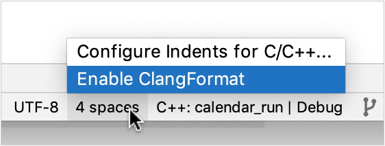

# Prestissimo - C++ Presto Worker Implementation using Velox

Prestissimo implements the [Presto Worker REST API](https://prestodb.io/docs/current/develop/worker-protocol.html)
using [Velox](https://github.com/facebookincubator/velox).

## Table of Contents
* [Build from Source](#build-from-source)
* [Build using Dockerfile](#build-using-dockerfile)
* [Development](#development)
* [Create Pull Request](#create-pull-request)
* [Advance Velox Version](#advance-velox-version)
* [Functional test using containers](#functional-test-using-containers)
* [Troubleshooting](#troubleshooting)

## Build from Source
* Clone the Presto repository

`git clone https://github.com/prestodb/presto.git`
* Run `cd presto/presto-native-execution && make submodules`

### Dependency installation
Dependency installation scripts based on the operating system are
available inside `presto/presto-native-execution/scripts`.

* macOS: `setup-macos.sh`
* CentOS Stream 9: `setup-centos.sh`
* Ubuntu: `setup-ubuntu.sh`

The above setup scripts use the `DEPENDENCY_DIR` environment variable to set the
location to download and build packages. This defaults to `deps-download` in the current
working directory.

Use `INSTALL_PREFIX` to set the install directory of the packages. This defaults to
`deps-install` in the current working directory on macOS and to the default install
location (for example, `/usr/local`) on Linux.
Using the default install location `/usr/local` on macOS is discouraged because this
location is owned by `root`.

Manually add the `INSTALL_PREFIX` value in the IDE or bash environment, so subsequent
Prestissimo builds can use the installed packages. Say
`export INSTALL_PREFIX=/Users/$USERNAME/presto/presto-native-execution/deps-install` to `~/.zshrc`.

The following libraries are installed by the above setup scripts.
The Velox library installs other
[dependencies](https://github.com/facebookincubator/velox/tree/main/CMake/resolve_dependency_modules/README.md)
not listed below.

| Name       | Version |
| ---------- | ------- |
| [Velox](https://github.com/facebookincubator/velox)  | Latest  |
| [CMake](https://cmake.org/) | Minimum `3.10` |
| [gperf](https://www.gnu.org/software/gperf) |`v3.1`|
| [proxygen](https://github.com/facebook/proxygen) |`v2024.07.01.00`|

Prestissimo sources the Velox scripts and the configuration for the installation
location and other configuration applies to Prestissimo. Please make sure to also
review the [Velox README](https://github.com/facebookincubator/velox/tree/main/README.md).

For build issues refer to the troubleshooting section in this document.

### Supported architectures, operating systems, and compilers

The supported architectures are `x86_64 (avx, sse)`, and `AArch64 (apple-m1+crc, neoverse-n1)`.

Prestissimo can be built by a variety of compilers (and versions) but not all.
Compilers (and versions) not mentioned are known to not work or have not been tried.

#### Minimum required
| OS | compiler |
| -- | -------- |
| Ubuntu 22.04 | `gcc11` |
| macOS | `clang15` |
| CentOS 9/RHEL 9 | `gcc11` |

#### Recommended
| OS | compiler |
| -- | -------- |
| CentOS 9/RHEL 9 | `gcc12` |
| Ubuntu 22.04 | `gcc11` |
| macOS | `clang15 (or later)` |

### Build Prestissimo
#### Parquet and S3 Support
Parquet support is enabled by default. To disable it, add `-DPRESTO_ENABLE_PARQUET=OFF`
to the `EXTRA_CMAKE_FLAGS` environment variable.

`export EXTRA_CMAKE_FLAGS="${EXTRA_CMAKE_FLAGS -DPRESTO_ENABLE_PARQUET=OFF"`

To enable S3 support, add `-DPRESTO_ENABLE_S3=ON` to the `EXTRA_CMAKE_FLAGS`
environment variable.

`export EXTRA_CMAKE_FLAGS="${EXTRA_CMAKE_FLAGS} -DPRESTO_ENABLE_S3=ON"`

S3 support needs the [AWS SDK C++](https://github.com/aws/aws-sdk-cpp) library.
This dependency can be installed by running the target platform build script
from the `presto/presto-native-execution` directory.

`./velox/scripts/setup-centos9.sh install_aws_deps`
    Or
`./velox/scripts/setup-ubuntu.sh install_aws_deps`

#### JWT Authentication
To enable JWT authentication support, add `-DPRESTO_ENABLE_JWT=ON` to the
`EXTRA_CMAKE_FLAGS` environment variable.

`export EXTRA_CMAKE_FLAGS="${EXTRA_CMAKE_FLAGS} -DPRESTO_ENABLE_JWT=ON"`

JWT authentication support needs the [JWT CPP](https://github.com/Thalhammer/jwt-cpp) library.
This dependency can be installed by running the script below from the
`presto/presto-native-execution` directory.

`./scripts/setup-adapters.sh jwt`

#### Worker Metrics Collection

To enable worker level metrics collection and to enable the REST API `v1/info/metrics`
follow these steps:

*Pre-build setup:* `./scripts/setup-adapters.sh prometheus`

*CMake flags:* `PRESTO_STATS_REPORTER_TYPE=PROMETHEUS`

`export EXTRA_CMAKE_FLAGS="${EXTRA_CMAKE_FLAGS} -DPRESTO_STATS_REPORTER_TYPE=PROMETHEUS"`

*Runtime configuration:* `runtime-metrics-collection-enabled=true`

* After installing the above dependencies, from the
`presto/presto-native-execution` directory, run `make`
* For development, use `make debug` to build a non-optimized debug version.
* Use `make unittest` to build and run tests.

#### Arrow Flight Connector
To enable Arrow Flight connector support, add to the `EXTRA_CMAKE_FLAGS` environment variable:
`export EXTRA_CMAKE_FLAGS="${EXTRA_CMAKE_FLAGS} -DPRESTO_ENABLE_ARROW_FLIGHT_CONNECTOR=ON"`

The Arrow Flight connector requires the Arrow Flight library. You can install this dependency
by running the following script from the `presto/presto-native-execution` directory:

`./scripts/setup-adapters.sh arrow_flight`

#### Nvidia cuDF GPU Support

To enable support with [cuDF](https://github.com/facebookincubator/velox/tree/main/velox/experimental/cudf),
add to the `EXTRA_CMAKE_FLAGS` environment variable:
`export EXTRA_CMAKE_FLAGS="${EXTRA_CMAKE_FLAGS} -DPRESTO_ENABLE_CUDF=ON"`

In some environments, the CUDA_ARCHITECTURES and CUDA_COMPILER location must be explicitly set.
The make command will look like:

`CUDA_ARCHITECTURES=80 CUDA_COMPILER=/usr/local/cuda/bin/nvcc EXTRA_CMAKE_FLAGS=" -DPRESTO_ENABLE_CUDF=ON" make`

The required dependencies are bundled from the Velox setup scripts.

#### Spatial type and function support
Spatial type and function support is enabled by default. To disable it, add to `EXTRA_CMAKE_FLAGS` environment variable:
`export EXTRA_CMAKE_FLAGS="${EXTRA_CMAKE_FLAGS} -PRESTO_ENABLE_SPATIAL=OFF"`

The spatial support adds new types (OGC geometry types) and functionality for spatial calculations.

### Makefile Targets
A reminder of the available Makefile targets can be obtained using `make help`
```
    make help
    all                     Build the release version
    clean                   Delete all build artifacts
    cmake                   Use CMake to create a Makefile build system
    build                   Build the software based in BUILD_DIR and BUILD_TYPE variables
    debug                   Build with debugging symbols
    release                 Build the release version
    unittest                Build with debugging and run unit tests
    format-fix              Fix formatting issues in the current branch
    format-check            Check for formatting issues on the current branch
    header-fix              Fix license header issues in the current branch
    header-check            Check for license header issues on the current branch
    tidy-fix                Fix clang-tidy issues in the current branch
    tidy-check              Check clang-tidy issues in the current branch
    help                    Show the help messages
```

## Build using Dockerfile
Information on how to build a dependency and runtime image of Prestissimo [can be found here](scripts/dockerfiles/README.md).

## Development
### Setup Presto with [IntelliJ IDEA](https://www.jetbrains.com/idea/) and Prestissimo with [CLion](https://www.jetbrains.com/clion/)

Clone the whole Presto repository. Close IntelliJ and CLion if running.

From the Presto repo run the commands below:
* `git fetch upstream`
* `git co upstream/master`
* `mvn clean install -DskipTests -T1C -pl -presto-docs`

Run IntelliJ IDEA:

Run HiveExternalWorkerQueryRunner,
* Edit/Create `HiveExternalWorkerQueryRunner` Application Run/Debug Configuration (alter paths accordingly).
  * Main class: `com.facebook.presto.nativeworker.HiveExternalWorkerQueryRunner`.
  * VM options: `-ea -Xmx5G -XX:+ExitOnOutOfMemoryError -Duser.timezone=America/Bahia_Banderas -Dhive.security=legacy`.
  * Working directory: `$MODULE_DIR$`
  * Environment variables: `PRESTO_SERVER=/Users/<user>/git/presto/presto-native-execution/cmake-build-debug/presto_cpp/main/presto_server;DATA_DIR=/Users/<user>/Desktop/data;WORKER_COUNT=0`
  * Use classpath of module: choose `presto-native-execution` module.

Run IcebergExternalWorkerQueryRunner,
* Edit/Create `IcebergExternalWorkerQueryRunner` Application Run/Debug Configuration (alter paths accordingly).
  * Main class: `com.facebook.presto.nativeworker.IcebergExternalWorkerQueryRunner`.
  * VM options: `-ea -Xmx5G -XX:+ExitOnOutOfMemoryError -Duser.timezone=America/Bahia_Banderas -Dhive.security=legacy`.
  * Working directory: `$MODULE_DIR$`
  * Environment variables: `PRESTO_SERVER=/Users/<user>/git/presto/presto-native-execution/cmake-build-debug/presto_cpp/main/presto_server;DATA_DIR=/Users/<user>/Desktop/data;WORKER_COUNT=0`
    * When `addStorageFormatToPath = false` **(Default)**,

      `$DATA_DIR/iceberg_data/<catalog_type>`. Here `catalog_type` could be `HIVE | HADOOP | NESSIE | REST`.

      `addStorageFormatToPath` is `false` by default because Java `HiveQueryRunner` and `IcebergQueryRunner` do not add the file format to the path.
    * When `addStorageFormatToPath = true`,

      `$DATA_DIR/iceberg_data/<file_format>/<catalog_type>`. Here `file_format` could be `PARQUET | ORC | AVRO` and `catalog_type` could be `HIVE | HADOOP | NESSIE | REST`.
  * Use classpath of module: choose `presto-native-execution` module.

Run NativeSidecarPluginQueryRunner:
* Edit/Create `NativeSidecarPluginQueryRunner` Application Run/Debug Configuration (alter paths accordingly).
  * Main class: `com.facebook.presto.sidecar.NativeSidecarPluginQueryRunner`.
  * VM options : `-ea -Xmx5G -XX:+ExitOnOutOfMemoryError -Duser.timezone=America/Bahia_Banderas -Dhive.security=legacy`.
  * Working directory: `$MODULE_DIR$`
  * Environment variables: `PRESTO_SERVER=/Users/<user>/git/presto/presto-native-execution/cmake-build-debug/presto_cpp/main/presto_server;DATA_DIR=/Users/<user>/Desktop/data;WORKER_COUNT=0`
  * Use classpath of module: choose `presto-native-sidecar-plugin` module.

Run CLion:
* File->Close Project if any is open.
* Open `presto/presto-native-execution` directory as CMake project and wait till CLion loads/generates cmake files, symbols, etc.
* Edit configuration for `presto_server` module (alter paths accordingly).
  * Program arguments: `--logtostderr=1 --v=1 --etc_dir=/Users/<user>/git/presto/presto-native-execution/etc`
  * Working directory: `/Users/<user>/git/presto/presto-native-execution`
* For sidecar, Edit configuration for `presto_server` module (alter paths accordingly).
  * Program arguments: `--logtostderr=1 --v=1 --etc_dir=/Users/<user>/git/presto/presto-native-execution/etc_sidecar`
  * Working directory: `/Users/<user>/git/presto/presto-native-execution`
* Edit menu CLion->Preferences->Build, Execution, Deployment->CMake
  * CMake options: `-DVELOX_BUILD_TESTING=ON -DCMAKE_BUILD_TYPE=Debug`
  * Build options: `-- -j 12`
  * Optional CMake options to enable Parquet and S3: `-DPRESTO_ENABLE_PARQUET=ON -DPRESTO_ENABLE_S3=ON`
* Edit menu CLion->Preferences->Editor->Code Style->C/C++
  * Scheme: `Project`
* To enable clang format you need
  * Open any h or cpp file in the editor and select `Enable ClangFormat` by clicking `4 spaces` rectangle in the status bar (bottom right) which is next to `UTF-8` bar.

    

### Run Presto Coordinator + Worker
* Note that everything below can be done without using IDEs by running command line commands (not in this readme).
* Run QueryRunner as per your choice,
  * For Hive, Run `HiveExternalWorkerQueryRunner` from IntelliJ and wait until it starts (`======== SERVER STARTED ========` is displayed in the log output).
  * For Iceberg, Run `IcebergExternalWorkerQueryRunner` from IntelliJ and wait until it starts (`======== SERVER STARTED ========` is displayed in the log output).
* Scroll up the log output and find `Discovery URL http://127.0.0.1:50555`. The port is 'random' with every start.
* Copy that port (or the whole URL) to the `discovery.uri` field in `presto/presto-native-execution/etc/config.properties` for the worker to announce itself to the Coordinator.
* In CLion run "presto_server" module. Connection success will be indicated by `Announcement succeeded: 202` line in the log output.
* See **Run Presto Client** to start executing queries on the running local setup.

### Run Presto Coordinator + Sidecar
* Note that everything below can be done without using IDEs by running command line commands (not in this readme).
* Add a property `presto.default-namespace=native.default` to `presto-native-execution/etc/config.properties`.
* Run `NativeSidecarPluginQueryRunner` from IntelliJ and wait until it starts (`======== SERVER STARTED ========` is displayed in the log output).
* Scroll up the log output and find `Discovery URL http://127.0.0.1:50555`. The port is 'random' with every startup.
* Copy that port (or the whole URL) to the `discovery.uri` field in`presto/presto-native-execution/etc_sidecar/config.properties` for the sidecar to announce itself to the Coordinator.
* In CLion run "presto_server" module. Connection success will be indicated by `Announcement succeeded: 202` line in the log output.
* See **Run Presto Client** to start executing queries on the running local setup.

### Run Presto Client
* Run the following command from the presto root directory to start the Presto client:
    ```
    java -jar presto-cli/target/presto-cli-*-executable.jar --catalog hive --schema tpch
    ```
* You can start from `show tables;` and `describe table;` queries and execute more queries as needed.

### Run Integration (End to End or E2E) Tests
* Note that everything below can be done w/o using IDEs by running command line commands (not in this readme).
* Open a test file which has the test(s) you want to run in IntelliJ from `presto/presto-native-execution/src/test/java/com/facebook/presto/nativeworker` path.
* Click the green arrow to the left of the test class line of code and chose if you want to Run or Debug. This will run all tests in this class.
* Alternatively click the green arrow to the left of the test class' test method line of code and chose if you want tor Run or Debug. This will run all tests only in this class's member.
* The framework will launch single Coordinator and four native workers to test-run the queries.
* Similarly, the unit tests of Velox and presto_cpp can be run from CLion.

### Code formatting, headers, and clang-tidy

Makefile targets exist for showing, fixing and checking formatting, license
headers and clang-tidy warnings.  These targets are shortcuts for calling
`presto/presto-native-execution/scripts/check.py` .

GitHub Actions run `make format-check`, `make header-check` and
`make tidy-check` as part of our continuous integration.  Pull requests should
pass linux-build, format-check, header-check and other jobs without errors
before being accepted.

Formatting issues found on the changed lines in the current commit can be
displayed using `make format-show`.  These issues can be fixed by using `make
format-fix`.  This will apply formatting changes to changed lines in the
current commit.

Header issues found on the changed files in the current commit can be displayed
using `make header-show`.  These issues can be fixed by using `make
header-fix`.  This will apply license header updates to the files in the current
commit.

Similar commands `make tidy-show`, `make-tidy-fix`, `make tidy-check` exist for
running clang-tidy, but these checks are currently advisory only.

An entire directory tree of files can be formatted and have license headers added
using the `tree` variant of the format.sh commands:
```
presto/presto-native-execution/scripts/check.py format tree
presto/presto-native-execution/scripts/check.py format tree --fix

presto/presto-native-execution/scripts/check.py header tree
presto/presto-native-execution/scripts/check.py header tree --fix
```

All the available formatting commands can be displayed by using
`presto/presto-native-execution/scripts/check.py help`.

There is currently no mechanism to *opt out* files or directories from the
checks.  When we need one it can be added.

## Create Pull Request
* Submit PRs as usual following [Presto repository guidelines](https://github.com/prestodb/presto/wiki/Review-and-Commit-guidelines).
* Prestissimo follows the Velox [coding style](https://github.com/facebookincubator/velox/blob/main/CODING_STYLE.md).
* Add `[native]` prefix in the `title` as well as to the `commit message` for PRs modifying anything in `presto-native-execution`.
* PRs that only change files in `presto-native-execution` should be approved by a Code Owner ([team-velox](https://github.com/orgs/prestodb/teams/team-velox)) to have merging enabled.

## Advance Velox Version
For Prestissimo to use a newer Velox version from the Presto repository root:
* `git -C presto-native-execution/velox checkout main`
* `git -C presto-native-execution/velox pull`
* `git add presto-native-execution/velox`
* Build and run tests (including E2E) to ensure everything works.
* Submit a PR, get it approved and merged.

## Functional test using containers
To build container images and do functional tests, see [Prestissimo: Functional Testing Using Containers](testcontainers/README.md).

## Troubleshooting
For known build issues check the wiki page [Troubleshooting known build issues](https://github.com/prestodb/presto/wiki/Troubleshooting-known-build-issues).
