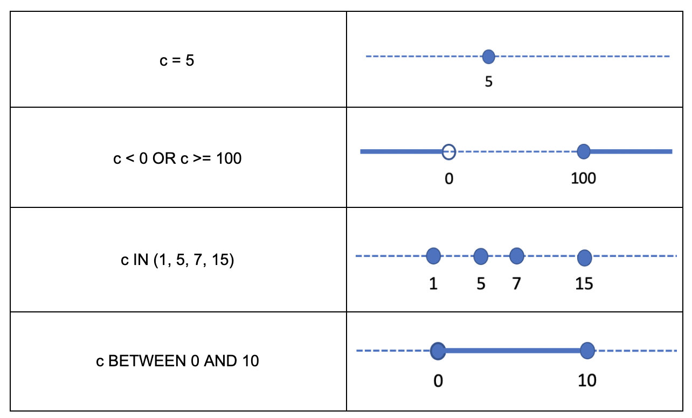
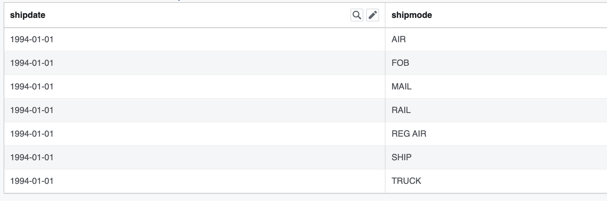

================================================
Performance Guide into TableScan and Aggregation
================================================

Introduction
------------

In this guide I’ll explain how to investigate the performance of a scan +
aggregation query that runs on Prestissimo, a next-generation Presto worker
powered by Velox. After reading this guide you’ll know about the domain and
remaining filters and how they differ, you’ll understand how to determine
whether aggregation pushdown happens or not for a given query, you’ll have the
tools to reproduce a production query in a unit test for quick debugging and
profiling. You will also learn about special columns $path and $bucket and
special table xxx$partition. The learnings from this guide can be applied to
troubleshooting a failure or a crash as well.

Query Plan
----------

Let’s look at a simple query (TPC-H #6):

.. code-block:: sql

    SELECT
        SUM(l.extendedprice * l.discount) AS revenue
    FROM lineitem l
    WHERE
        l.shipdate >= CAST(DATE '1994-01-01' AS VARCHAR)
        AND l.shipdate < CAST(DATE '1994-01-01' + INTERVAL '1' YEAR AS VARCHAR)
        AND l.discount BETWEEN .06 - 0.01 AND .06 + 0.01
        AND l.quantity < 24

The first step is to check the query plan. You can generate the plan by running
the EXPLAIN command using Presto client. EXPLAIN command
takes an optional parameter which specifies whether to produce a logical or
distributed query plan. The distributed plan is the logical plan broken down
into fragments (or stages).

Note: In Presto, the terms Fragment and Stage are used to refer to the same
thing. These terms are interchangeable.

Note: You can find out more about EXPLAIN command in Presto documentation at
https://prestodb.io/docs/current/sql/explain.html

Let’s generate a distributed query plan for the query above:

.. code-block:: sql

	EXPLAIN (TYPE distributed) <query text>

This gives us the following:

.. code-block:: text

    Fragment 0 [SINGLE]
        Output layout: [sum]
        Output partitioning: SINGLE []
        Stage Execution Strategy: UNGROUPED_EXECUTION
        - Output[revenue] => [sum:double]
                Estimates: {rows: 10000 (87.89kB), cpu: ?, memory: ?, network: ?}
                revenue := sum
            - Limit[10000] => [sum:double]
                    Estimates: {rows: 10000 (87.89kB), cpu: ?, memory: ?, network: ?}
                - Aggregate(FINAL) => [sum:double]
                        sum := "presto.default.sum"((sum_4))
                    - LocalExchange[SINGLE] () => [sum_4:double]
                        - RemoteSource[1] => [sum_4:double]

    Fragment 1 [SOURCE]
        Output layout: [sum_4]
        Output partitioning: SINGLE []
        Stage Execution Strategy: UNGROUPED_EXECUTION
        - Aggregate(PARTIAL) => [sum_4:double]
                sum_4 := "presto.default.sum"((expr))
            - ScanProject[table = TableHandle {connectorId=hive, connectorHandle='HiveTableHandle{schemaName=tpch, tableName=lineitem, analyzePartitionValues=Optional.empty}', layout='Optional[lineitem{domains={shipdate=[ [["1994-01-01", "1995-01-01")] ], discount=[ [["0.049999999999999996", "0.06999999999999999"]] ], quantity=[ [(<min>, "24.0")] ]}}]'}, grouped = false, projectLocality = LOCAL] => [expr:double]
                    Estimates: {rows: 53987447 (463.38MB), cpu: 971774042.40, memory: 0.00, network: 0.00}/{rows: 53987447 (463.38MB), cpu: 1457661063.60, memory: 0.00, network: 0.00}
                    expr := (extendedprice) * (discount)
                    LAYOUT: lineitem{domains={shipdate=[ [["1994-01-01", "1995-01-01")] ], discount=[ [["0.049999999999999996", "0.06999999999999999"]] ], quantity=[ [(<min>, "24.0")] ]}}
                    discount := discount:double:6:REGULAR
                        :: [["0.049999999999999996", "0.06999999999999999"]]
                    extendedprice := extendedprice:double:5:REGULAR
                    shipdate:string:10:REGULAR
                        :: [["1994-01-01", "1995-01-01")]
                    quantity:double:4:REGULAR
                        :: [(<min>, "24.0")]

This query plan has 2 sections - **Fragment 0 [SINGLE]** followed by **Fragment
1[SOURCE]** - corresponding to 2 stages of the query. Notice that stages are
listed in the opposite order of execution, e.g. leaf stage where execution
starts appears last. The words [SINGLE] and [SOURCE] in the fragment heading
tell us how wide the stage is running. SINGLE means that the stage runs on a
single node. SOURCE means that the stage runs on all nodes in the cluster.

.. note::

    Session property max_tasks_per_stage or configuration property
    stage.max-tasks-per-stage can be used to limit the number of nodes used in a
    SOURCE stage.

.. note::

    You can find session properties in SystemSessionProperties.java file in
    presto-main module. The corresponding configuration properties can be found in
    QueryManagerConfig.java, TaskManagerConfig.java, MemoryManagerConfig.java,
    FeaturesConfig.java, NodeMemoryConfig.java and WarningCollectorConfig.java
    files in the same module.

.. note::

    Session properties can be used to modify behavior for a single query.
    Config properties specify behavior for all queries running in a given cluster.
    Most configuration properties have corresponding session properties, but some
    don’t. This is the case for properties which cannot be modified at runtime due
    to technical reasons.

For interactive queries, it is usually the case that all the time is spent
processing the leaf stage. That’s because interactive queries tend to be
cardinality reducing either through selective filtering or low-cardinality
aggregation or both. Let’s take a closer look at the leaf stage plan.

.. code-block:: text

    Fragment 1 [SOURCE]
        Output layout: [sum_4]
        Output partitioning: SINGLE []
        Stage Execution Strategy: UNGROUPED_EXECUTION
        - Aggregate(PARTIAL) => [sum_4:double]
                sum_4 := "presto.default.sum"((expr))
            - ScanProject[table = TableHandle {connectorId=hive, connectorHandle='HiveTableHandle{schemaName=tpch, tableName=lineitem, analyzePartitionValues=Optional.empty}', layout='Optional[lineitem{domains={shipdate=[ [["1994-01-01", "1995-01-01")] ], discount=[ [["0.049999999999999996", "0.06999999999999999"]] ], quantity=[ [(<min>, "24.0")] ]}}]'}, grouped = false, projectLocality = LOCAL] => [expr:double]
                    Estimates: {rows: 53987447 (463.38MB), cpu: 971774042.40, memory: 0.00, network: 0.00}/{rows: 53987447 (463.38MB), cpu: 1457661063.60, memory: 0.00, network: 0.00}
                    expr := (extendedprice) * (discount)
                    LAYOUT: lineitem{domains={shipdate=[ [["1994-01-01", "1995-01-01")] ], discount=[ [["0.049999999999999996", "0.06999999999999999"]] ], quantity=[ [(<min>, "24.0")] ]}}
                    discount := discount:double:6:REGULAR
                        :: [["0.049999999999999996", "0.06999999999999999"]]
                    extendedprice := extendedprice:double:5:REGULAR
                    shipdate:string:10:REGULAR
                        :: [["1994-01-01", "1995-01-01")]
                    quantity:double:4:REGULAR
                        :: [(<min>, "24.0")]

There are two plan nodes: ScanProject and partial Aggregation. ScanProject
represents two separate operators: TableScan and FilterProject. Aggregation
node represents a single operator. Hence, there are 3 operators: TableScan ->
FilterProject -> Aggregation. Notice that just like fragments, plan nodes /
operators are listed in the opposite order of execution. ScanProject plan node
where execution starts is listed last.

The Aggregation node shows that there is a single aggregate function, SUM,
applied to column "expr".

    sum_4 := "presto.default.sum"((expr))

Column "expr" is produced by FilterProject operator by evaluating an expression
over columns produced by TableScan operator:

    expr := (extendedprice) * (discount)

ScanProject node contains a lot of information. First, it shows that we are
using hive connector:

    TableHandle {**connectorId=hive**,

.. note::

    It is important to note the connector name as it must be used when
    specifying connector-specific session properties. For example, Hive-specific
    max_split_size session property must be specified as
    <connector-name>.max_split_size, e.g. hive.max_split_size.

.. note::

    You can find Hive-specific session properties in
    HiveSessionProperties.java in the presto-hive module and corresponding
    configuration properties in HiveClientConfig.java in the same module.

.. note::

    You can check session properties in-effect using SHOW SESSION command.

Next, the ScanProject node shows the connector handle which includes the schema,
table name and other properties that are out of scope of this guide.

    connectorHandle='HiveTableHandle{
        schemaName=tpch,
        tableName=lineitem,
        analyzePartitionValues=Optional.empty}'

We see that TableScan is reading from lineitem table in tpch schema. Further,
ScanProject node shows the layout which repeats the table name we already saw
in the connector handle and adds a new property: "domains". The terms here are
non-intuitive - layout, domain - but the information is useful. Domains
property describes the simple filters applied to individual columns. These
filters are pushed deep into the ORC reader and are evaluated as part of
decoding the data from the ORC streams. These can be evaluated very
efficiently.

.. code-block:: text

    layout='Optional[lineitem{
        domains={
            shipdate=[ [["1994-01-01", "1995-01-01")] ],
            discount=[ [["0.049999999999999996", "0.06999999999999999"]] ],
            quantity=[ [(<min>, "24.0")] ]}}]'}

There are 3 filters on columns "shipdate", "discount" and "quantity". The filter
on column "quantity" correspond to the "l.shipdate >= CAST(DATE '1994-01-01' AS
VARCHAR) AND l.shipdate < CAST(DATE '1994-01-01' + INTERVAL '1' YEAR AS
VARCHAR)" expression. The filter on column "discount" corresponds to
the "l.discount BETWEEN .06 - 0.01 AND .06 + 0.01" expression. The filter on
column "quantity" corresponds to the "l.quantity < 24" expression.

.. note::

    In Velox, these filters are represented by Filter classes defined in
    velox/type/Filter.h and applied by SelectiveColumnReader defined in
    velox/dwio/dwrf/reader/SelectiveColumnReader.h .

.. note::

    In Velox, SubfieldFilters is a map of filters keyed on Subfield which
    represents the column name. Velox uses Subfield class and not std::string or
    similar for the column name because a filter can apply to a nested column in a
    struct or an element of an array or map. In these cases, having a more
    structured representation of the "column" is helpful. An example of such a
    filter would be a.b.c = 5 or a[5] < 10 or m["cats"] > 100.

.. note::

    In the Java codebase, these filters are represented by TupleDomainFilter
    classes.

What kind of filters should one expect to appear in the "domains" property? A
filter qualifies if (1) it applies to a single column or subfield of scalar
type, e.g. not a map, array or struct; (2) it can be represented as a final set
of disjoint ranges of values. These filters are therefore sometimes called
range filters. Here are some examples for an integer column. These trivially
extend to floating point columns, strings and booleans.

ScanProject node header concludes with the list of columns projected out of the
operator. In this query, ScanProject projects out a single column "expr" of
type DOUBLE.

    … => [expr:double]

The rest of the information in the ScanProject node is a list of columns used
by the operator. First come regular columns, followed by partition keys. For
each column, there is column name and type, e.g discount:double.

    **discount** := discount:double:6:REGULAR
        :: [["0.049999999999999996", "0.06999999999999999"]]

    **extendedprice** := extendedprice:double:5:REGULAR

    **shipdate**:string:10:REGULAR
        :: [["1994-01-01", "1995-01-01")]

    **quantity**:double:4:REGULAR
        :: [(<min>, "24.0")]

If we turn lineitem into a partition table with partition keys shipdate and
shipmode, ScanProject node will show all partition keys with a list of values
that apply to this specific query. This can be used to find out how many total
partitions are read by multiplying the number of values for each partition key.
Here we have 7 values for partition key "shipmode" and 366 values
for "shipdate".  There are a total of 7 * 366 = 2562 partitions accessed by the
query.

    **shipdate**:string:-13:PARTITION_KEY
        :: [["1994-01-01"], ["1994-01-02"],...]

    **shipmode**:string:-14:PARTITION_KEY
        :: [["AIR"], ["FOB"], ["MAIL"], ["RAIL"], ["REG AIR"], ["SHIP"], ["TRUCK"]]

.. note::

    The calculation of the total number of partitions is an approximation as
    not all combinations of the partition key values might exist.

.. note::

    Partition pruning happens on the coordinator. The workers never see
    partitions not listed in the query plan.

When a query under investigation accesses multiple partitions, it is often
helpful to modify the query to access a single partition. You can do so by
adding equality filters for all the partition keys using values from the query
plan. For example, our query can be modified like this:

.. code-block:: sql

    SELECT
        SUM(l.extendedprice * l.discount) AS revenue
    FROM lineitem l
    WHERE
        l.shipdate = '1994-01-01'
        AND l.shipmode = 'AIR'
        AND l.discount BETWEEN .06 - 0.01 AND .06 + 0.01
        AND l.quantity < 24

You can use a special table xxx$partitions to query all the partitions in
a given table. For example,

.. code-block:: sql

    SELECT
      *
    FROM
      "lineitem.$partitions"
    WHERE
      shipdate = '1994-01-01'

This query returns a list of all partitions with partition key "shipdate" equal
to "1994-01-01":

Statistics-Based Pruning
------------------------

Range (or TupleDomain) filters are used to prune whole files and sections of
files during execution. ORC files contain basic statistics about column values,
such as minimum and maximum values and presence of nulls. These statistics are
available for the whole file as well as for sections of the file called
rowgroups or strides. Check out https://orc.apache.org/specification/ to learn
more about the ORC format.

There is a special column "$path" that can be used to query file paths accessed
by the query. For each row the "$path" column reports the path of the file
containing that row. For example,

.. code-block:: sql

    SELECT
        "$path"
    FROM lineitem
    WHERE
        shipdate = '1994-01-10'
    LIMIT
        5

This query returns file paths that look like this:

    .../shipdate=1994-01-10/shipmode=AIR/20210814_094649_15363_c5483_c7ba49d3-b1e7-4bf4-8dd7-1a08ef80c9a3

Notice **shipdate=1994-01-10/shipmode=AIR** subdirectory which corresponds to
partition keys. Each partition is stored in a separate directory, hence, all
files in a given partition will come from the same directory. Given a file path
you can identify the partition by looking at the partition key values in the
path.

.. note:: $path columns are generated on the fly by the HiveConnector.

When troubleshooting, it is often helpful to reduce the query to a single file.
You can do so by querying the files in a given partition and
adding "$path"="..." filter to the query. For example,

.. code-block::sql

    SELECT
        SUM(quantity)
    FROM lineitem
    WHERE
        shipdate = '1994-01-10'
        AND "$path"
            = '.../shipdate=1994-01-10/shipmode=AIR/20210814_094649_15363_c5483_c7ba49d3-b1e7-4bf4-8dd7-1a08ef80c9a3'
        AND l.discount BETWEEN .06 - 0.01 AND .06 + 0.01
        AND l.quantity < 24

You can check out the file- and rowgroup-level statistics for a given file using
the orc-statistics or orcfiledump tool:

    hive --orcfiledump -d <path_to_file>

    orc-statistics [--withIndex] <filename>

Here is an :doc:`example of the output of this command <orc-dump-output>`.

In this query we have filters on columns discount and quantity. Let’s look at
the statistics for these columns. First section of the output is listing all
the columns in the file along with their internal IDs. Searching for discount
and quantity produces two entries:

.. code-block:: text

    Field 5, Column 4, Name: quantity, Type: DOUBLE
    Field 7, Column 6, Name: discount, Type: DOUBLE

The quantity column has ID 5; discount column has ID 7. We’ll use these IDs to
look up file-level statistics next.

.. code-block:: text

    FileStats:
    Stats 0: values: 953, has null: false, size: Missing, raw size: Missing
      Stats 5: values: 953, has null: false, size: Missing, raw size: Missing, 1.0 -> 50.0, hasSum: false
      Stats 7: values: 953, has null: false, size: Missing, raw size: Missing, 0.0 -> 0.1, hasSum: false

Stats 5 line shows statistics for column "quantity". There are 953 non-null
values in the [1.0, 50.0] range. Stats 7 line shows statistics for
column "discount": 953 non-null values in the [0.0, 0.1] range.

If the query had a quantity > 50 filter, we could determine that no row in this
file can pass the filter and skip reading the file after examining the
statistics. This is what HiveConnector is doing internally. See testFilters
function in f4d/connectors/hive/HiveConnector.cpp.

If file-level statistics do not allow us to exclude all rows in the file from
the query processing, we proceed to check rowgroup-level statistics to see if
we can skip some of these.

.. note::

    Row-group skipping based on stats is implemented in filterRowGroups method
    of the SelectiveColumnReader.

Finally, it is worth mentioning another two pieces of useful information found
in the output of the orcfiledump tool: total number of rows in the file and the
system that produced the file. The number of rows appears at the top of the
file. The information about the producer is at the bottom.

.. code-block:: text

    Number of rows: 953

    UserMetadata:
            presto.writer.version ->  0.259.1-a8dc52e
            orc.writer.version ->  1
            presto_query_id ->  20210319_083036_17635_2j3mt
            orc.writer.name ->  presto
            presto_version ->  0.259

Remaining Filter
----------------

Not all filters are range filters. Let’s look at a different query that features
a non-range filter.

.. code-block:: sql

    SELECT
        linenumber,
        orderkey,
        tax,
        extendedprice
    FROM lineitem
    WHERE
        tax * extendedprice > 5000.0

Let’s start again with a query plan, in particular, the leaf stage.

.. code-block:: text

    Fragment 1 [SOURCE]
        Output layout: [orderkey, linenumber, extendedprice, tax]
        Output partitioning: SINGLE []
        Stage Execution Strategy: UNGROUPED_EXECUTION
        - LimitPartial[10000] => [orderkey:bigint, linenumber:integer, extendedprice:double, tax:double]
                Estimates: {rows: 10000 (312.50kB), cpu: 1727918297.60, memory: 0.00, network: 0.00}
            - TableScan[TableHandle {connectorId=’hive’, connectorHandle='HiveTableHandle{schemaName=tpch, tableName=lineitem, analyzePartitionValues=Optional.empty}', layout='Optional[tpch.lineitem{filter=((tax) * (extendedprice)) > (DOUBLE'5000.0')}]'}, grouped = false] => [orderkey:bigint, linenumber:integer, extendedprice:double, tax:double]
                    Estimates: {rows: 53987447 (1.61GB), cpu: 1727598297.60, memory: 0.00, network: 0.00}
                    LAYOUT: tpch.lineitem{filter=((tax) * (extendedprice)) > (DOUBLE'5000.0')}
                    orderkey := orderkey:bigint:0:REGULAR
                    tax := tax:double:7:REGULAR
                    linenumber := linenumber:int:3:REGULAR
                    extendedprice := extendedprice:double:5:REGULAR

The layout section of the TableScan operator includes a new field: filter.

.. code-block:: text

    LAYOUT: tpch.lineitem{filter=((tax) * (extendedprice)) > (DOUBLE'5000.0')}

This filter corresponds to the SQL expression "tax * extendedprice > 5000.0".
This expression depends on two columns, hence, cannot be represented as a
domain or range filter and cannot be pushed down into the ORC reader.

This filter is called the remaining filter, e.g. the filter remaining after
extracting all the range filters, and is evaluated by the HiveConnector on rows
remaining after all the range filters have been applied by the ORC reader.

The evaluation of the remaining filter in HiveConnector uses the same expression
evaluation engine as filters and projections evaluated as part of the
FilterProject operator. Hence, adaptive filter reordering is applied to
individual conjuncts. See ConjunctExpr::maybeReorderInputs in
f4d/exec/ControlExpr.cpp.

Note: SelectiveColumnReader also includes adaptive filter reordering for the
range filters. See ScanSpec::reorder in f4d/dwio/dwrf/reader/ScanSpec.cpp.

The results of evaluating a remaining filter are represented using dictionary
encoding. All the columns projected out of the TableScan operator are wrapped
into a dictionary with indices pointing to rows that passed the filter. The
dictionary wrapping is omitted if all rows pass.

Lazy Vector
-----------

In the TableScan operator, columns that are not used in any filter are projected
out as LazyVectors. LazyVector is a special kind of vector that doesn’t get
materialized until first use. If it never gets used it will never materialize.
When it is used, it is materialized only for a subset of needed rows.

Internally, LazyVector contains a function to load the rows when needed and a
set of rows to load. This is the set of rows that passed all the range filters.
If there is a remaining filter, the LazyVector will come out of the TableScan
wrapped in a dictionary.

LazyVector allows to delay materialization and reduce the number of rows
materialized to a set of absolutely needed values. For example, the number of
rows can be reduced further by a selective join. The idea comes from LazyBlock
in classic Presto, but Velox extends it further and leverages LazyVector to
implement aggregation pushdown.

You may wonder whether it is inefficient to read individual columns one at a
time instead of reading all columns at once. The answer is no. The ORC reader
has logic to coalesce nearby reads, e.g. it knows all the sections of the file
it may need to read. When it reads one section it reads sections which are
close-enough as well.

Aggregation Pushdown
--------------------

Aggregation pushdown into TableScan is implemented using LazyVector. Pushdown
applies to different aggregates independently. In a single Aggregation operator
some aggregates may use the pushdown and some may not. The pushdown is enabled
if (1) aggregation function supports it; (2) aggregation function applies to a
single column that is not used in any other aggregation function, a filter or
projection.

For example, aggregation pushdown is enabled in the following query. Here we
have a single aggregation function "sum" over a single column "quantity". Sum
supports aggregation pushdown and "quantity" is not used anywhere else.

.. code-block:: sql

    SELECT
      SUM(quantity)
    FROM
      lineitem
    WHERE
      shipdate between '1994-01-01' and '1994-12-31'

When aggregation pushdown is enabled, the aggregate function loads LazyBlock by
supplying a value hook which adds values extracted from the ORC stream into the
accumulator directly. No vector is produced in the process and we save on
allocating memory and copying data. In this case the CPU time used to extract
the values from the ORC stream is counted towards the Aggregation operator, not
TableScan operator.

Aggregation pushdown doesn’t apply in the TPC-H Q6 query we looked at earlier
because SUM is applied to the result of a projection: "extendedprice *
discount".

Performance Investigation
-------------------------

When investigating performance of a query, first check that all the possible
file and rowgroup pruning occurs. No matter how fast the data processing is,
you can’t beat the speed of doing nothing.

Next, pick a few file paths for deeper investigation. Make sure the selectivity
of the query on these files matches the average, e.g. don’t pick outliers. Once
you have a handful of files, copy these from storage to local disk.

Then, write a unit test to run the leaf stage of the query on the file you
copied. It is convenient to use velox/exec/tests/TableScanTest.cpp as a base.
Let’s write a repro for the TPC-H #6 query we looked at.

.. code-block:: sql

  SELECT
      SUM(l.extendedprice * l.discount) AS revenue
  FROM lineitem l
  WHERE
      l.shipdate >= CAST(DATE '1994-01-01' AS VARCHAR)
      AND l.shipdate < CAST(DATE '1994-01-01' + INTERVAL '1' YEAR AS VARCHAR)
      AND l.discount BETWEEN .06 - 0.01 AND .06 + 0.01
      AND l.quantity < 24

First, note that we don’t need filters on partition keys. These are applied on
the coordinator during partition pruning. Hence, we can drop the filter
on "shipdate" from our repro. We have two filters remaining: discount
BETWEEN .06 - 0.01 AND .06 + 0.01 and quantity < 24. We also have a
projection - extendedprice * discount - and sum aggregation over projected
column.

We can use SubfieldFiltersBuilder to build range filters. Method names in this
class are self-explanatory:

.. code-block:: c++

    auto filters = SubfieldFiltersBuilder()
         .add("discount", between(0.06 - 0.01, .06 + 0.01))
         .add("quantity", lessThan(24))
         .build();

We can then use PlanBuilder to build the plan, TableScan followed by
FilterProject followed by global partial Aggregation:

.. code-block:: c++

  auto rowType = ROW({"extendedprice", "discount"}, {DOUBLE(), DOUBLE()});
  auto assignments = allRegularColumns(rowType);
  auto tableHandle = makeTableHandle(std::move(filters));

  auto op = PlanBuilder()
                .tableScan(rowType, tableHandle, assignments)
      .project({"extendedprice * discount"}, {"expr"})
                .partialAggregation({}, {"sum(expr)"})
                .planNode();

Finally, we use the makeHiveSplit method to create a split from a file path. The
complete test looks like this:

.. code-block:: c++

    TEST_F(TableScanTest, repro) {
      const std::string filePath = "/tmp/repro.dwrf";
      auto filters = SubfieldFiltersBuilder()
                         .add("discount", between(0.06 - 0.01, .06 + 0.01))
                         .add("quantity", lessThan(24))
                         .build();

      auto rowType = ROW({"extendedprice", "discount"}, {DOUBLE(), DOUBLE()});
      auto assignments = allRegularColumns(rowType);
      auto tableHandle = makeTableHandle(std::move(filters));

      auto op = PlanBuilder()
                    .tableScan(rowType, tableHandle, assignments)
          .project({"extendedprice * discount"}, {"expr"})
                    .partialAggregation({}, {"sum(expr)"})
                    .planNode();

      CursorParameters params;
      params.planNode = op;

      auto start = std::chrono::steady_clock::now();

      auto cursor = std::make_unique<TaskCursor>(params);
      cursor->task()->addSplit("0", makeHiveSplit(filePath));
      cursor->task()->noMoreSplits("0");

      int32_t totalCnt = 0;
      while (cursor->moveNext()) {
        totalCnt += cursor->current()->size();
      }

      auto end = std::chrono::steady_clock::now();

      std::cout << "Total: " << totalCnt << std::endl;
      std::cout << "Time: "
                << std::chrono::duration_cast<std::chrono::milliseconds>(
                       end - start)
                       .count()
                << "ms" << std::endl;
    }

If the file is too short, we can always make duplicate splits and add them in a
loop:

.. code-block:: c++

  for (int i = 0; i < 100; i++) {
    cursor->task()->addSplit("0", makeHiveSplit(filePath));
  }
  cursor->task()->noMoreSplits("0");

We can now run this test under a debugger or a profiler. Remember to build in
Release mode when profiling. Built-in profiler in CLion is pretty convenient to
use. You can learn about how to use it at
https://www.jetbrains.com/help/clion/cpu-profiler.html At the same time, perf
on the command line works well too.
