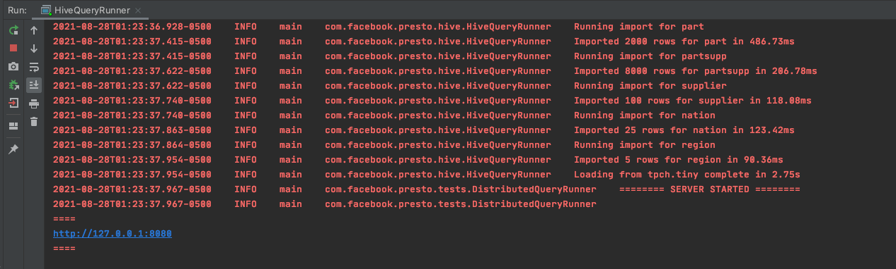

*****************************************
Presto Native Execution - Getting Started
*****************************************

Prerequisites
#############

Git & Github
-------------

1. Signup for a GitHub account if you don't have one already.
3. Set up public key authentication (using ssh keys) for GitHub, if you haven't done so already
4. Make sure you have git installed and works (Run git ---version to confirm)

Java
-----

We will be using JDK8 for Presto.

1. Install JDK8 from `oracle.com <http://www.oracle.com/technetwork/java/javase/downloads/jdk8-downloads-2133151.html>`_
2. Install `Open JDK 11 <https://adoptopenjdk.net/>`_
3. Add this line to your .bash_profile or .zshenv:

.. code-block:: bash

    export JAVA_HOME=$(/usr/libexec/java_home -v 1.8.0)

Source Code
------------

Ensure you have access to the following repositories:

1. `Presto <https://github.com/prestodb/presto>`_
2. `Presto_cpp <https://github.com/facebookexternal/presto_cpp>`_
3. `Velox <https://github.com/facebookincubator/velox>`_

Presto
#########

It is assumed that the reader has some familiarity with Presto, if not please readup on basic terms and architecture
`here <https://prestodb.io/docs/current/overview/concepts.html>`_.

.. image::  images/presto.png
            :align: center

We will setup Java based Presto co-ordinator and a C++ based Presto worker using the Velox library.

Setup Presto
#############

1. Fork `prestodb/presto  <https://github.com/prestodb/presto>`_ repository by clicking on the "Fork" button.

.. image::  images/fork.png
            :align: center

2. Clone the repo to your laptop.

.. code-block:: bash

    git clone https://github.com/<YOUR_GITHUB_USERNAME>/presto.git

Then ensure you set the right upstream.

.. code-block:: bash

    git remote add upstream git@github.com:prestodb/presto.git

3. Setup Maven

If you are on Windows or Linux, look up in the maven docs on how to get maven running on your platform.
If you are on a Mac, use  `Homebrew <http://brew.sh/>`_

.. code-block:: bash

    brew install maven
    mvn --version # Should be 3.5.0

4. Build Presto

Go to presto directory and build:

.. code-block:: bash

        cd presto
        ./mvnw clean install -DskipTests

5. Install IntelliJ

Download and install IntellliJ
You can also use any other IDE however the instructions in this document will only concern IntelliJ.

Setup IntelliJ
###############

1. Open IntelliJ and use ‘Open Existing’ to open the presto project
2. Create run configuration for HiveQueryRunner.
    a. Goto "Run -> Edit Configurations", click to add new Application
    b. Main class: ``com.facebook.presto.hive.HiveQueryRunner``
    c. VM options: ``-ea -Xmx2G -XX:+ExitOnOutOfMemoryError -Duser.timezone=America/Bahia_Banderas -Dhive.security=legacy``
    d. Working directory: ``$MODULE_DIR$``
    e. Use classpath of module: ``presto-hive``

.. image::  images/intelij_setup.png
            :align: center

Upon running this you should see something like the following:

Setup presto_cpp
#################

1. Clone presto_cpp GitHub repo from `here <https://github.com/facebookexternal/presto_cpp>`_
2. Ensure that Velox is checked out as a submodule for presto_cpp
3. This might require you to create a `Personal Access Token <https://docs.github.com/en/github/authenticating-to-github/keeping-your-account-and-data-secure/creating-a-personal-access-token>`_
4. Then run command below and enter your Personal Access Token or password

.. code-block:: bash

    git submodule update --init --recursive

    # Let's ensure we can build presto_cpp

    $cd ../presto_cpp
    $./scripts/setup-macos.sh

    $ make debug

5. Load the project in CLion and build it. Make sure you check the option for `CMake project`. You should see a build directory like this :

.. image::  images/cmake_clion.png
            :align: center

Setup Velox
############

Note: For the purpose of this document, we will just use the submodule inside presto_cpp. Typically though you would checkout Velox independently and carry your work there.

1. Run the following commands if you are setting up on a Mac.

.. code-block:: bash

    $ cd velox
    $ ./scripts/setup-macos.sh

2. Also add the following in your ~/.profile

.. code-block:: bash

    export PATH=$HOME/bin:$HOME/Library/Python/3.7/bin:$PATH

3. Now lets build the project

.. code-block:: bash

    $ make debug

    #[Optional] Run unit tests
    $ make unittest

End to End Run
###############

Let us now try and make a minor modification in Velox and call it from Presto.

Make Changes and Build
-----------------------

1. Lets make some simple change, Consider this set of `changes here <https://github.com/facebookincubator/velox/pull/37/files>`_. Add a similar function, say ``bitwise_xor``.
2. Make your changes inside the Velox subdirectory of ``presto_cpp``.
3. Make sure you can build your changes and that all the unit tests pass.

Add presto_cpp to Presto
--------------------------

We will add presto_cpp as a module to Presto.

1. Click File > New > Module From Existing Sources .. > , Then go to ``presto_cpp/java/presto-native-tests/pom.xml``

2. Now lets create the configuration for HiveExternalQueryRunner.
We will need three env variables for this purpose, so copy the following below and replace the text in bold with your specific text.

Env Variables: ``PRESTO_SERVER=<YOUR_PATH_TO_PRESTO_CPP>/cmake-build-debug/presto_cpp/main/presto_server;DATA_DIR=/Users/<YOUR_USER_NAME>/Desktop;WORKER_COUNT=0``

VM Options:
``-ea -Xmx2G -XX:+ExitOnOutOfMemoryError -Duser.timezone=America/Bahia_Banderas -Dhive.security=legacy``

Your run configuration should look something like below :

.. image::  images/run_configuration.png
            :align: center

NOTE:
    * ``WORKER_COUNT`` is the number of  workers to be launched along with the coordinator. In this case we put 0 as we want to externally launch our own CPP worker from CLion.
    * Use classpath of module: presto-native-tests
    * Launch the HiveExternalQueryRunner.
    * Note discovery URI. Something like ``http://127.0.0.1:54557``. Use the last discovery URI in the InteliJ logs

3. Update presto_cpp configuration:

a. Use discovery URI from the logs above and update the config.properties

b. Now create a run configuration for prestoserver like below:

.. image::  images/run_configuration2.png
            :align: center

Note the program arguments are as below:
``--logtostderr=1 --v=1 --etc_dir=/Users/<PATH_TO_YOUR>/presto_cpp``

Then start the presto_server executable. If all goes well you should see the server connect to the coordinator and see logs like so :

.. image::  images/connect_logs.png
            :align: center

4. Run Presto CLI:

.. code-block:: bash

    $ cd presto/presto-cli/target # Java presto repo
    $ java -jar presto-cli-0.257-SNAPSHOT-executable.jar --catalog hive --schema tpch

Note that 0.257 may change, pick the one exists in this directory
You should be able to connect and run a query from the command line now.
