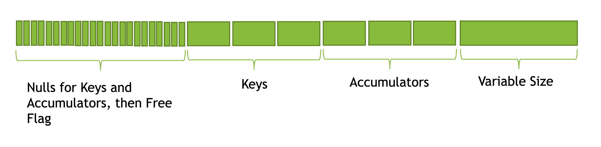

=================================
How to add an aggregate function?
=================================

Aggregate functions are calculated by the HashAggregation operator.
There can be one or more aggregate functions in a single operator.
Here are some examples.

Global aggregation (no grouping keys), single aggregate “count”.

.. code-block:: sql

    	SELECT count(*) FROM t

Global aggregation, two aggregates: “count” and “sum”:

.. code-block:: sql

        SELECT count(*), sum(b) FROM t

Aggregation with three aggregates: “count” and two “sum”s.

.. code-block:: sql

        SELECT a, count(*), sum(b), sum(c) FROM t GROUP BY 1

Aggregation with just one aggregate - “min” - and two grouping keys.

.. code-block:: sql

    	SELECT a, b, min(c) FROM t GROUP BY 1, 2

Typically, aggregations are calculated in two steps: partial aggregation
and final aggregation.

Partial aggregation takes raw data and produces intermediate results. Final
aggregation takes intermediate results and produces the final result. There
are also single and intermediate aggregations that are used in some cases.
Single aggregation is used when data is already partitioned on the grouping
keys and therefore no shuffle is necessary. Intermediate aggregations are used
to combine the results of partial aggregations computed in multiple threads in
parallel to reduce the amount of data sent to the final aggregation stage.

The four types, steps, of aggregation are distinguished solely by the types of
input and output.

========================  ====================    ====================
Step                      Input                   Output
========================  ====================    ====================
**Partial**               Raw Data                Intermediate Results
**Final**                 Intermediate Results    Final Results
**Single**                Raw Data                Final Results
**Intermediate**          Intermediate Results    Intermediate Results
========================  ====================    ====================

In some cases, the calculations performed by partial and final aggregations are
the same. This is the case for the :func:`sum`, :func:`min` and :func:`max`
aggregates. In most cases they are different. For example, partial :func:`count`
aggregate counts incoming values and final :func:count` aggregate sums up partial
counts to produce a total.

The signature of an aggregate function consists of the type of the raw input data,
the type of the intermediate result and the type of the final result.

Memory Layout
-------------

HashAggregation operator stores data in rows. Each row corresponds to a unique combination of grouping key values. Global aggregations store data in a single row.

Aggregate functions can be classified by the type of their accumulators into three groups:

* Fixed width accumulators:
    * :func:`count`, :func:`sum`, :func:`avg`
    * :func:`min`, :func:`max`, :func:`arbitrary` (for fixed-width types)
* Variable width accumulators with append-only semantics:
    * :func:`array_agg`
    * :func:`map_agg`
* Variable width accumulators which can be modified in any way, not just appended to.
    * :func:`min`, :func:`max` (for strings)
    * :func:`arbitrary` (for variable-width types)
    * :func:`approx_percentile`
    * :func:`approx_distinct`

Fixed-width part of the accumulator is stored in the row. Variable-width
part (if exists) is allocated using :doc:`HashStringAllocator <arena>` and a pointer is
stored in the fixed-width part.

A row is a contiguous byte buffer. Given N aggregates, first N / 8 bytes
store the null flags, one bit per aggregate, followed by fixed-width
accumulators.

Aggregate class
---------------

To add an aggregate function,

* Prepare:
    * Figure out what are the input, intermediate and final types.
    * Figure out what are partial and final calculations.
    * Design the accumulator. Make sure the same accumulator can accept both raw
      inputs and intermediate results.
    * Create a new class that extends velox::exec::Aggregate base class
      (see velox/exec/Aggregate.h) and implement virtual methods.
* Register the new function using exec::registerAggregateFunction(...).
* Add tests.
* Write documentation.

Accumulator size
----------------

The implementation of the velox::exec::Aggregate interface can start with *accumulatorFixedWidthSize()* method.

.. code-block:: c++

      // Returns the fixed number of bytes the accumulator takes on a group
      // row. Variable width accumulators will reference the variable
      // width part of the state from the fixed part.
      virtual int32_t accumulatorFixedWidthSize() const = 0;

The HashAggregation operator uses this method during initialization to calculate the total size of the row and figure out offsets at which different aggregates will be storing their data. The operator then calls velox::exec::Aggregate::setOffsets method for each aggregate to specify the location of the accumulator.

.. code-block:: c++

      // Sets the offset and null indicator position of 'this'.
      // @param offset Offset in bytes from the start of the row of the accumulator
      // @param nullByte Offset in bytes from the start of the row of the null flag
      // @param nullMask The specific bit in the nullByte that stores the null flag
      void setOffsets(int32_t offset, int32_t nullByte, uint8_t nullMask)

The base class implements the setOffsets method by storing the offsets in member variables.

.. code-block:: c++

      // Byte position of null flag in group row.
      int32_t nullByte_;
      uint8_t nullMask_;
      // Offset of fixed length accumulator state in group row.
      int32_t offset_;

Typically, an aggregate function doesn’t use the offsets directly. Instead, it uses helper methods from the base class.

To access the accumulator:

.. code-block:: c++

      template <typename T>
      T* value(char* group) const {
        return reinterpret_cast<T*>(group + offset_);
      }

To manipulate the null flags:

.. code-block:: c++

      bool isNull(char* group) const;

      // Sets null flag for all specified groups to true.
      // For any given group, this method can be called at most once.
      void setAllNulls(char** groups, folly::Range<const vector_size_t*> indices);

      inline bool clearNull(char* group);

Initialization
--------------

Once you have accumulatorFixedWidthSize(), the next method to implement is initializeNewGroups().

.. code-block:: c++

      // Initializes null flags and accumulators for newly encountered groups.
      // @param groups Pointers to the start of the new group rows.
      // @param indices Indices into 'groups' of the new entries.
      virtual void initializeNewGroups(
          char** groups,
          folly::Range<const vector_size_t*> indices) = 0;

This method is called by the HashAggregation operator every time it encounters new combinations of the grouping keys. This method should initialize the accumulators for the new groups. For example, partial “count” and “sum” aggregates would set the accumulators to zero. Many aggregate functions would set null flags to true by calling the exec::Aggregate::setAllNulls(groups, indices) helper method.

GroupBy aggregation
-------------------

At this point you have accumulatorFixedWidthSize() and initializeNewGroups() methods implemented. Now, we can proceed to implementing the end-to-end group-by aggregation. We need the following pieces:

* Logic for adding raw input to the accumulator:
    * addRawInput() method.
* Logic for producing intermediate results from the accumulator:
    * extractAccumulators() method.
* Logic for adding intermediate results to the accumulator:
    * addIntermediateResults() method.
* Logic for producing final results from the accumulator:
    * extractValues() method.
* Logic for adding previously spilled data back to the accumulator:
    * addSingleGroupIntermediateResults() method.

Some methods are only used in a subset of aggregation workflows. The following
tables shows which methods are used in which workflows.

.. list-table::
   :widths: 50 25 25 25 25 25
   :header-rows: 1

   * - Method
     - Partial
     - Final
     - Single
     - Intermediate
     - Streaming
   * - addRawInput
     - Y
     - N
     - Y
     - N
     - Y
   * - extractAccumulators
     - Y
     - Y (used for spilling)
     - Y (used for spilling)
     - Y
     - Y
   * - addIntermediateResults
     - N
     - Y
     - N
     - Y
     - Y
   * - extractValues
     - N
     - Y
     - Y
     - N
     - Y
   * - addSingleGroupIntermediateResults
     - N
     - Y
     - Y
     - N
     - N

We start with the addRawInput() method which receives raw input vectors and adds the data to accumulators.

.. code-block:: c++

      // Updates the accumulator in 'groups' with the values in 'args'.
      // @param groups Pointers to the start of the group rows. These are aligned
      // with the 'args', e.g. data in the i-th row of the 'args' goes to the i-th group.
      // The groups may repeat if different rows go into the same group.
      // @param rows Rows of the 'args' to add to the accumulators. These may not be
      // contiguous if the aggregation is configured to drop null grouping keys.
      // This would be the case when aggregation is followed by the join on the
      // grouping keys.
      // @param args Data to add to the accumulators.
      // @param mayPushdown True if aggregation can be pushdown down via LazyVector.
      // The pushdown can happen only if this flag is true and 'args' is a single
      // LazyVector.
      virtual void addRawInput(
          char** groups,
          const SelectivityVector& rows,
          const std::vector<VectorPtr>& args,
          bool mayPushdown = false) = 0;

addRawInput() method would use DecodedVector’s to decode the input data. Then, loop over rows to update the accumulators. It is a good practice to define a member variable of type DecodedVector for each input vector. This allows for reusing the memory needed to decode the inputs between batches of input.

After implementing the addRawInput() method, we proceed to adding logic for extracting intermediate results.

.. code-block:: c++

      // Extracts partial results (used for partial and intermediate aggregations).
      // @param groups Pointers to the start of the group rows.
      // @param numGroups Number of groups to extract results from.
      // @param result The result vector to store the results in.
      virtual void
      extractAccumulators(char** groups, int32_t numGroups, VectorPtr* result) = 0;

Next, we implement the addIntermediateResults() method that receives intermediate results and updates accumulators.

.. code-block:: c++

      virtual void addIntermediateResults(
          char** groups,
          const SelectivityVector& rows,
          const std::vector<VectorPtr>& args,
          bool mayPushdown = false) = 0;

Next, we implement the extractValues() method that extracts final results from the accumulators.

.. code-block:: c++

      // Extracts final results (used for final and single aggregations).
      // @param groups Pointers to the start of the group rows.
      // @param numGroups Number of groups to extract results from.
      // @param result The result vector to store the results in.
      virtual void
      extractValues(char** groups, int32_t numGroups, VectorPtr* result) = 0;

Finally, we implement the addSingleGroupIntermediateResults() method that is used to add previously spilled data back to the accumulator.

.. code-block:: c++

      // Updates the single final accumulator from intermediate results for global
      // aggregation.
      // @param group Pointer to the start of the group row.
      // @param rows Rows of the 'args' to add to the accumulators. These may not
      // be contiguous if the aggregation has mask. 'rows' is guaranteed to have at
      // least one active row.
      // @param args Intermediate results produced by extractAccumulators().
      // @param mayPushdown True if aggregation can be pushdown down via LazyVector.
      // The pushdown can happen only if this flag is true and 'args' is a single
      // LazyVector.
      virtual void addSingleGroupIntermediateResults(
          char* group,
          const SelectivityVector& rows,
          const std::vector<VectorPtr>& args,
          bool mayPushdown) = 0;

GroupBy aggregation code path is done. We proceed to global aggregation.

Global aggregation
------------------

Global aggregation is similar to group-by aggregation, but there is only one group and one accumulator. After implementing group-by aggregation, the only thing needed to enable global aggregation is to implement addSingleGroupRawInput() method (addSingleGroupIntermediateResults() method is already implemented as it is used for spilling group by).

.. code-block:: c++

      // Updates the single accumulator used for global aggregation.
      // @param group Pointer to the start of the group row.
      // @param allRows A contiguous range of row numbers starting from 0.
      // @param args Data to add to the accumulators.
      // @param mayPushdown True if aggregation can be pushdown down via LazyVector.
      // The pushdown can happen only if this flag is true and 'args' is a single
      // LazyVector.
      virtual void addSingleGroupRawInput(
          char* group,
          const SelectivityVector& allRows,
          const std::vector<VectorPtr>& args,
          bool mayPushdown) = 0;

Spilling is not helpful for global aggregations, hence, it is not supported. The
following table shows which methods are used in different global aggregation
workflows.

.. list-table::
   :widths: 50 25 25 25 25 25
   :header-rows: 1

   * - Method
     - Partial
     - Final
     - Single
     - Intermediate
     - Streaming
   * - addSingleGroupRawInput
     - Y
     - N
     - Y
     - N
     - Y
   * - extractAccumulators
     - Y
     - N
     - N
     - Y
     - Y
   * - addSingleGroupIntermediateResults
     - N
     - Y
     - N
     - Y
     - Y
   * - extractValues
     - N
     - Y
     - Y
     - N
     - Y

Factory function
----------------

We can now write a factory function that creates an instance of the new
aggregation function and register it by calling exec::registerAggregateFunction
(...) and specifying function name and signatures.

HashAggregation operator uses this function to create an instance of the
aggregate function. A new instance is created for each thread of execution. When
partial aggregation runs on 5 threads, it uses 5 instances of each aggregate
function.

Factory function takes core::AggregationNode::Step
(partial/final/intermediate/single) which tells what type of input to expect,
input type and result type.

.. code-block:: c++

        bool registerApproxPercentile(const std::string& name) {
          std::vector<std::shared_ptr<exec::AggregateFunctionSignature>> signatures;
          ...

          exec::registerAggregateFunction(
              name,
              std::move(signatures),
              [name](
                  core::AggregationNode::Step step,
                  const std::vector<TypePtr>& argTypes,
                  const TypePtr& resultType) -> std::unique_ptr<exec::Aggregate> {
                if (step == core::AggregationNode::Step::kIntermediate) {
                  return std::make_unique<ApproxPercentileAggregate<double>>(
                      false, false, VARBINARY());
                }

                auto hasWeight = argTypes.size() == 3;
                TypePtr type = exec::isRawInput(step) ? argTypes[0] : resultType;

                switch (type->kind()) {
                  case TypeKind::BIGINT:
                    return std::make_unique<ApproxPercentileAggregate<int64_t>>(
                        hasWeight, resultType);
                  case TypeKind::DOUBLE:
                    return std::make_unique<ApproxPercentileAggregate<double>>(
                        hasWeight, resultType);
                  ...
                }
              });
          return true;
        }

        static bool FB_ANONYMOUS_VARIABLE(g_AggregateFunction) =
            registerApproxPercentile(kApproxPercentile);

Use FunctionSignatureBuilder to create FunctionSignature instances which
describe supported signatures. Each signature includes zero or more input
types, an intermediate result type and final result type.

FunctionSignatureBuilder and FunctionSignature support Java-like
generics, variable number of arguments and lambdas. See more in
:ref:`function-signature` section of the :doc:`scalar-functions` guide.

Here is an example of signatures for the :func:`approx_percentile` function. This
functions takes value argument of a numeric type, an optional weight argument
of type INTEGER, and a percentage argument of type DOUBLE. The intermediate
type does not depend on the input types and is always VARBINARY. The final
result type is the same as input value type.

.. code-block:: c++

        for (const auto& inputType :
               {"tinyint", "smallint", "integer", "bigint", "real", "double"}) {
            // (x, double percentage) -> varbinary -> x
            signatures.push_back(exec::AggregateFunctionSignatureBuilder()
                                     .returnType(inputType)
                                     .intermediateType("varbinary")
                                     .argumentType(inputType)
                                     .argumentType("double")
                                     .build());

            // (x, integer weight, double percentage) -> varbinary -> x
            signatures.push_back(exec::AggregateFunctionSignatureBuilder()
                                     .returnType(inputType)
                                     .intermediateType("varbinary")
                                     .argumentType(inputType)
                                     .argumentType("bigint")
                                     .argumentType("double")
                                     .build());
          }

Testing
-------

It is time to put all the pieces together and test how well the new function
works.

Use AggregationTestBase from velox/aggregates/tests/AggregationTestBase.h as a
base class for the test.

If the new aggregate function is supported by `DuckDB
<https://duckdb.org/docs/sql/aggregates>`_, you can use DuckDB to check
results. In this case you specify input data, grouping keys, a list of
aggregates and a SQL query to run on DuckDB to calculate the expected results
and call helper function testAggregates defined in AggregationTestBase class.
Grouping keys can be empty for global aggregations.

.. code-block:: c++

    // Global aggregation.
    testAggregations(vectors, {}, {"sum(c1)"}, "SELECT sum(c1) FROM tmp");

    // Group by aggregation.
    testAggregations(
        vectors, {"c0"}, {"sum(c1)"}, "SELECT c0, sum(c1) FROM tmp GROUP BY 1");

If the new function is not supported by DuckDB, you need to specify the expected
results manually.

.. code-block:: c++

    // Global aggregation.
    testAggregations(vectors, {}, {"map_union(c1)"}, expectedResult);

    // Group by aggregation.
    testAggregations(vectors, {"c0"}, {"map_union(c1)"}, expectedResult);

Under the covers, testAggregations method generates multiple different but
logically equivalent plans, executes these plans, verifies successful
completion and compares the results with DuckDB or specified expected results.

The following query plans are being tested.

* Partial aggregation followed by final aggregation. Query runs
  single-threaded.
* Single aggregation. Query runs single-threaded.
* Partial aggregation followed by intermediate aggregation followed by final
  aggregation. Query runs single-threaded.
* Partial aggregation followed by local exchange on the grouping keys followed
  by final aggregation. Query runs using 4 threads.
* Local exchange using round-robin repartitioning followed by partial
  aggregation followed by local exchange on the grouping keys followed by
  final aggregation with forced spilling. Query runs using 4 threads.

Query run with forced spilling is enabled only for group-by aggregations and
only if `allowInputShuffle_` flag is enabled by calling allowInputShuffle
() method from the SetUp(). Spill testing requires multiple batches of input.
To split input data into multiple batches we add local exchange with
round-robin repartitioning before the partial aggregation. This changes the order
in which aggregation inputs are processed, hence, query results with spilling
are expected to be the same as without spilling only if aggregate functions used
in the query are not sensitive to the order of inputs. Many functions produce
the same results regardless of the order of inputs, but some functions may return
different results if inputs are provided in a different order. For
example, :func:`arbitrary`, :func:`array_agg`, :func:`map_agg` and
:func:`map_union` functions are sensitive to the order of inputs,
and :func:`min_by` and :func:`max_by` functions are sensitive to the order of
inputs in the presence of ties.

Function names
--------------

Same as scalar functions, aggregate function names are case insensitive. The names
are converted to lower case automatically when the functions are registered and
when they are resolved for a given expression.

Documentation
-------------

Finally, document the new function by adding an entry to velox/docs/functions/aggregate.rst

You can see the documentation for all functions at :doc:`../functions/aggregate` and read about how documentation is generated at https://github.com/facebookincubator/velox/tree/main/velox/docs#velox-documentation

Accumulator
-----------

Variable-width accumulators need to use :doc:`HashStringAllocator <arena>` to allocate memory. An instance of the allocator is available in the base class: *velox::exec::Aggregate::allocator_*.

Sometimes you’ll need to create a custom accumulator. Sometimes one of the existing accumulators would do the jobs.

SingleValueAccumulator used by :func:`min`, :func:`max` and :func:`arbitrary` functions can be used to store a single value of variable-width type, e.g. string, array, map or struct.

ValueList accumulator used by :func:`array_agg` and :func:`map_agg` accumulates a list of values. This is an append-only accumulator.

An StlAllocator defined in velox/exec/HashStringAllocator.h can be used to make STL containers (e.g. std::vector) backed by memory allocated via the HashStringAllocator. StlAllocator is not an accumulator itself, but can be used to design accumulators that use STL containers. It is used by :func:`approx_percentile` and :func:`approx_distinct`.

Memory allocated from the HashStringAllocator needs to be released in the destroy() method. See velox/aggregates/ArrayAgg.cpp for an example.

.. code-block:: c++

      void destroy(folly::Range<char**> groups) override {
        for (auto group : groups) {
          if (auto header = value<ArrayAccumulator>(group)->elements.begin()) {
            allocator_->free(header);
          }
        }
      }

End-to-End Testing
------------------

To confirm that aggregate function works end to end as part of query, update testAggregations() test in TestHiveAggregationQueries.java in presto_cpp repo to add a query that uses the new function.

.. code-block:: java

    assertQuery("SELECT orderkey, array_agg(linenumber) FROM lineitem GROUP BY 1");
