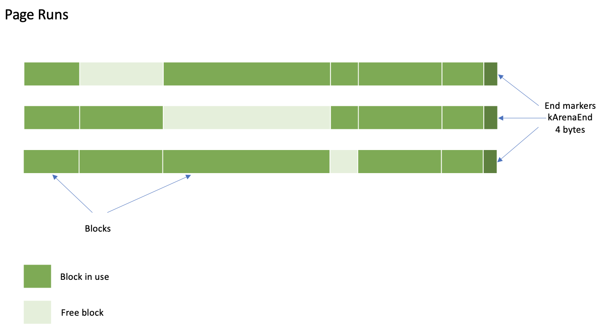
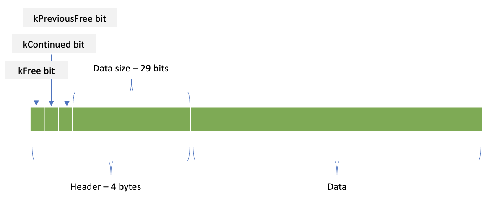
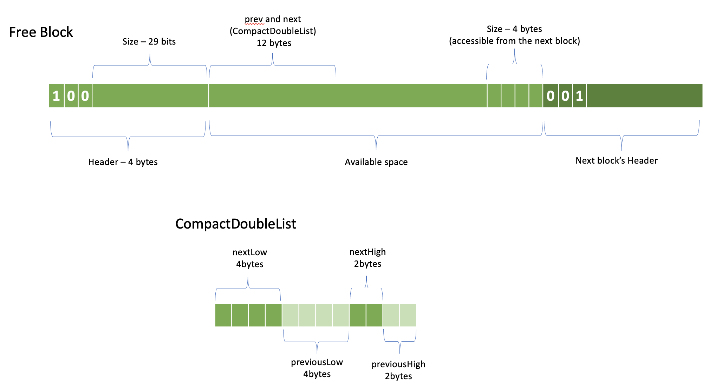
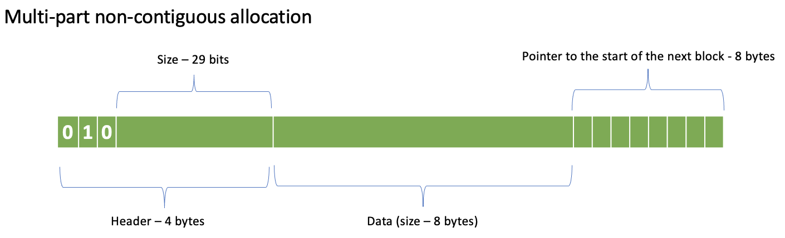

================
Arena Allocation
================

exec::HashStringAllocator implements an arena backed by memory::Allocation
and supports contiguous and non-contiguous allocations. It is used to store
variable width accumulators for the aggregate functions, hash tables for joins
and aggregations. It is also used to back byte streams used to serialize and
deserialize shuffle data.

This implementation is inspired by `TLSF: a New Dynamic Memory Allocator for
Real-Time Systems <http://www.gii.upv.es/tlsf/files/ecrts04_tlsf.pdf>`_ paper and
`GitHub implementation <https://github.com/mattconte/tlsf>`_.

If you want to implement aggregate functions with variable width accumulators,
it would be helpful to understand the HashStringAllocator.

Layout
------

Memory is allocated in standard size contiguous runs of 4KB pages. The available
sizes are: 4, 8, 16, 32, 64, 128, 256 pages. The minimum run is 16KB = 4 pages
of 4KB each. Individual blocks are then allocated from the page runs.

exec::HashStringAllocator writes a 4 bytes end marker (kArenaEnd) at the end of
each page run. Blocks are allocated one after another. Each block starts with a
4 bytes header which contains 1-bit flags and size. kFree bit indicates whether
a block is free. kContinued indicates a block in a multi-part non-contiguous
allocation. kPreviousFree indicates that a block immediately before this block
is free,

When blocks are freed, adjacent free blocks are coalesced into larger free
blocks.

Free blocks are organized into a circular doubly linked list. 6-byte pointers to
next and previous free blocks are stored in 12 bytes immediately following the
header. The size of the free block is stored in the header and also in the last
4 bytes of the block.

The size of the free block written at the end of the block is used to coalesce
adjacent free blocks. When a block is freed, we check if the block immediately
before is free using kPreviousFree bit. We find the size of the preceding free
block by reading 4 bytes before the header of the current block. We then
calculate the start of the preceding free block by subtracting its size and 4
bytes for the header from the start of the current block. To coalesce the two
blocks we calculate the combined size of the blocks and write it into the header
of the first block. We also store the new size in the last 4 bytes of the second
block. The next and previous links stored in CompactDoubleList do not need
updating.

Blocks in multi-part non-contiguous allocations use kContinued bit to indicate
the presence of the “next” block and store the pointer to that block in the last
8 bytes.

API
---

Allocate() and free() methods allocate and free continuous blocks of specified
size. When the free() method is called on the first block in a multi-part
non-contiguous allocation, it frees all the blocks in that allocation.

.. code-block:: c++

      // Allocates 'size' contiguous bytes preceded by a Header. Returns
      // the address of Header.
      Header* allocate(int32_t size);

      // Adds the allocation of 'header' and any extensions (if header has
      // kContinued set) to the free list.
      void free(Header* header);

StlAllocator, an allocator backed by HashStringAllocator that can be used with
STL containers, is implemented using the above allocate() and free() methods.

NewWrite(), extendWrite() and finishWrite() methods allow for serializing
variable width data whose size is not known in advance using ByteOutputStream. When
using ByteOutputStream, the underlying data may come from multiple non-contiguous
blocks. ByteOutputStream transparently manages allocation of additional blocks by
calling HashStringAllocator::newRange() method.

.. code-block:: c++

      // Sets stream to write to this pool. The write can span multiple
      // non-contiguous runs. Each contiguous run will have at least
      // kMinContiguous bytes of contiguous space. finishWrite finalizes
      // the allocation information after the write is done.
      // Returns the position at the start of the allocated block.
      Position newWrite(ByteOutputStream& stream, int32_t preferredSize = kMinContiguous);

      // Completes a write prepared with newWrite or
      // extendWrite. Up to 'numReserveBytes' unused bytes, if available, are left
      // after the end of the write to accommodate another write. Returns the
      // position immediately after the last written byte.
      Position finishWrite(ByteOutputStream& stream, int32_t numReserveBytes);

      // Sets 'stream' to write starting at 'position'. If new ranges have to
      // be allocated when writing, headers will be updated accordingly.
      void extendWrite(Position position, ByteOutputStream& stream);

The prepareRead() method allows deserializing the data using ByteInputStream.

.. code-block:: c++

    // Sets 'stream' to range over the data in the range of 'header' and
    // possible continuation ranges.
    static void prepareRead(
        const Header* header,
        ByteInputStream& stream);

Examples of Usage
-----------------

Variable-width accumulators of aggregate functions use HashStringAllocator to
allocate memory.

SingleValueAccumulator
^^^^^^^^^^^^^^^^^^^^^^

SingleValueAccumulator used by :func:`min`, :func:`max` and :func:`arbitrary` functions stores a single value of variable-width type, e.g. string, array, map or struct.

To write the first value, the accumulator allocates a new block using newWrite()
and stores the position to the start of the block in a member variable. When
re-writing the value, the accumulator calls extendWrite() and provides the
position to the start of the block. This way the data is re-written in-place.
The accumulator calls finishWrite() after writing the value.

.. code-block:: c++

        // Write first value
        ByteOutputStream stream(allocator);
        auto begin = allocator->newWrite(stream);
        // ... write to the stream
        allocator->finishWrite(stream);

        // Update the value
        ByteOutputStream stream(allocator);
        auto begin = allocator->extendWrite(begin, stream);
        // ... write to the stream
        allocator->finishWrite(stream);

The accumulator uses prepareRead() to read the data back using ByteInputStream.

.. code-block:: c++

        ByteInputStream stream;
        exec::HashStringAllocator::prepareRead(begin, stream);
        // … read from the stream

ValueList
^^^^^^^^^

ValueList append-only accumulator used by :func:`array_agg` and :func:`map_agg` accumulates a
list of values. ValueListReader allows for copying the values from the ValueList
into a flat Vector.

This accumulator starts by allocating the first block using newWrite() and
stores the position to the start of that first block. It also stores the
position after the last write returned from the finishWrite() call. To append
data, the accumulator calls entendWrite() with the position after the last
write.

.. code-block:: c++

        // Write first value
        ByteOutputStream stream(allocator);
        auto begin = allocator->newWrite(stream);
        // ... write to the stream
        auto current = allocator->finishWrite(stream);

        // Update the value
        ByteOutputStream stream(allocator);
        auto begin = allocator->extendWrite(current, stream);
        // ... write to the stream
        allocator->finishWrite(stream);

StlAllocator
^^^^^^^^^^^^

An StlAllocator defined in velox/exec/HashStringAllocator.h can be used to make
STL containers (e.g. std::vector) backed by memory allocated via the
HashStringAllocator. StlAllocator is not an accumulator itself, but can be used
to design accumulators that use STL containers. It is used by :func:`approx_percentile`
and :func:`approx_distinct`.

.. code-block:: c++

        std::vector<double, exec::StlAllocator<double>> values{exec::StlAllocator<double>(allocator)};
