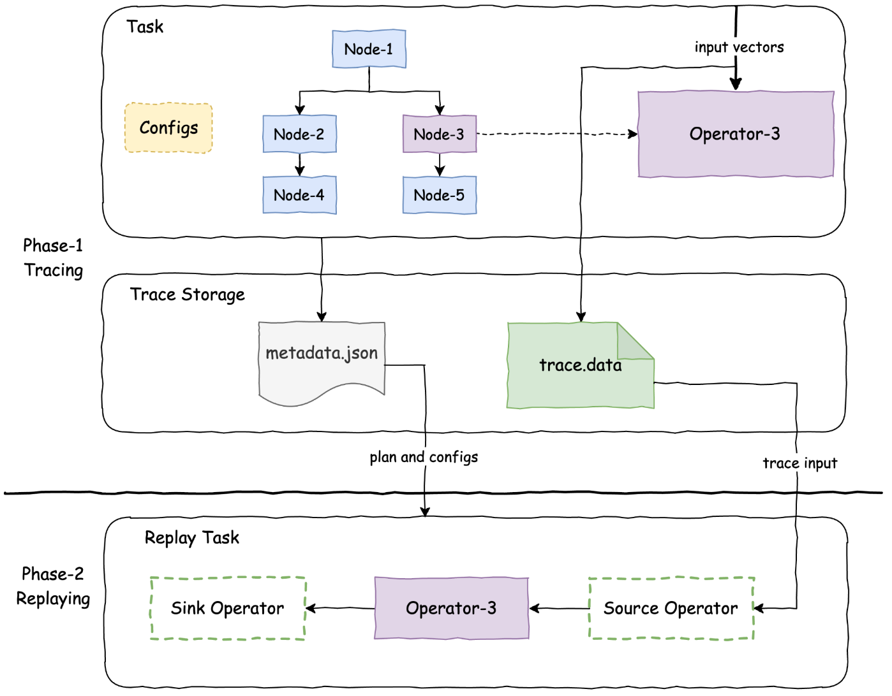

=======
Tracing
=======

Background
----------

The query trace tool helps analyze and debug query performance and correctness
issues. It helps prevent interference from the test noises in a production
environment (such as storage, network etc) by allowing replay of a part of the
query plan and data set in an isolated environment such as a local machine.
This is useful for debugging query performance debugging as we don't have to
replay the whole query in a production environment.

How Tracing Tool Works
----------------------

The tracing process consists of two phases: tracing and replaying.

**Tracing Phase**

- When the query starts, the task records the metadata including query plan fragment,
  query configuration, and connector properties.
- During the query execution, each traced operator records the input vectors and saves
  in the specified storage location.
- The metadata are serialized using json format and operator data inputs are serialized
  using `Presto serializer <https://prestodb.io/docs/current/develop/serialized-page.html>`_.

**Replaying Phase**

1. Read and deserialize the recorded query plan in tracing phase, extract the target plan
   node, and assemble a plan fragment with a customized source and sink nodes. The source
   node reads the input from the serialized operator inputs on storage and sink operator
   prints or logs out the execution stats.
2. Build a task with the assembled plan fragment in step 1.
3. Apply the recorded query configuration and connector properties to replay the task with
   the same input and configuration as in production.

**NOTE**: The Presto serialization doesn't always preserve vector encoding (lazy vectors are
loaded, nested dictionaries are flattened). Hence, replay may differ from the original run.

Tracing Framework
-----------------

The tracing framework consists of three components:

1. **Metadata and Data Writer**: metadata writer and the data writer.
2. **Metadata and Data Reader**: metadata reader and the data reader.
3. **Query Trace Replayer**: display query summaries or replay the
   execution of the target operator.

Query Trace Writer
^^^^^^^^^^^^^^^^^^

**QueryMetadataWriter** records the query metadata during task creation,
serializes, and writes them into a file in JSON format. There are two kinds
of metadata:

- Query configurations and connector properties are specified by the user per query.
  They can be serialized as JSON map objects (key-value pairs).
- Plan fragment of the task (also known as a plan node tree). It can be serialized
  as a JSON object, which is already supported in Velox.

**QueryDataWriter** records the input vectors from the target operator, which are
serialized and written as a binary file.

Query Trace Reader
^^^^^^^^^^^^^^^^^^

**QueryMetadataReader** can load the query metadata JSON file, and extract the query
configurations, connector properties, and the plan fragment.

**QueryDataReader** can read and deserialize the input vectors of the target operator.
It is used as the utility to replay the input data as a source operator in the target
operator replay.

**NOTE**: `QueryDataWriter` serializes and flushes the input vectors in batches,
allowing it to replay the input process using the same sequence of batches.

Query Trace Util
^^^^^^^^^^^^^^^^

- Create tracing directories.
- Get query summaries.
- Provide utilities to extract the target plan node, and assemble a plan fragment with
  customized trace source and sink node with it.

Query Trace Tool
----------------

The query trace tool leverages the trace reader to display query summaries and replay the
execution of specific operators (TBD).

Tracing tools Usage
^^^^^^^^^^^^^^^^^^^

.. code-block:: c++

  query_replayer --root $root_dir --summary --pretty

It would show something as the follows

.. code-block:: c++

  ++++++Query trace summary++++++
  Number of tasks: 1
  Task ids: task-1
  ++++++Query configs and plan:++++++
  {
  "planNode":{
  "filter":{},
  "outputType":{...},
  "nullAware":false,
  "sources":[{...}, {...}],
  "leftKeys":[],
  "joinType":"INNER",
  "id":"5",
  "name":"HashJoinNode"
  },
  "connectorProperties":{...},
  "queryConfig":{...}
  }

Here is a full list of supported command line arguments.

* ``--usage``: Show the usage.
* ``--root``: Root dir of the query tracing.
* ``--summary``: Show the summary of the tracing including number of tasks and task ids.
  It also print the query metadata including query configs, connectors properties, and query plan in JSON format.
* ``--short_summary``: Only show number of tasks and task ids.
* ``--task_id``: Specify the target task id, if empty, show the summary of all the traced query tasks.

Future Work
-----------

https://github.com/facebookincubator/velox/issues/9668
