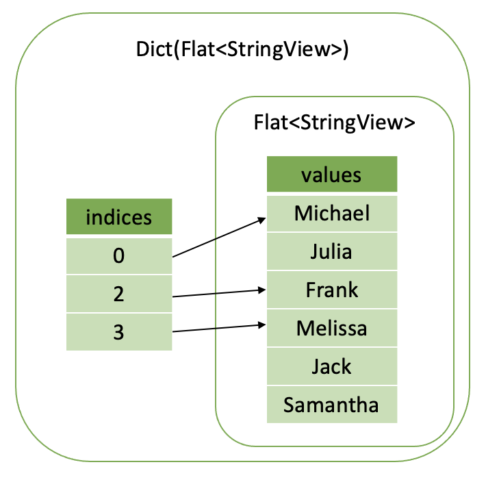

===================
Dictionary Encoding
===================

Introduction
------------

Velox makes extensive use of Dictionary encoding to avoid data copying.
Dictionary encoding is used to compactly represent repeated values and to
represent a subset of rows without copying data.

Dictionary vector consists of a nulls buffer, indices buffer and a base vector.

Let’s say we have a table of people’s favourite colors. First column is a
person’s name. Second column is the person’s favorite color.

========    ======
name        color
========    ======
Michael     red
Julia       blue
Frank       red
Melissa     red
Jack        blue
Samantha    green
========    ======

Color column has lots of repeated values and can be represented as a dictionary
vector. First, we make a flat base vector containing only distinct colors:
[red, blue, green]. Then we map each color to an index into the base vector:
0 - red, 1 - blue, 2 - green. Using this mapping, we convert the original values
into an array of indices: [0, 1, 0, 0, 1, 2]. Finally, we combine the indices and
a base vector to make a dictionary vector.

.. image:: images/dictionary-repeated.png
  :width: 300

Now, let’s say we want to represent a subset of the people whose favourite color
is red. We can take the original flat vector of names and wrap it in a dictionary
vector with indices pointing only to rows where color = “red”, e.g. rows 0, 2 and 3.

As you can see, dictionary vectors can be used to represent both cardinality increase
and cardinality reduction. The array of indices can be smaller or larger than the size
of the base vector. Indices may or may not repeat.

We say that the dictionary vector wraps the base vector. Any vector can be wrapped in
a dictionary vector, hence, a vector may have many layers of dictionaries on top of
the base vector.

Some examples of the operations that create dictionary vectors are:

* ORC Reader produces dictionary vectors for columns with lots of repeated values.
* Filter operator uses dictionary encoding to represent a subset of the input rows that passed the filter.
* Join operator uses dictionary encoding to represent cardinality change for the probe columns.
* Unnest operator will use dictionary encoding to “duplicate” the input rows without copying the data.
* Functions use dictionary encoding to represent the result as a subset of the input. E.g. :func:`element_at` function and subscript operator for arrays and maps use dictionary encoding to represent the result as a subset of the input array elements or map values.

A filter applied to a dictionary column produced by the ORC reader makes a dictionary
vector two layers deep: Dict(Dict(Flat)). A projection using a function like :func:`element_at`
may add another layer of dictionary on top: Dict(Dict(Dict(Flat))).

Nulls
-----

Dictionary vector has a nulls buffer separate from the nulls buffer of
the base vector. This allows dictionary vectors to add nulls to a base vector
which may not have nulls. This flexibility comes in handy in the
implementation of the element_at function which returns null if the specified
element doesn’t exist.

Nulls buffer in a dictionary vector is optional and can be omitted if the
dictionary doesn’t add nulls. A dictionary vector without the nulls buffer may
still represent null values if the base vector has nulls.

In the presence of the nulls buffer, values in the indices buffer
corresponding to null entries are undefined.

BaseVector::wrapInDictionary() is a convenience method that makes a dictionary
vector from a nulls buffer, an indices buffer and a base vector.

.. _decoded-vector:

DecodedVector
-------------

As we’ve seen a vector can have many layers of dictionaries: Dict(Dict(....Dict
(Flat)...)). How do we access the data in such a vector? We use DecodedVector,
which works for all types, or SimpleVector<T>, which works only for primitive
types.

Here is an example of using SimpleVector<int32_t> to access elements of a vector
of type INTEGER:

.. code-block:: c++

        auto intVector = vector->as<SimpleVector<int32_t>>();
        rows.applyToSelected([&] (auto row) {
            if (intVector->isNullAt(row)) {
                // Process null value.
            } else {
                auto value = intVector->valueAt(row);
                // Process non-null value of type int32_t.
            }
            return true;
        });

The isNullAt(index) and valueAt(index) methods of SimpleVector<T> are virtual
and have different implementations for different encodings. For dictionary
encoding, these methods recursively call methods of the base vectors until they
read the innermost flat vector that returns the value. This is quite inefficient
and hence performance-sensitive code paths should use DecodedVector instead.

DecodedVector combines multiple wrappings into at most one. It takes any vector
and produces a reference to the flat base vector and an array of indices into
that vector.  DecodedVector also produces a combined nulls buffer from the
nulls buffers of the dictionary encodings and the base vector.

Note: It might be easy to confuse flat base vector mentioned above with a
FlatVector<T> template class which represents flat vectors of primitive types.
Each vector has a type and encoding. The type refers to the type of values the
vector stores, e.g. INTEGER, MAP(INTEGER, DOUBLE), ARRAY(REAL). The encoding
refers to the way the values are compacted, e.g. flat, dictionary, constant.
ArrayVector, MapVector and RowVector classes represent flat vectors of types
ARRAY, MAP and ROW respectively. FlatVector<T> represents flat vectors of
primitive types. Flat, dictionary and constant encodings apply to all types.

For scalar types, valueAt(index) and isNullAt(index) methods provide access to
individual null flags and values. Here is an example of decoding and accessing
the values of a vector of type INTEGER:

.. code-block:: c++

        DecodedVector decoded(vector, rows);
        rows.applyToSelected([&] (auto row) {
            if (decoded.isNullAt(row)) {
                // Process null value.
            } else {
                auto value = decoded.valueAt<int32_t>(row);
                // Process non-null value of type int32_t.
            }
            return true;
        });

DecodedVector takes a vector to decode and a SelectivityVector that
specifies a subset of rows to decode. This ensures that decoding is performed
only for the necessary rows.

For complex types, base() and indices() methods provide access to the base
vector and row mapping into the base vector. isNullAt(index) method can still
be used to check for top level nulls. Here is an example of decoding and
accessing the values of a vector of type ARRAY(INTEGER).

.. code-block:: c++

        // Decode top-level array vector.
        DecodedVector decoded(vector, rows);
        auto base = decoded.base()->as<ArrayVector>();
        auto indices = decoded.indices();

        // Access individual elements via SimpleVector<int32_t>. This is convenient, but not efficient.
        auto elements = base->elements()->as<SimpleVector<int32_t>>();

        rows.applyToSelected([&] (auto row) {
            if (decoded.isNullAt(row)) {
                // Process null array.
            } else {
                auto size = base->sizeAt(indices[row]);
                auto offset = base->offsetAt(indices[row]);
                // Process array elements stored in [offset, offset + size) slots of the elements vector.

                for (auto i = 0; i < size; ++i) {
                   if (elements->isNullAt(offset + i)) {
                      // Process null element of the array.
                   } else {
                      auto value = elements->valueAt(offset + i);
                      // Process non-null element of the array of type int32_t.
                   }
                }
            }
            return true;
        });

Note: DecodedVector applied to complex type vectors processes wrappings only
for the top-level vector, e.g. array/map/row. Child vectors of the base vector
(e.g. elements vector of an array, keys and values vectors of a map, fields of
a row) are left unmodified. It may be necessary to decode these separately.

In the example above, we access the array elements using virtual methods
isNullAt(index) and valueAt(index) of the SimpleVector<int32_t>. To avoid
virtual function calls in performance-sensitive parts of the code, we can use
DecodedVector for the elements vector like so.

.. code-block:: c++

        // Decode top-level array vector.
        DecodedVector decoded(vector, rows);
        auto base = decoded.base()->as<ArrayVector>();
        auto indices = decoded.indices();

        // Decode nested elements vector.
        SelectivityVector nestedRows(base->elements()->size());
        DecodedVector decodedElements(base->elements(), nestedRows);

        rows.applyToSelected([&] (auto row) {
            if (decoded.isNullAt(row)) {
                // Process null array.
            } else {
                auto size = base->sizeAt(indices[row]);
                auto offset = base->offsetAt(indices[row]);
                // Process array elements stored in [offset, offset + size) slots of the elements vector.

                for (auto i = 0; i < size; ++i) {
                   if (decodedElements.isNullAt(offset + i)) {
                      // Process null element of the array.
                   } else {
                      auto value = decodedElements.valueAt<int32_t>(offset + i);
                      // Process non-null element of the array of type int32_t.
                   }
                }
            }
            return true;
        });

When working with maps, we would need to decode both keys and values nested
vectors. Here is what this might look like for a vector of type MAP(INTEGER, DOUBLE).

.. code-block:: c++

        // Decode top-level map vector.
        DecodedVector decoded(vector, rows);
        auto base = decoded.base()->as<MapVector>();
        auto indices = decoded.indices();

        // Decode nested keys and values vectors.
        SelectivityVector nestedRows(base->mapKeys()->size());
        DecodedVector decodedKeys(*base->mapKeys(), nestedRows);
        DecodedVector decodedValues(*base->mapValues(), nestedRows);

        rows.applyToSelected([&] (auto row) {
            if (decoded.isNullAt(row)) {
                // Process null map.
            } else {
                auto size = base->sizeAt(indices[row]);
                auto offset = base->offsetAt(indices[row]);
                // Process map elements stored in [offset, offset + size) slots of the keys and values vectors.

                for (auto i = 0; i < size; ++i) {
                   std::optional<int32_t> key;
                   std::optional<double> value;
                   if (!decodedKeys.isNullAt(offset + i)) {
                      key = decodedKeys.valueAt<int32_t>(offset + i);
                   }
                   if (!decodedValues.isNullAt(offset + i)) {
                      value = decodedValues.valueAt<double>(offset + i);
                   }
                   // Process (key, value) pair.
                }
            }
            return true;
        });

DecodedVector transparently handles all kinds of wrappings, e.g.
constant, dictionary and sequence, but detailed description of these is out of
scope for this article.

Optimizations
-------------

Memory Reuse
^^^^^^^^^^^^

DecodedVector allocates memory. Reuse instances of DecodedVector to reduce
memory allocations.

Use LocalDecodedVector when implementing a VectorFunction. LocalDecodedVector
fetches an instance of DecodedVector from a pool of reusable instances stored
in EvalCtx. The instance is automatically returned to the pool when
LocalDecodedVector goes out of scope.

.. code-block:: c++

        LocalDecodedVector holder(context, vector, rows);
        auto decoded = holder.get();

When implementing an aggregate function, use a DecodedVector member variable
for each input vector. There will be a few variables for raw input vectors and
a few more for intermediate input vectors.

.. code-block:: c++

        class ApproxDistinctAggregate : public exec::Aggregate {

              // partial aggregation
              void decodeArguments(
                  const SelectivityVector& rows,
                  const std::vector<VectorPtr>& args) {
                decodedValue_.decode(*args[0], rows, true);
                if (args.size() > 1) {
                  decodedMaxStandardError_.decode(*args[1], rows, true);
                  checkSetMaxStandardError();
                }
              }

              // final aggregation
              decodedHll_.decode(*args[0], rows, true);

          DecodedVector decodedValue_;
          DecodedVector decodedMaxStandardError_;
          DecodedVector decodedHll_;
        }

Flat and Constant Encodings
^^^^^^^^^^^^^^^^^^^^^^^^^^^

Often it is useful to provide a separate code path for constant or flat
vectors with no nulls. Use DecodedVector::isConstantMapping() and
DecodedVector::isFlatMapping() to tell whether the vector is constant or flat
and DecodedVector::mayHaveNulls() to tell whether the vector has any nulls in
the rows of interest.

For example, here is an optimized calculation of a sum of integer values.

.. code-block:: c++

        int32_t sum = 0;

        if (!decoded.mayHaveNulls() && decoded.isFlatMapping()) {
            auto rawValues = decoded.values<int32_t>();

            // Compiler can autoSIMDize this loop
            rows.applyToSelected([&] (auto row) {
                sum += rawValues[row];
                return true;
            });
            return sum;
        }

        if (decoded.isConstantMapping()) {
          if (!decoded.isNullAt(0)) {
            sum += rows.countSelected() * decoded.valueAt(0);
          }
          return sum;
        }

        rows.applyToSelected([&] (auto row) {
            if (!decoded.isNullAt(row)) {
                sum += decoded.valueAt<int32_t>(row);
            }
            return true;
        });
        return sum;
