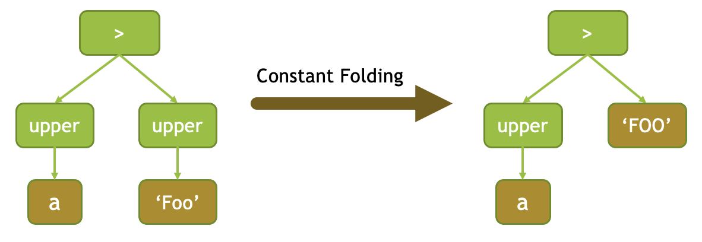
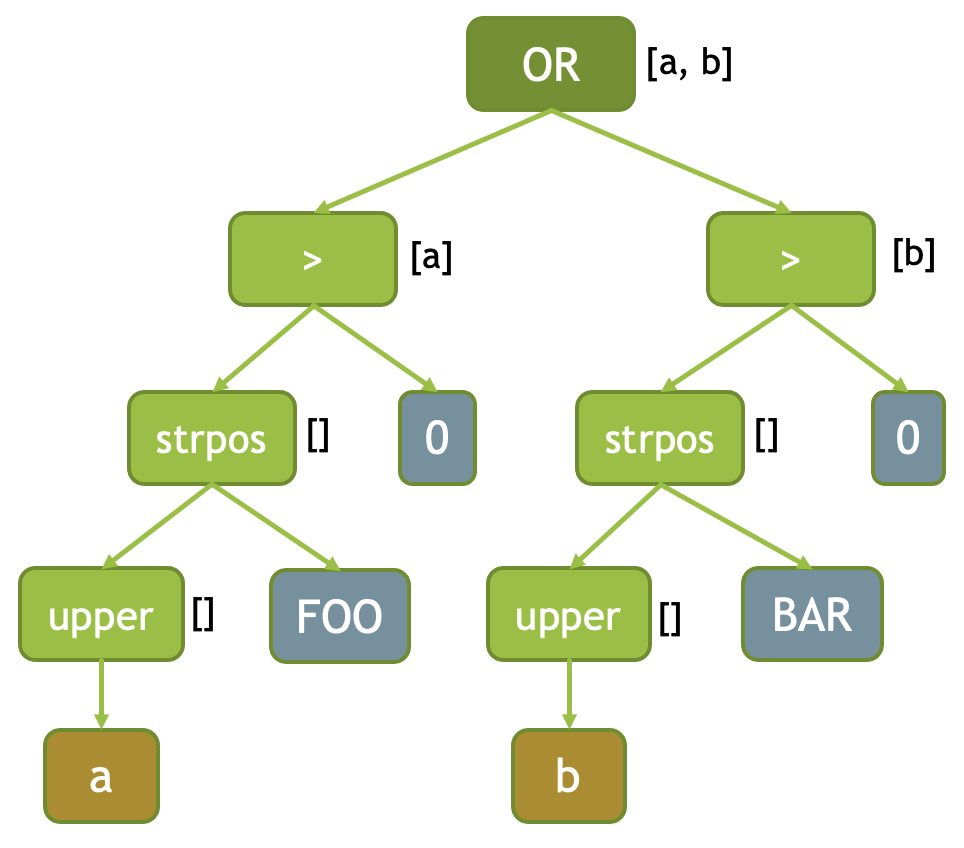

=====================
Expression Evaluation
=====================

Velox features vectorized expression evaluation. It is used in FilterProject
operator to evaluate filter and project expressions and in HiveConnector to
evaluate the “remaining” filter expression. It can also be used standalone.

Check **velox/example/ExpressionEval.cpp** for an example usage of the API.

Expression Trees
----------------

Expression evaluation takes expression trees as input. Each node in the tree is
a subclass of core::ITypedExpr which specifies return type and zero or more
input expressions (child nodes in the tree). Each expression can be one of:

* FieldAccessTypedExpr
* ConstantTypedExpr
* CallTypedExpr
* CastTypedExpr
* LambdaTypedExpr

**FieldAccessTypedExpr** represents a column of the input RowVector. The column is
identified by name. This is always a leaf node in the tree.

**ConstantTypedExpr** represents a constant value (or literal). This is always a
leaf node in the tree.

**CallTypedExpr** represents a function call. A function is identified by name. The
input expressions specify the number and types of arguments for the function
which allows to identify a specific function implementation unambiguously. The
function could be a simple function or vectorized function.

**CallTypedExpr** can also represent a special form by specifying one of the
predefined names. These names cannot be used by simple or vector functions.

and
	AND expression. Takes 2 or more input expressions of type boolean. Returns
	true if all inputs are true, false if at least one input is false, null
	otherwise.

	If some input generates an error for a row on which another input returns
	false, the error is suppressed.

or
	OR expression. Takes 2 or more input expressions of type boolean. Returns
	true if at least one input is true, false if all inputs are false, null
	otherwise.

	If some input generates an error for a row on which another input returns
	true, the error is suppressed.

if
	IF expression. Takes 2 or 3 input expressions: a boolean condition; then
	clause; optional else clause.

	When the else clause is not specified, the expression returns null for rows
	which do not pass the condition. When the else clause is specified, its
	return type must be the same as the return type of the then clause.

switch
	SWITCH expression represents a generalization of the IF expression. It takes
	one or more (condition, then clause) pairs and an optional else clause.

	When the else clause is not specified, the expression returns null for rows
	which do not pass any of the conditions.

	The return types of all the then clauses and the else clause must be the
	same.

cast
	CAST expression. Takes a single input expression. The result type determines
	the target type for the cast.

try
	TRY expression. Takes a single input expression.

	Handles errors generated by the input expression by returning nulls for the
	corresponding rows.

coalesce
    COALESCE expression. Takes multiple input expressions of the same type.

    Returns the first non-null value in the argument list. Like an IF or SWITCH
    expression, arguments are only evaluated if necessary.

When evaluating AND and OR expressions, the engine adaptively reorders the
conjuncts to evaluate the cheapest most decisive conjuncts first. E.g. the AND
expression chooses to evaluate the cheapest conjunct that returns FALSE most
often while the OR expression chooses to evaluate the cheapest conjunct that
returns TRUE most often.

The error suppression logic in the AND and OR expressions is designed to deliver
consistent results regardless of the order of the conjuncts.

**CastTypedExpr** - Same as CAST expression above.

**LambdaTypedExpr** represents a lambda expression specified by input types
(signature of the lambda) and an expression (body of the lambda). This is
always a leaf node in the tree.

Expression Evaluation
---------------------

Expression evaluation is broken down into two steps: compilation and evaluation.
Compilation step takes a list of expressions in the form of core::ITypedExpr
trees and produces a list of executable expressions in the form of exec::Expr
trees. Evaluation takes input data as a RowVector, evaluates compiled
expressions and returns the results. The evaluation step can be repeated as
many times as needed to process all the data.

Compilation
^^^^^^^^^^^

To compile an expression, one creates an instance of exec::ExprSet. ExprSet’s
constructor takes a list of expressions (core::ITypedExpr pointing to the root
of the expression tree) and a context (core::ExecCtx). The constructor
processes the expressions and creates trees of exec::Expr class instances.

ExprSet accepts multiple expressions and identifies common subexpressions across
all of them so that they can be calculated just once. FilterProject operator
benefits from this capability as it creates a single ExprSet for all of the
filter and project expressions. The compilation steps also flattens adjacent
AND, OR and concat-line expressions and performs constant folding.

Each node in the expression tree is transformed to a corresponding instance of
the exec::Expr class.

======================  ===================
core::ITypedExpr node   exec::Expr instance
======================  ===================
FieldAccessTypedExpr    FieldReference
ConstantTypedExpr       ConstantExpr
CallTypedExpr           * CastExpr if function name is “cast”;
                        * ConjunctExpr if function name is “and” or “or”;
                        * SwitchExpr if function name is “if” or “switch”;
                        * CoalesceExpr if function name is "coalesce"
                        * TryExpr if function name is “try”;
                        * Expr if function name is none of the above.
CastTypedExpr           CastExpr
LambdaTypedExpr         LambdaExpr
======================  ===================

CallTypedExpr nodes are processed to determine whether function names refer to
special form expressions or functions (vectorized or simple). The lookup is
performed in the following order and the search stops on the first match:

* Check if name matches one of special forms.
* Check if name and signature (i.e. input types) matches one of vectorized functions.
* Check if name and signature (i.e. input types) matches one of simple functions.

Common SubExpression Detection
``````````````````````````````

The following diagram shows the expression tree for the **strpos(upper
(a), 'FOO') > 0 OR strpos(upper(a), 'BAR') > 0** expression. Here, **upper
(a)** is a common subexpression. It is represented by a single instance of Expr
class which appears twice in the tree.

.. image:: images/cse.png
  :width: 600
  :align: center

Flatten ANDs and ORs
````````````````````

Adjacent AND nodes are consolidated into one. Similarly, adjacent OR nodes are
consolidated into one. This maximizes the effect of adaptive conjunct
reordering during execution of the AND and OR expressions.

.. image:: images/flatten-and.png
  :width: 600
  :align: center

Flatten concat-like functions
`````````````````````````````

Functions that behave like associative operators can declare support for
flattening. In that case, adjacent nodes of the same function are
consolidated into one.

A good example is concat(varchar,..) Presto function. Evaluating concat(a, b, c,
d) is more efficient than evaluating concat(a, concat(b, concat(c, d))).
Concatenating 4 columns at once allows to calculate the total amount of memory
needed for the final result, allocate it in one chunk, then copy individual
values to the right offsets. This saves on memory allocations and reduces data
copy as compared to concatenating two columns at a time.

Concat Presto function declares support for flattening allowing the expression
compiler to convert concat(a, concat(b, concat(c, d))) expression to
concat(a, b, c, d).

Other functions that can leverage this optimization include concat(array,..) and
map_concat(map,..).

A function declaring support for flattening must have a signature with variadic
arguments of the same type and return type must be the same as input type.

        f(x,..) -> x

Flattening converts sub-expressions like f(x1, f(x2, f(x3, x4))) into
f(x1, x2, x3, x4).

Flattening happens before constant folding, hence, f(a, f(constant-x, constant-y))
becomes f(a, constant-x, constant-y), not f(a, constant-z), where
constant-z = f(constant-x, constant-y).

Flattening also affects common sub-expression detection. Without flattening, in
an expression like g(f(a, f(b, c)), f(d, f(b, c))), the compiler would
identify f(b, c) as a common sub-expression. With flattening, the expression
will be re-writen as g(f(a, b, c), f(d, b, c)) and no common sub-expression
will be identified.

Constant Folding
````````````````

Once we have a tree of executable expressions (exec::Expr), ExprSet identifies
deterministic subexpressions which do not depend on any columns, evaluates
these and replaces them with a single constant expression. This optimization is
called constant folding.

For example, in the expression **upper(a) > upper('Foo')** subexpression **upper
(‘Foo’)** is deterministic and doesn’t depend on any columns. It will be
evaluated during compilation time and replaced by a single ConstantExpr
node **FOO**.



Expression Metadata
```````````````````

Executable expressions include a set of metadata that’s used during evaluation.
This is calculated by Expr::computeMetadata() virtual methods and stored in
member variables of the exec::Expr class.

* *distinctFields_* - List of distinct input columns if different from the parent expression. This list is empty if the list of distinct input columns is the same as for the parent expression.
* *propagatesNulls_* - Boolean indicating whether a null in any of the input columns causes this expression to always return null for the row.
* *deterministic_* - Boolean indicating whether this expression and all its children are deterministic.
* *hasConditionals_* - Boolean indicating whether this expression or any of its children is an IF, SWITCH, AND or OR expression.
* *isMultiplyReferenced_* - Boolean indicating whether this is a common subexpression, e.g. a subexpression that appears more than once in the set of expressions managed by the ExprSet.

Here is an example of *distinctFields_* for an expression **strpos(upper
(a), ‘FOO’) > 0 OR strpos(upper(b), BAR) > 0**. Distinct fields for each
expression are shown in brackets to the right of the expression node. OR node
has 2 fields: a and b. Each of the greater then nodes have a single field: a or
b. Nodes evaluating strpos and upper functions have an empty list of distinct
fields because they depend on exactly the same columns as their parent nodes.
The distinct fields metadata triggers peeling of encodings for the input data
and allows to run whole subexpressions on a subset of unique values.



Evaluation
^^^^^^^^^^

An instance of ExprSet represents one or more executable expressions.
ExprSet::eval() method can be invoked repeatedly to evaluate all or a subset of
the expressions on multiple batches of data.

FilterProject operator uses a single instance of the ExprSet for all of the
filter and project expressions. For each batch of input data, the operator
first evaluates the filter expression on all input rows and then evaluates all
of the project expressions on a subset of rows that passed the filter. If no
rows passed the filter, the evaluation of project expressions is skipped.

The input to ExprSet::eval() is EvalCtx which contains a RowVector representing
the input data and a SelectivityVector which identifies a subset of rows for
which to evaluate the expressions.

Common SubExpressions (CSEs)
````````````````````````````

ExprSet::eval() calls Expr::eval() for individual expressions. Expr::eval
() first checks if the expression is a deterministic common subexpression
(*isMultiplyReferenced_* == true) and if so whether it has been evaluated
already. If it was, the previously calculated results are returned and
evaluation concludes.

It is possible that the set of rows used in previous evaluation is less than the
current set of rows. In this case, the evaluation proceeds to compute the
expression for the missing rows. The results are combined with the previously
computed values to produce a final result.

Individual expressions recursively call Expr::eval() for the input expressions.
This allows the common subexpression optimization to apply at any level of the
tree, not just at the root.

Computing on Distinct Values Only
`````````````````````````````````

When inputs are dictionary encoded, deterministic expressions are calculated on
distinct values only. This is achieved by examining input columns
(*distinctFields_*) to identify shared dictionary wrappings, peeling off these
wrappings to extract a set of inner vectors with a set of indices corresponding
to the original rows, evaluating the expression on these inner vectors and
wrapping the results into dictionary vectors using the original wrappings.

One way to illustrate this mechanism is by considering an **upper
(color)** expression over the “color” column that is dictionary encoded using a
dictionary of 3 values: 0 - red, 1 - green, 2 - blue. Let’s say the dictionary
vector has 1’000 entries. These are represented with an indices buffer of 1000
values in the range of [0, 2] and an inner flat vector of size 3: [red, green,
blue]. When evaluating **upper(color)** expression, Expr::peelEncodings
() method is used to peel off a dictionary and produce a new set of inputs:
inner flat vector or size 3 and a set of indices into that vector: [0, 1, 2].
Then, “upper” function is applied to 3 values - [red, green, blue] - to produce
another flat vector of size 3: [RED, GREEN, BLUE]. Finally, the result is
wrapped in a dictionary vector using the original indices to produce a
dictionary vector that represents 1000 color values in upper case.

Peeling of encodings occurs at the highest node in the expression tree that
depends on a given set of columns. This is achieved by applying peelEncodings
method to *distinctFields_* which are populated only if the set of columns is
different from the parent expression. E.g. in expression f(g(color)) dictionary
encoding is peeled off at the very top of the expression tree and the whole
expression is evaluated on just 3 distinct values.

Memoizing the Dictionaries
``````````````````````````

When input vectors come from TableScan we can have multiple batches of input
dictionary vectors referencing the same base vector. A “color” column may have
millions of rows that refer to the same base set of values: red, green, blue.
In this case, each batch of input has a dictionary vector with the same base
vector and different indices buffer. Expr::eval() remembers the results of
evaluating the expression on the underlying base vector and re-uses these
results for subsequent batches. For each new batch it just wraps the original
results using indices buffer of the input vector. This logic is implemented in
the Expr::evalWithMemo() method and applies only to deterministic expressions.

Handling Nulls
``````````````

When an expression is propagating nulls (*propagatingNulls_* metadata described
earlier), the expression is evaluated only on rows where no input is null and
the results are updated to set nulls for rows with null inputs. Here, it comes
in handy that DictionaryVector allows for adding nulls (e.g. DictionaryVector
has a nulls buffer that is separate from the nulls buffer of the base vector).
Thus nulls can be added efficiently regardless of whether the results of the
expression evaluation are flat or dictionary encoded.

Evaluation Algorithm
````````````````````

Expression evaluation traverses the expression tree starting at the root in the
depth-first order. For each node a sequence of operations is performed.

.. image:: images/expression-evaluation.png
  :width: 800
  :align: center

#. **Expr::eval** - entry point into the node evaluation. Check if the expression is a shared subexpression that has already been evaluated. If so, check if it was evaluated for all the necessary rows. If so, produce the result and terminate evaluation early. Otherwise, set the rows for evaluation to a subset of rows for which results are missing and proceed to next steps.
#. **Expr::evalEncodings** - If expression is deterministic and depends on fewer columns than its parent, try to peel off shared encodings of the input columns. If peeling is successful, replace input columns with corresponding inner vectors, update the set of rows for evaluation to corresponding rows in the inner vectors and store the peeled off wrappings for later use.
#. **Expr::evalWithNulls** - If expression propagates nulls, check input columns and identify rows where at least one input is null. Remove these rows from the set of rows for evaluation.
#. **Expr::evalAll** - The expression can be either a special form or a function call. If it is a special form, evaluate the expression by invoking Expr::evalSpecialForm(). If it is a function call, recursively evaluate all input expressions by calling Expr::eval() on the child nodes and produce input vectors. If the function has default null behavior, identify all rows where input vectors are null and remove these from the set of rows for evaluation. If the function is deterministic and input vectors are not flat, try to peel off encodings. If peeling is successful, replace input vectors with corresponding inner vectors, update the set of rows for evaluation to corresponding rows in the inner vectors and store the peeled off wrappings for later use. Evaluate the function by calling VectorFunction::apply(). Adjust the results by wrapping them using peeled encodings and by setting nulls on rows which were removed due to null inputs. NOTE: The handling of nulls and peeling of encodings in this step may seem to be duplicating the similar steps from Expr::evalEncodings and Expr::evalWithNulls. The difference is that Expr::evalEncodings and Expr::evalWithNulls are working with the input data provided for the whole expression tree while this step is working with the input vectors that were calculated by evaluating input expressions.
#. **Finalize** - Set nulls for rows that were removed from evaluation due to null inputs. If any encoding was peeled off, use it to wrap the result. If the expression is a shared subexpression and there is a partial result from prior evaluation, incorporate it into the final result, then save the result for future use.

Error Handling in AND, OR, TRY
``````````````````````````````

When evaluating AND expression, If some input generates an error for a row on
which another input returns false, the error is suppressed.

When evaluating OR expression, If some input generates an error for a row on
which another input returns true, the error is suppressed.

The error suppression logic in the AND and OR expressions is designed to deliver
consistent results regardless of the order of the conjuncts.

TRY expression handles the exceptions by setting the result to null in the
corresponding rows. Error handling in AND, OR and TRY expressions relies on all
expressions and vector functions to properly support EvalCtx::throwOnError
flag. When set to false, the expression and vector functions should not throw
exceptions if a row’s data is invalid, but record the error by calling
EvalCtx::setError(row, exception).

Adaptive Conjunct Reordering in AND and OR
``````````````````````````````````````````

AND and OR expressions use the same mechanism as Selective ORC Reader to track
the performance of individual conjuncts and adaptively reorder these to
evaluate conjuncts that drop most rows fastest first.

The AND expression evaluates the cheapest conjunct that returns FALSE most often
first while the OR expression evaluates the cheapest conjunct that returns TRUE
most often first.

Evaluation of IF, SWITCH
````````````````````````

SWITCH expression evaluation goes through the following steps:

* Evaluate the first condition on all rows.
* Evaluate the first “then” clause on a subset of rows where the first condition is true and produce a partially populated result vector.
* Evaluate the second condition on rows where the first condition is not true.
* Evaluate the second “then” clause on a subset of rows where the second condition. Pass the partially populated result vector to Expr::eval when evaluating the “then” clause and expect the expression to update the result vector with the calculated values for the specified rows while preserving the already calculated results.
* Continue to process all the (condition, then clause) pairs. Terminate early if run out of rows.
* Finally, evaluate the else clause for the remaining rows. If the else clause is not specified, set nulls for the remaining rows.

SWITCH expression sets EvalCtx::isFinalSelection flag to false. The expressions
are expected to use this flag to decide whether the partially populated result
vector must be preserved or can be overwritten.

