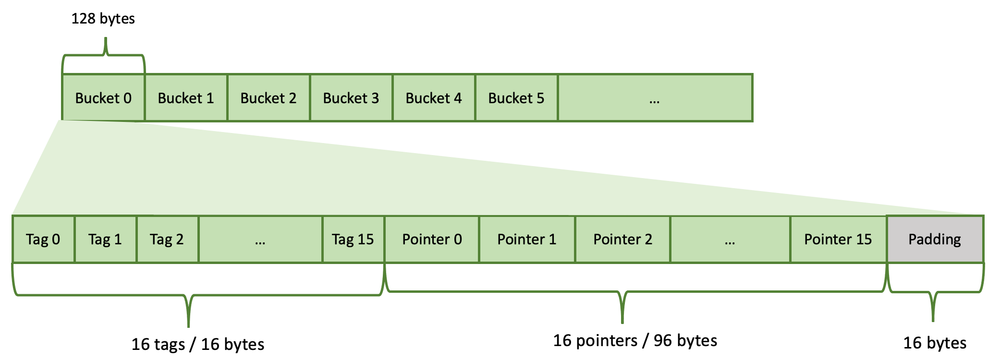
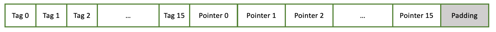
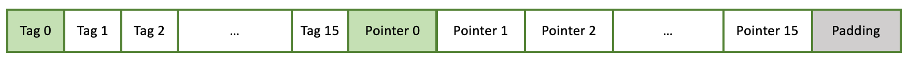
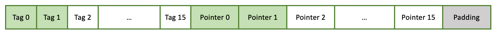
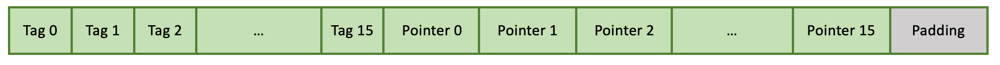

.. role:: raw-html(raw)
    :format: html

.. role:: m(math)

==========
Hash table
==========

The hash table used in Velox is similar to the
`F14 hash table <https://engineering.fb.com/2019/04/25/developer-tools/f14/>`_.
The main difference is that the Velox hash table allows vectorized inserts and lookups, while F14 doesn't.

Layout
------

The hash table is implemented as an array of buckets. It is a linear data structure.
Each bucket uses 128 bytes (2 * 64 = 2 cache lines) and contains 16 slots.
Each hash table entry occupies one slot. The hash table’s capacity is the total number of slots: total
number of buckets * 16. The hash table’s capacity is always a power of 2.

Each slot consists of 2 pieces: a tag (7 bits) and a pointer (6 bytes).
There are a total of 16 tags and 16 pointers in a bucket. These are stored tags first, followed by
pointers. Each tag occupies 1 byte (only 7 bits are used). 16 tags occupy 16 bytes. Each pointer
occupies 6 bytes. 16 pointers occupy 96 bytes. There are 16 bytes left unused at the end of the bucket.
These are referred to as padding.

A hash table is never full. There are always some empty slots. Velox allows the hash table to fill up to
:raw-html:`<text style="font-size:1.2em;background-color:none">⅞</text>` of capacity before resizing.
On resize the hash table’s capacity doubles.

Individual buckets may be completely empty, partially filled or full. Buckets are filled left to right.
If a bucket is partially full, then first N tags and N pointers are filled and the rest are free (N < 16).

Inserting an entry
------------------

To insert a new entry we need to figure out which slot to put it in.
A slot is identified by bucket and offset within the bucket. First, we compute a hash of the entry.
Then, we compute a tag and a bucket number from the hash.

We use 7 bits of the hash for the tag: bits 38-44 inclusive. We use N bits of the hash for the bucket
starting from bit 8.

The number of bits used for the bucket is decided based on the hash table capacity.
Remember that capacity is always a power of 2: :m:`2^n`. Each bucket stores 16 entries, hence, we
need :m:`2^{(n-4)}` buckets to store :m:`2^n` entries. Hence, we need to use n-4 bits of the hash for the bucket.

Let's say we have a hash table that can store a million entries: :m:`2^{20}` = 1,048,576. Here, n = 20 and
N = n - 4 = 16. We will use 16 bits for the bucket.

Given hash number:

01011011 11001010 011\ :raw-html:`<text style="background-color:orange">11100 01</text>`\101001 10110111
1\ :raw-html:`<text style="background-color:#ADD8E6">0010100 11111000 1</text>`\ 1001110

We compute the tag as 1\ :raw-html:`<text style="background-color:orange">1110001</text>` and bucket offset
as 1,374,336 (00000000 00000000 00000000 00000000 00000000
0\ :raw-html:`<text style="background-color:#ADD8E6">0010100 11111000 1</text>`\ 0000000).
Bucket offset is the number of bytes from the start of the hash table.

.. code-block:: c++

    bucket offset = bucket number * 128
    bucket number = bucket offset / 128

The bucket offset is used to get to the bucket, in this case bucket number 10737.
The candidate bucket can be empty, partially filled or full.

**The bucket is empty.**

In this case, we simply insert our entry into the first slot of the bucket.
We store only the tag (7 bits of the hash value) in the hash table. The hash number itself is not stored.
The pointer refers to memory outside of the hash table where the complete value is stored.
This is usually a row in a RowContainer. The hash table can be viewed as an index on top of a RowContainer
that helps locate records with matching keys faster. The hash table itself doesn’t store data or keys.

**The bucket is partially filled.**

For example, the bucket has one slot occupied (like above).
In this case there is a possibility that the new entry is a duplicate of the one already stored.
Hence, we compare the tag of the new entry with tags stored in the bucket.
If none match, this entry is not a duplicate, so we store it in the next available slot in the bucket.

However, if one or more existing tags match the tag of the new entry, we follow the pointers to compare
the keys to determine whether there is a match or not. If there is no match we insert a new entry.
Otherwise, there is a duplicate. The row is chained to the row list pointed to by the row entry
and no new entry is inserted.

**The bucket is full.**

First, we need to check if the new entry is a duplicate of one of the 16 entries stored in the bucket.
We compare tags and if necessary follow the pointers to compare the keys.
If there is a match, the row is chained to the row list pointed to by the row entry
and no new entry is inserted. If there is no match, we go to the
next bucket and repeat the process. In rare cases, we may end up checking many buckets until we find a
duplicate existing entry or an empty slot for the new entry. That’s why it is important to ensure that
the hash table is never full and there are enough gaps in the form of empty slots.

Resizing
--------

If the hash table fills up beyond :raw-html:`<text style="font-size:1.2em;background-color:none">⅞</text>`
of capacity, it needs to be resized. Each resize doubles the capacity.
A new hash table is allocated and all existing entries inserted using the “Inserting an entry” process.
Since we know that all entries are unique, the “Inserting an entry” process can be simplified to
eliminate the logic for checking whether a new entry is a duplicate of an existing one. Hence, to
insert an entry, we compute a hash, extract tag and bucket number, go to the bucket and insert the
entry if there is space. If the bucket is full, we proceed to the next bucket and continue until we
find a bucket with an empty slot. We insert the new entry there.

Use Cases
---------

The main use cases for the hash table are `Join <joins.html>`_ and
`Aggregation <aggregations.html>`_ operators.

The HashBuild operator builds the hash table to store unique values of the join keys found on the build
side of the join. The HashProbe operator looks up entries in the hash table using join keys from the
probe side. The HashProbe operator does not insert new entries into the hash table and never triggers
a resize. The pointers in the hash table refer to rows in a RowContainer that store individual
rows for the build side of the join.

The HashAggregation operator stores unique grouping keys in the hash table. The pointers in the hash table
refer to rows in a RowContainer that store grouping keys along with accumulators of the aggregate
functions.

Implementation
--------------

The hash table is implemented by the ``HashTable`` class in namespace ``facebook::velox::exec``.
