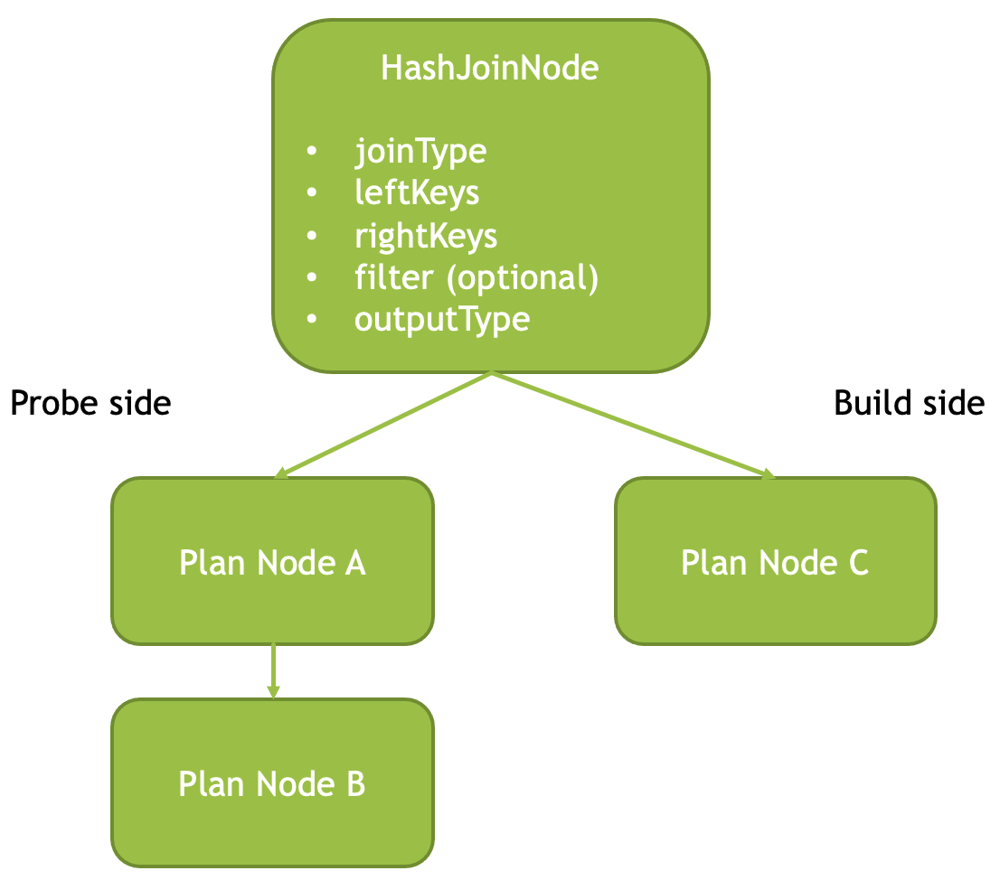
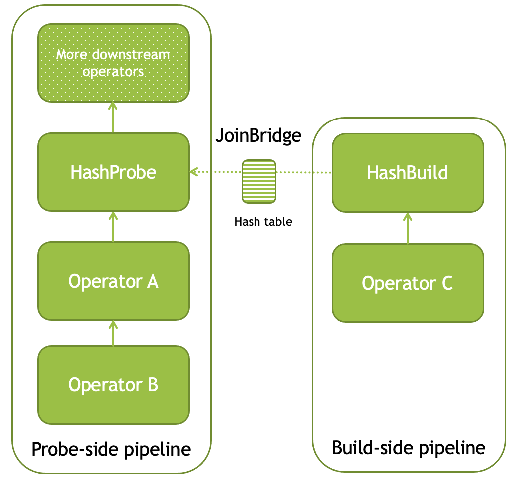
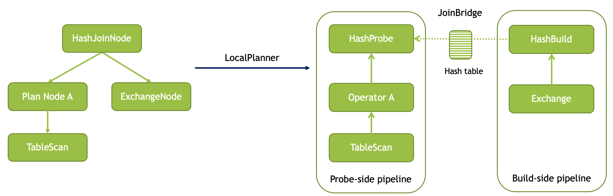
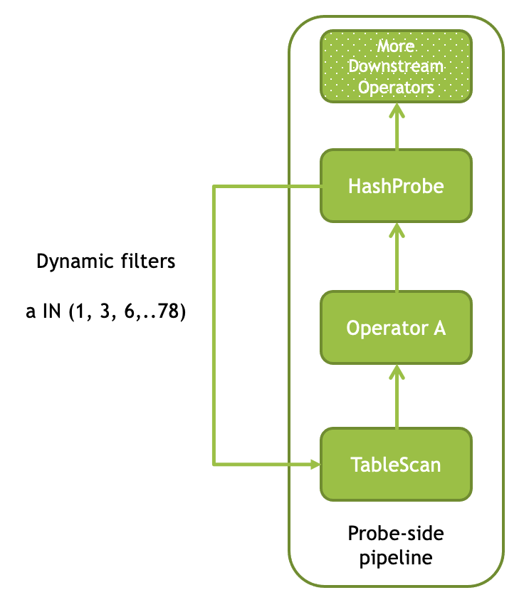
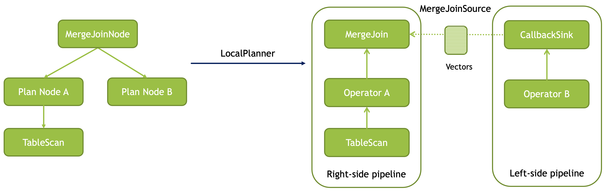

=====
Joins
=====

Velox supports inner, left, right, full outer, semi and anti hash joins using
either partitioned or broadcast distribution strategies. Velox also supports
cross joins.

Velox also supports inner and left merge join for the case where join inputs are
sorted on the join keys. Right, full, semi and anti merge joins are not
supported yet.

Hash Join Implementation
------------------------

Use HashJoinNode plan node to insert a join into a query plan. Specify the join
type, an equi-clause, e.g. pairs of columns on the left and right side whose
values need to match, and an optional filter to apply to join results.

The join type can be one of kInner, kLeft, kRight, kFull, kSemi, or kAnti.

Filter is optional. If specified it can be any expression over the results of
the join. This expression will be evaluated using the same expression
evaluation engine as used by the FilterProject operator and HiveConnector.

Inner join with a filter is equivalent to a join operator followed by
FilterProject operator, but left join with a filter is different. Left join
returns all rows from the left side along with all the matches on the build
side that pass the filter. The results also include rows from the left side for
which there is no match on the build side or neither match passed the filter.

To illustrate the difference between the left join with a filter and a left join
followed by a filter consider the following data.

Left side:

==  =====
id  value
==  =====
1   10
2   20
3   30
4   40
==  =====

Right side:

==  ====
id  name
==  ====
2   'a'
2   'b'
3   'c'
3   'd'
3   'e'
4   'f'
==  ====

The result of the left join on left.id = right.id is:

====  =======  ======
l.id  l.value  r.name
====  =======  ======
1     10       null
2     20       'a'
2     20       'b'
3     30       'c'
3     30       'd'
3     30       'e'
4     40       'f'
====  =======  ======

The result of the left join on left.id = right.id with a filter right.name IN
('a', 'f') is:

====  =======  ======
l.id  l.value  r.name
====  =======  ======
1     10       null
2     20       'a'
3     30       null
4     40       'f'
====  =======  ======

Compare this with the result of left join on left.id = right.id followed by
filter right.name IN ('a', 'f'):

====  =======  ======
l.id  l.value  r.name
====  =======  ======
2     20       'a'
4     40       'f'
====  =======  ======

To execute a plan with a join, Velox creates two separate pipelines. One
pipeline processes the build side data and creates a hash table. The other
pipeline processes the data on the probe side, joins it with the build side
data by probing the hash table and continues execution as specified by
downstream plan nodes. HashJoinNode is translated into two separate operators:
HashProbe and HashBuild. HashProbe operator becomes part of the probe-side
pipeline. HashBuild operator is installed as the last operator of the
build-side pipeline. The output of the HashBuild operator is a hash table which
HashProbe operator gets access to via a special mechanism: JoinBridge.

Both HashBuild and HashAggregation operators use the same data structure for the
hash table: velox::exec::HashTable. The payload, the non-join key columns
referred to as dependent columns, are stored row-wise in the RowContainer.

Using the hash table in join and aggregation allows for a future optimization
where the hash table can be reused if the aggregation is followed by the join
and aggregation and join keys are the same. We expect to implement this
optimization in the near future, but it is currently not implemented.

While processing input and building a hash table HashBuild operator analyzes the
values of the join keys to determine whether these keys can be normalized
(e.g. multiple keys can be merged into a single 64-bit integer key) or mapped
to a small integer domain to allow for array-based lookup. This mechanism is
implemented in the velox::exec::VectorHasher and is shared between aggregations
and joins.

Build and probe side pipelines can run multi-threaded and their parallelism can
be specified independently. HashBuild operator has extra logic to support
parallel building of the hash table where the operator that finishes building
its table last is responsible for merging it with all the other hash tables
before making the hash table available over the JoinBridge.

Dynamic Filter Pushdown
~~~~~~~~~~~~~~~~~~~~~~~

In some queries the join runs in the same stage as the probe-side table scan.
This happens if the join build side is broadcasted (when it is small enough) to
all join nodes or if the query is using bucket-by-bucket execution mode. In
these scenarios, it is often the case that only a small fraction of the join
keys on the probe side match the build side and it is beneficial to filter out
probe rows during table scan. This optimization is referred to as dynamic
filtering or dynamic filter pushdown.

Velox implements this optimization by leveraging VectorHashers that contain full
knowledge about the join key values on the build side. For each join key
with not too many distinct values, an in-list filter is constructed using the set
of distinct values stored in the corresponding VectorHasher. These filters
are then pushed down into the TableScan operator and make their way into the
HiveConnector which uses them to (1) prune files and row groups based on
statistics and (2) filter out rows when reading the data.

It is worth noting that the biggest wins come from using the dynamic filters to
prune whole file and row groups during table scan.

Dynamic filter pushdown is possible only if the join key column comes from a
collocated TableScan operator unmodified. HashProbe asks the Driver which
columns support filter pushdown (e.g. which columns come unmodified from an
operator which accepts dynamic filters) and generates filters only for such
columns.

In cases when the join has a single join key and no dependent columns and all
join key values on the build side are unique it is possible to replace the join
completely with the pushed down filter. Velox detects such opportunities and
turns the join into a no-op after pushing the filter down.

Dynamic filter pushdown optimization is enabled for inner and semi joins.

Broadcast Join
~~~~~~~~~~~~~~

Broadcast join refers to a specific distributed execution strategy where the
build side is small enough that it can be copied (broadcasted) to all the join
nodes and that allows to avoid re-shuffling the probe and build sides to
arrange for all rows with the same keys to appear on the same machine. Whether
the join is executed using broadcast or partitioned strategy has no effect on
the join execution itself. The only difference is that broadcast execution
allows for dynamic filter pushdown while partitioned execution does not.

PartitionedOutput operator and PartitionedOutputBufferManager support
broadcasting the results of the plan evaluation. This functionality is enabled
by setting boolean flag "broadcast" in the PartitionedOutputNode to true.

Anti Joins
~~~~~~~~~~

Anti join is used for queries like this:

.. code-block:: sql

    SELECT * FROM t WHERE t.key NOT IN (SELECT key FROM u)

Anti join returns probe-side rows which have no match in the build side. The
exact semantics of the anti join is tricky:

#. when the build side contains an entry with a null in any of the join keys, the join returns no rows;

#. when the build side is empty, the join returns all rows, including rows with null join keys;

#. when the build side is not empty, the join returns only rows with non-null join keys and no match in the build side.

The cases (1) and (2) cannot be identified locally (unless the join runs in
broadcast mode) as they require knowledge about the whole build side. It is
necessar to know whether the combined build side across all nodes is empty and
if not if it contains a null key. To provide this information locally,
PartitionedOutput operator supports a mode where it replicates all rows with
nulls in the partitioning keys to all destinations and in case there are no
rows with null keys replicates one arbitrary chosen row to all destinations.
This mode is enabled by setting the "replicateNullsAndAny" flag to true in the
PartitionedOutputNode plan node.

Replicate-nulls-and-any function of the PartitionedOutput operator ensures that
all nodes receive rows with nulls in join keys and therefore can implement the
semantics described in (1). It also ensures that local build sides are empty
only if the whole build side is empty, allowing to implement semantic
(2). Sending one row with a non-null key to multiple “wrong” destinations is
safe because that row cannot possibly match anything on these destinations.

Empty Build Side
~~~~~~~~~~~~~~~~

For inner and semi joins, when the build side is empty, Velox implements an
optimization to finish the join early and return an empty set of results
without waiting to receive all the probe side input. In this case all upstream
operators are canceled to avoid unnecessary computation.

Skipping Duplicate Keys
~~~~~~~~~~~~~~~~~~~~~~~

When building a hash table for semi or anti join HashBuild operator skips
entries with duplicate keys as these are not needed. This is achieved by
configuring exec::HashTable to set the "allowDuplicates" flag to false. This
optimization reduces memory usage of the hash table in case the build side
contains duplicate join keys.

Execution Statistics
~~~~~~~~~~~~~~~~~~~~

HashBuild operator reports the range and number of distinct values for each join
key if these are not too large and allow for array-based join or use of
normalized keys.

* rangeKey<N> - the range of values for the join key #N
* distinctKey<N> - the number of distinct values for the join key #N

HashProbe operator reports whether it replaced itself with the pushed down
filter entirely and became a no-op.

* replacedWithDynamicFilterRows - the number of rows which were passed through
  without any processing after filter was pushed down

HashProbe also reports the number of dynamic filters it generated for push
down.

* dynamicFiltersProduced - number of dynamic filters generated (at most one per
  join key)

TableScan operator reports the number of dynamic filters it received and passed
to HiveConnector.

* dynamicFiltersAccepted - number of dynamic filters received

Merge Join Implementation
-------------------------

Use MergeJoinNode plan node to insert a merge join into a query plan. Make sure
both left and right sides of the join produce results sorted on the join keys.
Specify the join type, an equi-clause, e.g. pairs of columns on the left and
right side whose values need to match, and an optional filter to apply to join
results.

To execute a plan with a merge join, Velox creates two separate pipelines. One
pipeline processes the right side data and puts it into JoinMergeSource. The
other pipeline processes the data on the left side, joins it with the right
side data and continues execution as specified by downstream plan nodes.
MergeJoinNode is translated into MergeJoin operator and a CallbackSink backed
by JoinMergeSource. MergeJoin operator becomes part of the left-side
pipeline. CallbackSink is installed at the end of the right-side pipeline.

Usage Examples
--------------

Check out velox/exec/tests/HashJoinTest.cpp and MergeJoinTest.cpp for examples
of how to build and execute a plan with a hash or merge join.
