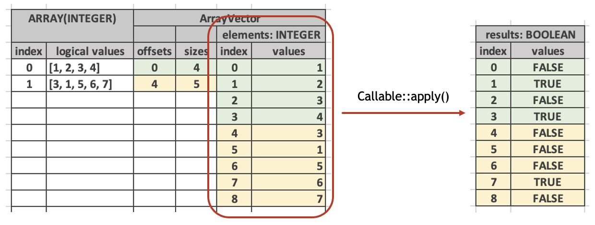
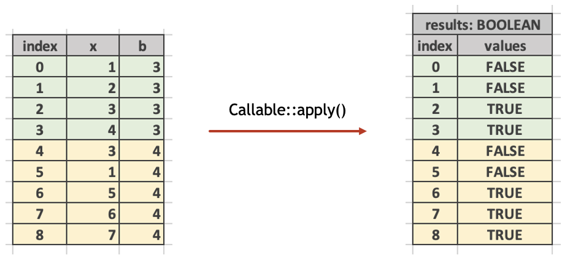
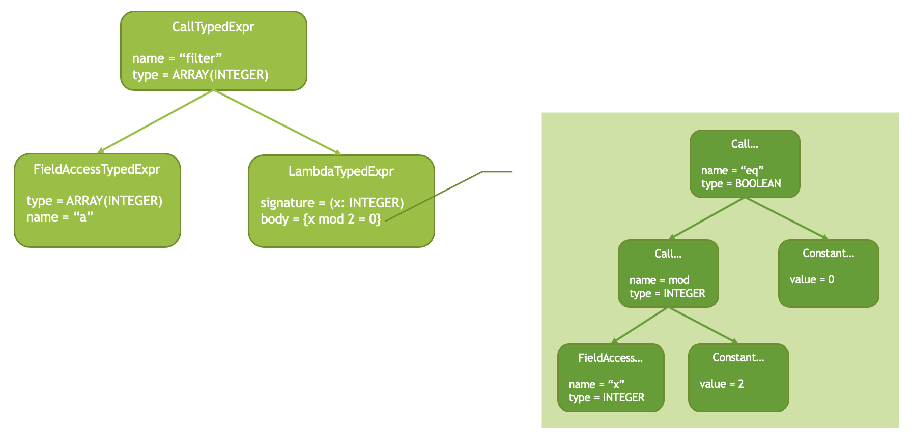

=============================
How to add a lambda function?
=============================

This article assumes familiarity with `Presto’s lambda functions
<https://prestodb.io/blog/2020/03/02/presto-lambda>`_.

Introduction
------------

Velox supports lambda functions which are used to implement computations over
arrays and maps. Lambda functions are higher order functions that take
arguments which are functions themselves. For example, the :func:`filter`
function takes an array or a map and a predicate and returns a subset of the
array or map elements which pass the predicate. The :func:`transform` function
takes an array and a function, applies that function to each element of the
array and returns an array of results.

Here is an example of using filter and transform functions in Presto SQL:

.. code-block:: sql

    > select filter(array[1, 2, 3, 4], x -> x % 2 = 0);
     [2, 4]

    > select transform(array[1, 2, 3, 4], x -> x * 2)
     [2, 4, 6, 8]

"x -> x % 2 = 0" is a lambda expression. It consists of a signature and a body
separated by an "arrow". Notice that in Presto SQL the signature of a lambda
consists only of argument names. Argument types are inferred from the context,
e.g. from the type of the array argument of "filter".

Lambdas may use captures to access any column in the scope of the enclosing
function. Let’s say we have a dataset with an array column "a" and an integer
column "b":

=================   ==========
a: array(integer)   b: integer
=================   ==========
[1, 2, 3, 4]        3
[3, 1, 5, 6, 7]     4
=================   ==========

We can filter the array "a" to keep only elements that are greater than or equal
to "b":

.. code-block:: sql

    > select filter(a, x -> x >= b)

    [3, 4]
    [5, 6, 7]

Here, "b" in the lambda expression is the capture. Lambda expressions can use
zero or more captures.

Further, it is possible to apply different lambda expressions to different rows
in the dataset. For example, we can filter the array "a" to keep even elements
if "b" is even and odd elements if "b" is odd.

.. code-block:: sql

    > select filter(a, if(b % 2 == 0, x -> x % 2 == 0, x % 2 == 1))

    [1, 3]
    [6]

Note: At the time of writing Presto didn’t support this syntax.

Function Vector
---------------

In Velox, lambda functions must be implemented as vector functions. These
receive their lambda inputs as vectors of type FUNCTION. For example,
the "filter" function receives two vectors: a vector of type ARRAY and another
vector of type FUNCTION.

Function type is a nested type whose children contain lambda argument types
followed by lambda return type. The exact type of the lambda argument of
the "filter" function above is FUNCTION(INTEGER(), BOOLEAN()).

Function vectors are implemented using the FunctionVector class. These vectors
store callable objects that represent executable lambda expressions in a
compact form. In most cases lambda expression is the same for all rows, but it
is possible for different rows to be associated with different lambdas as we
have seen above. FunctionVector stores a list of different lambdas along with a
set of rows each lambda applies to. Each lambda is represented as an object of
type Callable which allows for evaluating the lambda on a set of rows.

.. code-block:: c++

    class Callable {
      bool hasCapture() const;

      void apply(
          const SelectivityVector& rows,
          BufferPtr wrapCapture,
          exec::EvalCtx& context,
          const std::vector<VectorPtr>& args,
          VectorPtr& result);
    };

The "apply" method of Callable is similar to the "apply" method of
VectorFunction as it takes a set of rows to evaluate on and a list of vectors
representing the input data. For example, the "filter" function uses
Callable::apply to evaluate the lambda on the elements of the input array. In
this case, "rows" represents the rows of the elements vector and "args"
contains a single elements vector. The "result" is a boolean vector which
has "true" value for the elements which pass the predicate and "false" value
for the elements which do not.

In addition to "rows" and "args", Callable::apply() method takes an
optional "wrapCapture" buffer parameter. This parameter must be specified if
the lambda expression uses a capture, e.g. if Callable::hasCapture() returns
true. The "wrapCapture" buffer is used to align the top-level capture rows with
the nested rows of the array elements or map keys or values.

Consider the "filter(a, x -> x >= b)" example. The "x >= b" expression requires
two inputs: "x" and "b". Here, "x" is an element of the array with a total of 9
rows, while "b" is a top-level column with just 2 rows. To align "x" and "b" we
need to repeat "b" as many times as there are elements in the corresponding
array.

If there are multiple captures, all of them need to be aligned in the same way,
e.g. their values need to be repeated as many times as there are elements in
the corresponding array or map. The "wrapCapture" parameter in Callable::apply
() is used to specify an indices buffer that can be used to wrap captures in
dictionary vectors to achieve this alignment. The Callable object already
contains the vectors for captures and these do not need to be included in
the "args" parameter of the "apply()" method.

Unlike other vectors, FunctionVector doesn’t allow access to Callable objects
for individual rows. Instead, it provides an iterator which returns unique
instances of the Callable object along with a set of rows they apply to.

For example, "filter" function can iterate over distinct Callables like so:

.. code-block:: c++

    auto it = args[1]->asUnchecked<FunctionVector>()->iterator(rows);
    while (auto entry = it.next()) {
        ... entry.callable is a pointer to Callable ...
        ... entry.rows is the set of rows this Callable applies to ...
    }

In most cases there will be only one instance of Callable, but function
implementations need to allow for multiple.

FunctionVector::iterator() method takes SelectivityVector parameter which
restricts the returned iterator to a subset of the specified rows. These
usually are the rows the lambda function is evaluated on, e.g. the "rows"
parameter to VectorFunction::apply() method.

End-to-End Flow
---------------

A lambda function call in an expression tree is represented by a CallTypedExpr
node with a LambdaTypedExpr child. The "filter(a, x -> x % 2 = 0)" would be
represented like this:

Note that LambdaTypedExpr node doesn’t have any children. The expression that
represents the body of the lambda is contained inside the LambdaTypedExpr
node.

This expression tree is compiled into a tree of executable expressions.
LambdaTypedExpr is compiled into a special form LambdaExpr which includes a
compiled body (an instance of executable expression, e.g.
std::shared_ptr<Expr>) and a list of FieldReference instances for captures. A
result of evaluating LambdaExpr is a FunctionVector.
LambdaExpr::evalSpecialForm() creates instances of Callable and stores them in
a FunctionVector.

Lambda Function Signature
-------------------------

To specify a signature of a lambda function use "function(argType1, argType2,..,
returnType)" syntax for the type of the lambda argument. Here is an example of
the signature of the "filter" function:

.. code-block:: c++

    // array(T), function(T, boolean) -> array(T)
    return {exec::FunctionSignatureBuilder()
                .typeVariable("T")
                .returnType("array(T)")
                .argumentType("array(T)")
                .argumentType("function(T,boolean)")
                .build()};

Testing
-------

Testing framework doesn't support Presto SQL lambda expressions, e.g. one cannot
evaluate "filter(a, x - >x >= b)" expression directly. Instead, use the
registerLambda helper method of the FunctionBaseTest class to register lambda
expression and give it a name, then use that name to specify the lambda
parameter. Here is an example that evaluates "filter(a, x ->x >= b)" expression
in a test:

.. code-block:: c++

  auto rowType = ROW({"a", "b"}, {ARRAY(BIGINT()), BIGINT()});

  registerLambda("lambda", ROW({"x"}, {BIGINT()}), rowType, "x >= b"));

  auto result =
      evaluate<BaseVector>("filter(a, function('lambda'))", data);

The first argument to registerLambda is the name for the lambda. This name can
later be used to refer to the lambda in a function call.

The second argument is the signature of the lambda, e.g. the list of lambda
parameters along with their names and types.

The third argument is the type of the input data to the overall expression. This
is used to resolve the types of captures.

The last argument is the lambda body as SQL expression.

To specify lambda expression as an argument of a lambda function use function
(‘<lambda-name>’) syntax.
