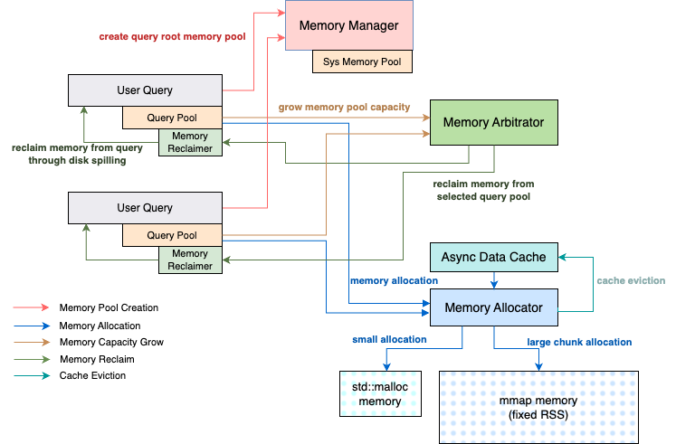
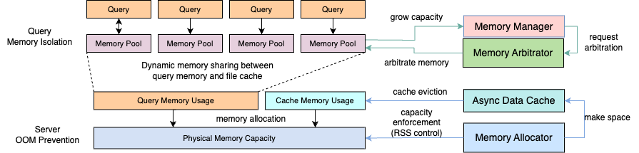
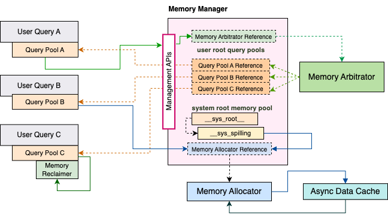
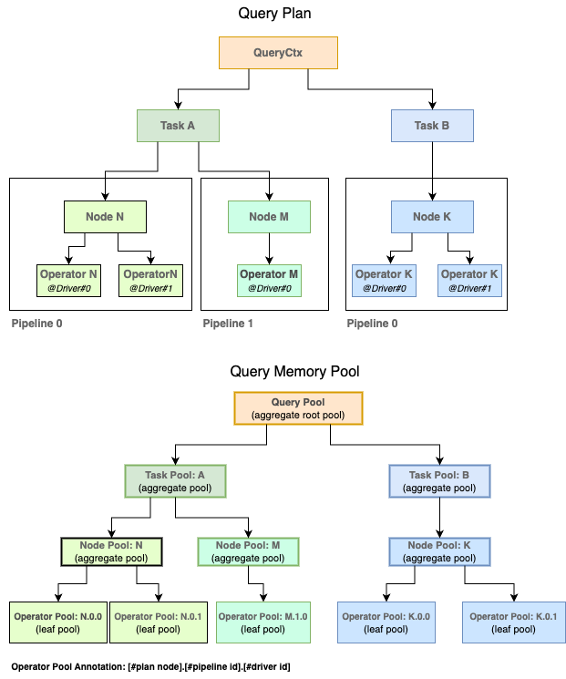
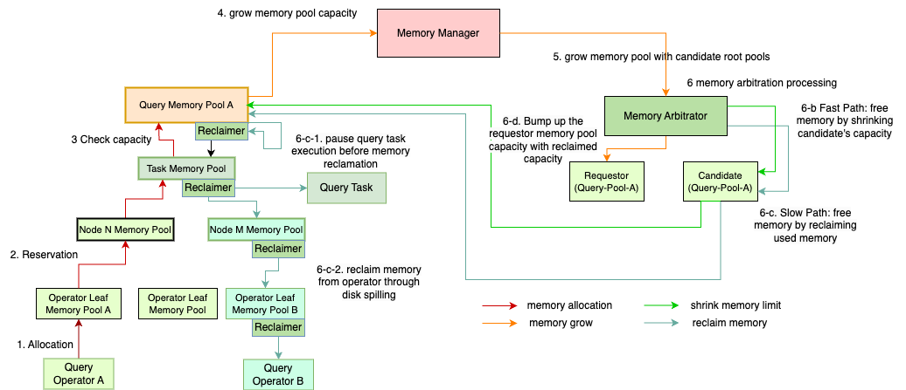
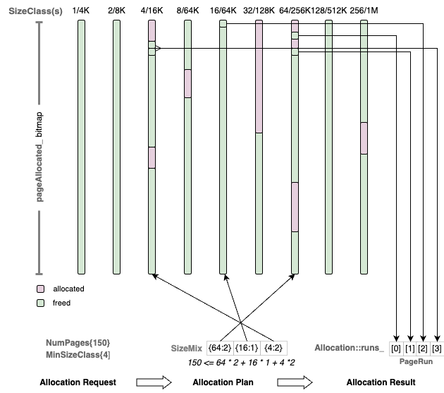

=================
Memory Management
=================

Background
----------

The Velox memory system is built on top of the `std::mmap <https://man7.org/linux/man-pages/man2/mmap.2.html>`_ library to avoid the
`memory fragmentation issue <https://stackoverflow.com/questions/3770457/what-is-memory-fragmentation>`_ with std::malloc. It provides the basic
memory allocation functions for query execution as well as the advanced
memory management functions such as fair memory sharing, transparent file cache
and server out-of-memory (OOM) prevention.

Velox provides the large contiguous and noncontiguous buffer allocation
functions to optimize the query memory allocation patterns. For example, a
query can allocate a large contiguous memory for a hash table
(*HashTable::allocateTables*) by using std::mmap to allocate physical memory from
the OS directly. For small buffer allocations, a query can allocate a large
chunk of non-contiguous memory, and then use `memory arena technique <https://nullprogram.com/blog/2023/09/27/>`_ like
*StreamArena* or *HashStringAllocator* to provide the small allocations on top of
it to reduce the number of expensive actual memory allocations.

Velox provides fair memory sharing among running queries by adjusting their
memory capacities at runtime in response to their memory usage changes. This
process is called memory arbitration. It ensures the total allocated memory
capacity of all the queries is within the system configured query memory limit.
It also prevents each individual query from running out of the user configured
per-query memory limit. When a query tries to allocate more memory than its
current capacity, the memory arbitration either increases the query’s capacity
by reclaiming the used memory from the other queries with larger capacities, or
reclaiming from the query itself if it exceeds per-query memory limit, to free
up space within its current capacity. The memory reclaim is achieved through
techniques like `disk spilling <https://facebookincubator.github.io/velox/develop/spilling.html>`_.

Velox provides transparent file cache to accelerate table scan through the hot
data reuse and prefetch. The file cache is integrated with the memory system to
achieve dynamic memory sharing between file cache and query memory. When a
query fails to allocate memory, we retry the allocation by shrinking the file
cache. Therefore, the file cache size is automatically adjusted in response to
the query memory usage change.

Velox provides server out of memory (OOM) prevention by managing the physical
memory allocation on its own through the std::mmap library. This allows us to
enforce explicit control on `Resident Set Size (RSS) <https://en.wikipedia.org/wiki/Resident_set_size#:~:text=In%20computing%2C%20resident%20set%20size,in%20main%20memory%20(RAM).>`_ of Velox memory usage. The
memory allocator in Velox handles all the memory allocations from both file
cache and query memory. It ensures the total allocated memory won’t exceed the
system memory limit configured for Velox to use. To further handle the spiky
memory usage from the non-Velox components, Velox provides a generic server
memory pushback mechanism to automatically shrink the file cache to return the
unused Velox memory back to the OS when the server is detected under low memory
condition.

Overall Design
--------------

Velox memory system consists of the following major memory components: memory
manager (*MemoryManager*), memory allocator (*MemoryAllocator*), file cache
(*AsyncDataCache*), memory arbitrator (*MemoryArbitrator*) and a number of memory
pools (*MemoryPool*). The memory manager creates all the other components. It
creates the memory allocator and memory arbitrator when initializing the memory
system, and creates the memory pool on-demand for query execution.

When a query starts execution, it first creates a root memory pool (query pool)
from the memory manager, and then creates a tree of child memory pools from the
root according to the query plan: a child memory pool for each query task
(task pool), a grandchild memory pool for each plan node (node pool) and a
great-grandchild memory pool for each operator instance (operator pool). During
the query execution, it allocates memory from the leaf operator pools and
propagates the memory usage up to the root query pool. If the aggregated memory
usage at the root exceeds the current query memory capacity, the query pool
sends a request to the memory arbitrator to grow its capacity. The memory
arbitrator either grows the requestor query pool’s capacity by reclaiming the
used memory from the other queries which has the largest capacity in the
system, or reclaiming from the request query pool itself to free up space
within its current capacity if it exceeds the per-query memory limit or it has
the largest capacity in the system. The used memory reclaim is achieved through
techniques like `disk spilling <https://facebookincubator.github.io/velox/develop/spilling.html>`_. If the memory arbitration succeeds, the leaf
operator pool can proceed with the actual memory allocation from memory
allocator. However, if the memory arbitration fails, then the query which has
the largest capacity in the system is chosen to fail with query memory capacity
exceeded error (local OOM). The failed query may or may not be the requestor
query pool itself.

The memory allocator does the actual memory allocation from its own managed
memory space in units of machine pages (4KB). It tracks the amount of allocated
memory, and returns an error if an allocation request exceeds the system memory
limit. This enables explicit control on RSS of Velox memory usage to help
prevent the server OOM.

The file cache provides the in-memory hot data cache and prefetch functions
when the user query accesses the remote storage. It allocates memory from the
memory allocator directly which is not counted in query memory usage. To
prevent the memory allocation failure because of excessive file cache memory
usage, the file cache retries the allocation failure by shrinking the file
cache. This achieves dynamic memory sharing between file cache and query memory
in response to the user query workload changes.

To summarize, the memory manager manages the memory pools and coordinates the
accesses between different memory components. The memory pool tracks a query’s
memory usage and interacts with the memory arbitrator to adjust the memory
capacity allocations among running queries to achieve fair memory sharing. The
memory allocator manages the physical memory allocations to prevent server OOM,
and interacts with file cache to achieve dynamic memory sharing between query
memory and file cache to maximize the memory efficiency. The rest of the
document describes each memory component in detail.

Memory Manager
--------------

The memory manager is created on server startup with the provided
*MemoryManagerOption*. It creates a memory allocator instance to manage the
physical memory allocations for both query memory allocated through memory pool
and cache memory allocated through the file cache. It ensures the total
allocated memory is within the system memory limit (specified by
*MemoryManagerOptions::allocatorCapacity*). The memory manager also creates a
memory arbitrator instance to arbitrate the memory capacity among running
queries. It ensures the total allocated query memory capacity is within the
query memory limit (specified by *MemoryManagerOptions::arbitratorCapacity*). The
memory arbitrator also prevents each individual query running out of its
per-query memory limit (specified by *QueryConfig::query_max_memory_per_node*) by
reclaiming overused memory through `disk spilling <https://facebookincubator.github.io/velox/develop/spilling.html>`_ (refer to `memory arbitrator
section <#memory-arbitrator>`_ for details).

After setting up the Velox memory system, the memory manager manages the memory
pools for query execution. When a query starts, it creates a root query pool
from the memory manager, and then creates a tree of child pools from the query
pool according to the query plan (see `memory pool section <#memory-pool>`_ for detail) for
memory allocations and usage tracking.

The memory manager keeps track of all the live query pools for the memory
arbitration process. When a query pool sends a request to the memory manager to
grow its capacity (*MemoryManager::growPool*), the memory manager forwards the
request to the memory arbitrator with the list of alive query pools as the
arbitration candidates. The memory arbitrator reclaims the used memory from the
candidates with the largest capacity first, and increases the requestor pool’s
capacity with the freed memory space accordingly. If the requestor pool already
has the largest capacity among all the candidates, then the memory arbitrator
reclaims memory from the requestor itself to free up space within its current
capacity. See `memory arbitration process section <#memory-arbitration-process>`_ for detailed description of
the memory arbitration process.

The memory manager doesn’t have ownership of user created query pools but only
tracks their liveness through *MemoryManager::dropPool* method which is invoked
by the query pool’s destructor to remove itself from the tracked list
(*MemoryManager::pools_*). The *QueryCtx* object owns the query pool which stays
alive until the query finishes.

The memory manager creates and owns a system root pool for Velox internal
operations such as `disk spilling <https://facebookincubator.github.io/velox/develop/spilling.html>`_. The difference between system root pool and
user created query root pool is that there is no per-query memory limit for the
system root pool so it doesn’t participate in the memory arbitration. The
reason is that the system operations are not executed on behalf of a particular
user query. Take `disk spilling <https://facebookincubator.github.io/velox/develop/spilling.html>`_ for example, it is triggered by memory
arbitration to free up used memory from the queries. We don’t expect
significant memory usage during a system operation, and eventually the memory
allocator guarantees the actual allocated memory are within the system memory
limit no matter if it is for system operation or for user query execution. In
practice, we shall reserve some space from the memory allocator to compensate
for such system memory usage. We can do that by configuring the query
memory limit (*MemoryManagerOptions::arbitratorCapacity*) to be smaller than the system memory
limit (*MemoryManagerOptions::allocatorCapacity*) (refer to `OOM prevention section <#server-oom-prevention>`_
for detail).

Memory System Setup
^^^^^^^^^^^^^^^^^^^

Here is the code block from Prestissimo that initializes the Velox memory system:

.. code-block:: c++
  :linenos:

   void PrestoServer::initializeVeloxMemory() {
     auto* systemConfig = SystemConfig::instance();
     const uint64_t memoryGb = systemConfig->systemMemoryGb();
     MemoryManagerOptions options;
     options.allocatorCapacity = memoryGb << 30;
     options.useMmapAllocator = systemConfig->useMmapAllocator();
     if (!systemConfig->memoryArbitratorKind().empty()) {
       options.arbitratorKind = systemConfig->memoryArbitratorKind();
       const uint64_t queryMemoryGb = systemConfig->queryMemoryGb();
       options.queryMemoryCapacity = queryMemoryGb << 30;
       ...
     }
     memory::initializeMemoryManager(options);

     if (systemConfig->asyncDataCacheEnabled()) {
       ...
       cache_ = std::make_shared<cache::AsyncDataCache>(
          memoryManager()->allocator(), memoryBytes, std::move(ssd));
     }
     ...
   }

* L5: set the memory allocator capacity (system memory limit) from
  the Prestissimo system config
* L6: set the memory allocator type from the Prestissimo system config. If
  *useMmapAllocator* is true, we use *MmapAllocator*, otherwise use
  *MallocAllocator*. `Memory Allocator section <#memory-allocator>`_ describes these two
  types of allocators
* L8: set the memory arbitrator kind from the Prestissimo system config.
  Currently, we only support the *“SHARED”* arbitrator kind (see `memory arbitrator section <#memory-arbitrator>`_).
  *“NOOP”* arbitrator kind will be deprecated soon (`#8220 <https://github.com/facebookincubator/velox/issues/8220>`_)
* L10: set the memory arbitrator capacity (query memory limit) from the
  Prestissimo system config
* L13: creates the process-wide memory manager which creates memory
  allocator and arbitrator inside based on MemoryManagerOptions initialized from previous steps
* L15-19: creates the file cache if it is enabled in Prestissimo system
  config

Memory Pool
-----------

The memory pool provides memory allocation functions for query execution. It
also tracks a query’s memory usage for per-query memory limit enforcement.
As shown in the Query Memory Pool Hierarchy figure, a query creates a tree of
memory pools that mirrors the query plan to have a fine-grained tracking of
memory usage for figuring out which task(s) or operator(s) use most of the
memory. At the root of the tree, *QueryCtx* creates a root query pool from the
memory manager. Each query task creates a child task pool from the query pool.
A query task executes a fragment of the query plan (e.g. an execution stage in
a distributed query execution plan in Prestissimo). Each plan node in a task’s
plan fragment creates a child node pool from the task pool
(*Task::getOrAddNodePool*). Each plan node belongs to one or more task
execution pipelines. Each pipeline might have multiple driver instances running
in parallel. Each driver instance consists of a pipeline of query operators,
and an operator is an instantiation of a query plan node in a driver. Hence
each operator creates a child operator pool from the node pool
(*Task::addOperatorPool*).

Query allocates memory from the operator pool at the leaf of the tree and
propagates the memory usage all the way up to the query pool at the root of the
tree to check if the memory usage has exceeded the per-query memory limit or
not. The memory allocation always happens at the leaf operator pool, the
intermediate pools only aggregate the memory usage (node pool and task pool),
and it is the root query pool that enforces the per-query memory limit. Given
that, we introduce two memory pool types (defined by *MemoryPool::Kind*) to
simplify the memory pool management: one is *LEAF* type which only allows the
memory allocations and the other is *AGGREGATE* type which aggregates the
memory usage from all its children but is not allowed to allocate memory
directly. Hence, the operator pool is *LEAF* type and all the others are
*AGGREGATE* type. We only enforce the memory limit check at the root query
pool.

Memory Usage Tracking
^^^^^^^^^^^^^^^^^^^^^

To track query memory usage, a leaf operator pool needs to propagate the memory
usage all the way up to the root query pool and check the memory limit for
every allocation, but this would be slow. Hence, memory pool uses a memory
reservation mechanism to track the query memory usage. A memory reservation is
made in 1MB or larger chunks to avoid excessive locking, propagating and
checking memory usage for every single allocation (see *MemoryPool::quantizedSize*
description below). A leaf operator pool maintains two counters for memory
reservation: one is the actual used memory (*MemoryPoolImpl::usedReservationBytes_*)
and the other is the memory reserved from the root query pool
(*MemoryPoolImpl::reservationBytes_*). The difference between the two counters
is the available memory for a leaf operator pool to use.

The intermediate pools only use *reservationBytes_* to count the aggregated memory
reservations held by all its child pools. The root query pool has two additional
counters for memory limit check: one is its current memory capacity
(*MemoryPoolImpl::capacity_*) which is the amount of memory available for the
query to use. The memory arbitrator sets this based on how many queries are
running, the total query memory limit and how much memory each query needs. The
other is max capacity (*MemoryPool::maxCapacity_*) which is the max capacity that
a query can grow up to. It is set by the user and is fixed during a query’s
lifetime (*QueryConfig::kQueryMaxMemoryPerNode*). The memory arbitrator can’t
set a query’s *capacity_* beyond its *maxCapacity_* limit.

When the root query pool receives a new memory reservation request, it increases
*reservationBytes_* and checks if it is within its current *capacity_* limit. If
it does, the root query pool accepts the request. If not, the root query pool
asks the memory arbitrator (via memory manager) to grow its capacity through the
memory arbitration (see `memory arbitrator section <#memory-arbitrator>`_ for details).
If the memory arbitration fails, the root query pool fails the request with a
query memory capacity exceeded error (local OOM error).

*MemoryPool::reserve* and *MemoryPool::release* are the two methods used by the
memory pool for memory reservation. The memory reservation is thread-safe and
*MemoryPool::reserveThreadSafe* is the main function that implements the memory
reservation logic:

#. The leaf memory pool calls *MemoryPool::reservationSizeLocked* to calculate
   the new required reservation (*incrementBytes*). It is based on the memory
   allocation size, and available memory reservation
   (*reservationBytes_ -  usedReservationBytes_*).

#. If *incrementBytes* is zero, the leaf memory pool has sufficient available
   reservation so it doesn’t need new reservation and just update
   *usedReservationBytes_* to reflect the new memory usage.

#. If *incrementBytes* is not zero, the leaf memory pool needs to call
   *MemoryPool::incrementReservationThreadSafe* (see below) to propagate the
   increment all the way up to the root memory pool to check if the new
   reservation request exceeds the query’s current capacity or not. If not,
   accept the reservation by incrementing *reservationBytes_* accordingly.

   Note that if *MemoryPool::incrementReservationThreadSafe* fails, it throws an
   exception to fail the memory allocation request with a local OOM error.

#. The leaf memory pool goes back to step-1 to check if there is sufficient
   available reservation for the allocation request after the reservation
   succeeds.

   Note that the concurrent allocation requests to the same leaf memory pool
   might steal away the reservation made in step-3 so we have to check again.
   We don’t hold the leaf memory pool’s lock while making a reservation from
   the root memory pool, which could be a blocking operation if memory
   arbitration is involved. Therefore, there could be a race condition if there
   are two concurrent memory reservation requests from the same leaf memory
   pool. But we don’t expect it to happen very often in practice.

As mentioned above, to avoid frequent concurrent memory reservations to the
root memory pool to reduce the cpu cost, the leaf memory pool does quantized
memory reservation. It rounds up the actual reservation bytes to the next large
quantized reservation value (MemoryPool::quantizedSize):

- round up to next MB if size < 16MB
- round up to next 4MB if size < 64MB
- round up to next 8MB if size >= 64MB

With the quantized reservation, we never reserve less than 1 MB of memory. Even
if we only need 1KB, we’ll have to reserve 1MB and if there is not enough
memory available the query will fail. It also means that if we run at
concurrency of 15, each driver thread will reserve at least 1MB and therefore
the query would require at least 15 MB of memory even if it uses just a few KB.

The implementation of MemoryPool::incrementReservationThreadSafe:

#. A non-root memory pool calls its parent pool’s *incrementReservationThreadSafe*
   method recursively to propagate the reservation request all the way up to
   the root memory pool

#. Check *MemoryPool::incrementReservationThreadSafe* result from the parent pool:

   a. If the function returns true, the reservation succeeds from the root
      memory pool and proceeds to accept the reservation (Step-3)
   b. If the function returns false, then reservation succeeds but has conflicts
      with other concurrent reservation requests detected at the root memory
      pool. We need to retry from the leaf memory pool again by returning false
      to *MemoryPoolImpl::reserveThreadSafe*
   c. If the memory reservation fails at the root memory pool, the function
      expects a query memory capacity exceeded exception thrown and the memory
      allocation fails

#. Call *MemoryPool::maybeIncrementReservation* to try to increment the
   reservation and check the result:

   a. For a non-root memory pool, this should always succeed as we only check
      capacity at the root memory pool
   b. For a root memory pool, the function might return false if the reservation
      request exceeds its current capacity and goes to step-4 to request memory
      arbitration

#. The root memory pool calls *MemoryManager::growPool* to grow its capacity.
   This triggers the memory arbitration process inside the memory arbitrator

#. If *MemoryManager::growPool* returns true, then we succeed in growing memory
   capacity (or reducing the memory usage within its current capacity). The
   function calls *MemoryPool::maybeIncrementReservation* again to check if the
   memory reservation can be satisfied or not. If not, then there should be a
   concurrent memory reservation request that takes away the grown memory
   capacity. Returns false to retry from the leaf memory pool again in this case
   (step2-b). Otherwise, returns true (step2-a).

#. If *MemoryManager::growPool* returns false, then we fail to grow capacity
   from the memory arbitrator and throws an query memory capacity exceeded error
   (step2-c)

Memory Pool APIs
^^^^^^^^^^^^^^^^

Memory pool has three sets of APIs for memory pool management, memory allocation
and memory arbitration. The following is a list of the major APIs to use in each
of the three sets.

Memory Pool Management
""""""""""""""""""""""

.. code-block:: c++

  /// Creates a root memory pool with specified 'name' and 'maxCapacity'.
  /// 'reclaimer' is provided for memory arbitration process.
  std::shared_ptr<MemoryPool> MemoryManager::addRootPool(
     const std::string& name = "",
     int64_t maxCapacity = kMaxMemory,
     std::unique_ptr<MemoryReclaimer> reclaimer = nullptr);

  /// Create an aggregate child memory pool which allows to create child memory
  /// pools from it, and it used to aggregate memory usage from its child pools.
  /// Aggregate memory pool is not allowed to allocate memory directly.
  virtual std::shared_ptr<MemoryPool> MemoryPool::addAggregateChild(
     const std::string& name);

  /// Create a leaf child memory pool which allows to allocate memory but are not
  /// allowed to create child pools.
  virtual std::shared_ptr<MemoryPool> MemoryPool::addLeafChild(
     const std::string& name);

  /// Creates new instance of MemoryPool for an operator, stores it in the task
  /// to ensure lifetime and returns a raw pointer.
  velox::memory::MemoryPool* Task::addOperatorPool(
     const core::PlanNodeId& planNodeId,
     int pipelineId,
     uint32_t driverId,
     const std::string& operatorType);

  /// Creates new instance of MemoryPool for a plan node, stores it in the task
  /// to ensure lifetime and returns a raw pointer.
  memory::MemoryPool* Task::getOrAddNodePool(
     const core::PlanNodeId& planNodeId);

Memory Allocation
"""""""""""""""""

The memory pool provides three types of memory allocations. If a user needs a
large chunk of buffer allocation and the allocated buffer doesn’t need to be
contiguous, then it can use *MemoryPool::allocateNonContiguous* to allocate a
number of variable sized buffers (see `non-contiguous allocation section <#non-contiguous-allocation>`_ for details). Velox uses this allocation for
*RowContainer*, *StreamArena*/*HashStringAllocator* and *AsyncDataCache* etc. If a user
needs a large contiguous buffer allocation with size > 1MB, then it can use
*MemoryPool::allocateContiguous* to allocate a large chunk of physical memory
from the OS directly through std::mmap (see `contiguous allocation section <#contiguous-allocation>`_ for
details). Velox uses this allocation for *HashTable*. For any other ad hoc
allocations, we can use *MemoryPool::allocate*. The memory allocator determines
how to allocate memory based on the actual allocation size (see
`small allocation section <#small-allocation>`_ for details).

.. code-block:: c++

  /// Allocates a buffer with specified 'size'. If the memory allocation is
  /// smaller than a predefined threshold, then we delegate the allocation to
  /// std::malloc (MmapAllocator::Options::maxMallocBytes).
  virtual void* MemoryPool::allocate(int64_t size) = 0;

  /// Frees an allocated buffer.
  virtual void MemoryPool::free(void* p, int64_t size) = 0;

  /// Allocates one or more runs that add up to at least 'numPages', with the
  /// smallest run being at least 'minSizeClass' pages. 'minSizeClass' must
  /// be <= the size of the largest size class (see non-contiguous allocation
  /// section for size class definition). The new memory is returned in 'out' on
  /// success and any memory formerly referenced by 'out' is freed. The function
  /// throws if allocation fails and 'out' references no memory and any partially
  /// allocated memory is freed.
  virtual void MemoryPool::allocateNonContiguous(
     MachinePageCount numPages,
     Allocation& out,
     MachinePageCount minSizeClass = 0) = 0;

  /// Frees non-contiguous 'allocation'. 'allocation' is empty on return.
  virtual void MemoryPool::freeNonContiguous(Allocation& allocation) = 0;

  /// Makes a large contiguous mmap of 'numPages'. The new mapped pages are
  /// returned in 'out' on success. Any formly mapped pages referenced by 'out'
  /// is unmapped in all the cases even if the allocation fails.
  virtual void MemoryPool::allocateContiguous(
     MachinePageCount numPages,
     ContiguousAllocation& out) = 0;

  /// Frees contiguous 'allocation'. 'allocation' is empty on return.
  virtual void MemoryPool::freeContiguous(ContiguousAllocation& allocation) = 0;

Memory Arbitration
""""""""""""""""""

The `memory arbitrator section <#memory-arbitrator>`_ below discusses how these memory arbitration
related methods are used in the memory arbitration and reclaim process.

.. code-block:: c++

  /// Returns the number of bytes that haven't been reserved for use, and can be
  /// freed by reducing this memory pool's limit.
  virtual uint64_t MemoryPool::freeBytes() const = 0;

  /// Invoked to bump up the memory pool's capacity by 'bytes'. The function
  /// returns the memory pool's new capacity after the grow.
  virtual uint64_t MemoryPool::grow(uint64_t bytes) = 0;

  /// Invoked to free up to the specified amount of unused memory reservations by
  /// reducing this memory pool's capacity without actually freeing up any
  /// used memory. The function returns the actually freed memory bytes. If
  /// 'targetBytes' is zero, the function frees all the unused memory reservation
  /// bytes.
  virtual uint64_t MemoryPool::shrink(uint64_t targetBytes = 0) = 0;

  /// Invoked by the memory arbitrator to enter memory arbitration processing. It
  /// is a noop if 'reclaimer_' is not set, otherwise invoke the reclaimer's
  /// corresponding method.
  virtual void MemoryPool::enterArbitration();

  /// Invoked by the memory arbitrator to leave memory arbitration processing. It
  /// is a noop if 'reclaimer_' is not set, otherwise invoke the reclaimer's
  /// corresponding method.
  virtual void MemoryPool::leaveArbitration();

  /// Function estimates the number of reclaimable bytes and returns in
  /// 'reclaimableBytes'. If the 'reclaimer' is not set, the function returns
  /// std::nullopt. Otherwise, it will invoke the corresponding method of the
  /// reclaimer.
  virtual std::optional<uint64_t> reclaimableBytes() const = 0;

  /// Invoked by the memory arbitrator to reclaim memory from this memory pool
  /// with specified reclaim target bytes. If 'targetBytes' is zero, then it
  /// tries to reclaim all the reclaimable memory from the memory pool. It is
  /// noop if the reclaimer is not set, otherwise invoke the reclaimer's
  /// corresponding method.
  virtual uint64_t MemoryPool::reclaim(uint64_t targetBytes);

Memory Arbitrator
-----------------

The memory arbitrator is used to arbitrate the memory capacity across running
queries to achieve fair memory sharing and prevent a query from running out of
its memory limit. To arbitrate memory capacity between running queries, the
memory arbitrator needs to be able to reclaim the used memory from a query
through techniques such as `disk spilling <https://facebookincubator.github.io/velox/develop/spilling.html>`_, and then transfer the freed memory
between queries by adjusting their memory pool’s capacities accordingly (see
`memory arbitration process section <#memory-arbitration-process>`_ for detail).

The *MemoryArbitrator* is defined to support different implementations for
different query systems. As for now, we implement *SharedArbitrator* for both
Prestissimo and Prestissimo-on-Spark. `Gulten <https://github.com/oap-project/gluten>`_ implements its own memory
arbitrator to integrate with the `Spark memory system <https://www.linkedin.com/pulse/apache-spark-memory-management-deep-dive-deepak-rajak/>`_. *SharedArbitrator*
ensures the total allocated memory capacity is within the query memory limit
(*MemoryManagerOptions::arbitratorCapacity*), and also ensures each individual
query’s capacity is within the per-query memory limit (*MemoryPool::maxCapacity_*).
When a query needs to grow its capacity, *SharedArbitrator* either reclaims the
used memory from the query itself if it has exceeded its max memory capacity,
or increases its capacity by reclaiming used memory from the other queries with
the largest memory capacity in the system.

Memory Arbitration Process
^^^^^^^^^^^^^^^^^^^^^^^^^^

The end-to-end memory arbitration process in *SharedArbitrator* works as follows:

#. The query operator A allocates memory from its leaf operator pool (operator
   pool A)
#. The operator pool A sends the memory reservation request to the root query
   pool (query pool A)
#. The query pool A is the root memory pool and it checks if the memory
   reservation request is within the current capacity or not
   (*MemoryPoolImpl::capacity_*). Let’s assume the request has exceeded the
   current capacity to trigger memory arbitration
#. The query pool A sends a request to the memory manager to grow its capacity
   for the new reservation (*MemoryManager::growPool*)
#. The memory manager forwards the request to the memory arbitrator
   (*MemoryArbitrator::growCapacity*) with the requestor memory pool plus the list
   of the root query pools as the memory arbitration candidates. The memory
   manager keeps the candidate query pools alive during the memory arbitration
   process
#. The memory arbitrator serializes the memory arbitration processing with one
   request at a time to ensure a consistent view of memory capacity allocated
   among queries. The memory arbitrator might receive concurrent arbitration
   requests from different queries or even from different driver threads of the
   same query. For each memory arbitration request:

   a. The memory arbitrator invokes *MemoryPool::enterArbitration* method of the
      requestor memory pool before starting memory arbitration. The request
      memory pool here is the operator pool A which initiates the memory
      reservation request. It calls *MemoryReclaimer::enterArbitration* method of
      the associated operator reclaimer (*Operator::MemoryReclaimer*). The
      operator reclaimer puts the driver thread into the suspension state
      (*Task::enterSuspended*). To reclaim memory from a query task, we need to
      first pause the task to stop all its driver threads to avoid any
      concurrent updates to its operator states during the memory reclamation.
      If the query task of the request memory pool is chosen to reclaim memory,
      then we have to put its driver thread into suspension state, otherwise
      the query task will never be paused as the request driver thread is under
      the memory arbitration process. Note a suspended driver thread is not
      counted as running in task pause processing.

   b. The memory arbitrator calls *SharedArbitrator::ensureCapacity* to check if
      the requestor query pool exceeds its max memory capacity limit with the
      new reservation or not (*MemoryPool::maxCapacity_*). If not, proceed to
      step-6-c. Otherwise, the memory arbitrator tries to reclaim used memory
      from the requestor pool itself. If memory reclamation has freed up
      sufficient memory from the requestor pool for the new reservation within
      its current capacity, then memory arbitration succeeds. If the requestor
      pool still exceeds the max memory capacity limit, then memory arbitration
      fails. Otherwise proceed to step-6-c.

   c. The memory arbitrator runs the fast path
      (*SharedArbitrator::reclaimFreeMemoryFromCandidates*) to reclaim the unused
      memory reservations from the candidate query pools without actually
      freeing the used memory. It first tries to reclaim from itself and then
      from the candidate pools which have the most free capacity
      (*MemoryPool::freeBytes*) until it reaches the memory reclaim target. Note
      that we set the memory reclaim target to a large value
      (*MemoryManagerOptions::memoryPoolTransferCapacity*) which could be more
      than the actual needed size, to avoid the frequent memory arbitrations.

   d. If the memory arbitrator hasn’t reclaimed enough free memory on fast
      path, it runs the slow path
      (*SharedArbitrator::reclaimUsedMemoryFromCandidates*) to reclaim the used
      memory from the candidate pools with the most reclaimable memory (see
      `memory reclaim process section <#memory-reclaim-process>`_ for the detailed memory
      reclaim process within a query).

   e. If the memory arbitrator has reclaimed enough memory, it grants the
      reclaimed memory to the requestor pool by increasing its memory capacity
      (*MemoryPool::grow*). If not, the memory arbitrator has to call
      *SharedArbitrator::handleOOM* to send the memory pool abort
      (*MemoryPool::abort*) request to the candidate memory pool with the largest
      capacity as victim to free up memory to let the other running queries
      with enough memory proceed. The memory pool abort fails the query
      execution and waits for its completion to release all the held memory
      resources.

   f. If the victim query pool is the requestor pool itself, then memory
      arbitration fails. Otherwise, go back to step-6-c to retry the memory
      arbitration one more time before giving up.

   g. The memory arbitrator invokes *MemoryPool::leaveArbitration* method of the
      requestor memory pool at the end of memory arbitration. The operator
      reclaimer moves its driver thread out of suspension state
      (*Task::leaveSuspended*).

Memory Reclaim Process
^^^^^^^^^^^^^^^^^^^^^^

Here is the memory reclaim process within a query:

#. The memory arbitrator invokes *MemoryPool::reclaim* method of a candidate
   query pool with a reclaim target in bytes, which calls the corresponding
   method of the associated memory reclaimer object (*MemoryReclaimer::reclaim*).
   The query pool uses the default implementation which sorts its child task
   pools based on the reclaimable bytes (*MemoryPool::reclaimableBytes*), and
   reclaim from the task with the most reclaimable bytes until reaches the
   reclaim target

#. The query pool invokes the reclaim method of the task pool which in turn
   calls into the associated task reclaimer (*Task::MemoryReclaimer*). The
   latter first pauses the task execution (*Task::requestPause*), and then
   sorts its child node pools based on the reclaimable bytes and reclaims
   memory from the node pools with the most reclaimable bytes. After reaching
   the reclaim target or having reclaimed from all the node pools, task
   reclaimer resumes the task execution (*Task::resume*)

#. The task pool invokes the reclaim method of the node pool which reclaim
   memory from its child operator pool with the most reclaimable bytes

#. The node pool eventually calls the operator pool to do the actual memory
   reclamation (*Operator::MemoryReclaimer*). Currently we support memory
   reclamation through disk spilling and table writer flush. *Operator::reclaim*
   is added to support memory reclamation with the default implementation does
   nothing. Only spillable operators override that method: *OrderBy*, *HashBuild*,
   *HashAggregation*, *RowNumber*, *TopNRowNumber*, *Window* and *TableWriter*.
   As for now, we simply spill everything from the spillable operator’s row
   container to free up memory. After we add memory compaction support for row
   containers, we could leverage fine-grained disk spilling features in Velox
   to only spill and free the required amounts of memory.

Note memory arbitrator can’t reclaim from a spillable operator if it has
triggered memory arbitration in the middle of data processing even after it
has stopped its query task execution. To prevent this, we added
*Operator::nonReclaimableSection_* to indicate if an operator is under a
non-reclaimable section or not, and the memory arbitrator can’t reclaim memory
from an operator which is under a non-reclaimable section. The driver execution
framework sets a running operator in the non-reclaimable section by default.
The spillable operator chooses to clear the non-reclaimable section at specific
call sites such as the memory reservation (*MemoryPool::maybeReserve*) before the
actual data processing to allow the memory arbitrator to reclaim memory.

Memory Allocator
----------------

The memory allocator manages the physical memory allocations for both query
memory allocated through memory pool and cache memory allocated directly from
file cache. The memory allocator ensures the total allocated memory is always
within the system memory limit. *MemoryAllocator* defines the memory allocator
interface. We have two allocator implementations: *MallocAllocator* delegates
all the memory allocations to std::malloc which is simple and reliable. We
provide it as the default option but we believe it has the issue with RSS
variation caused by memory fragmentation. Therefore we built *MMapAllocator* to
manage the physical memory allocations using the std::mmap to have explicit
control on RSS. We haven't yet confirmed whether *MmapAllocator* works better
than *MallocAllocator*, but we are able to run a sizable Prestissimo workload
using it. We will compare that workload using two allocators to determine which
one is better in the future. Users can choose the allocator for their
application by setting *MemoryManagerOptions::useMmapAllocator* (see
`memory system setup section <#memory-system-setup>`_ for example).

Non-Contiguous Allocation
^^^^^^^^^^^^^^^^^^^^^^^^^

A non-contiguous allocation is defined as an *Allocation* object which consists
of a number of PageRun(s). Each page run contains a contiguous buffer and the
buffers from different page runs don’t have to be contiguous. *MMapAllocator*
defines *MmapAllocator::SizeClass* data structure (similar to the one used in
`Umbra <https://db.in.tum.de/~freitag/papers/p29-neumann-cidr20.pdf>`_) to manage the non-contiguous allocation. A *SizeClass* object provides
allocation of a fixed size buffer (class page) which is a power of 2 of a
machine page size. *MMapAllocator* creates 9 different *SizeClass* objects with
class page size ranging from 1 machine page (4KB) to 256 machine pages (1MB).
To allocate a large number of machines pages, *MmapAllocator* calls
*MemoryAllocator::allocationSize* to build the allocation plan
(*MemoryAllocator::SizeMix*) which consists of a list of chosen *SizeClass* objects
and the number of class pages to allocate from each of them.

*MemoryAllocator::allocationSize* generates the allocation plan by searching from
the largest fit *SizeClass* to the min *SizeClass* as specified by the user. If min
*SizeClass* is not 1, there could be waste of memory in the last allocated class
page. As the example in the diagram, for an allocation request of 150 pages and
min *SizeClass* of 4, we choose to allocate 2 class pages from *SizeClass/64*, 1
from *SizeClass/16* and 2 from *SizeClass/4*. The total number of allocated machine
pages is 152. There are two machine pages wasted in the last allocated class
page from *SizeClass/4*. The memory allocator allocates memory from each of the
chosen *SizeClass* objects based on the allocation plan. The allocation result is
returned in an *Allocation* object which consists of 4 page runs: two runs from
*SizeClass/64* (the two allocated class pages are not contiguous in memory), one
from *SizeClass/16* and one from *SizeClass/4* (the two allocated class pages are
contiguous in memory).

Each *SizeClass* object sets up its own memory space using std::mmap with the
same size of the system memory limit. The setup memory space doesn’t cause any
memory allocation from the OS (or have backing memory) until the user writes
into the allocated memory space. The SizeClass object divides its own memory
space into a number of class pages, and uses *SizeClass::pageAllocated_* bitmap
to track if a class page is allocated or not. It uses the other bitmap
*SizeClass::pageMapped_* to track if a class page has backing memory or not
(mapped class page). To ensure RSS of Velox memory usage is within the system
memory limit, we assume an allocated class page always has backing memory, and
a freed class page also has backing memory until we call std::madvise to free
it back to the OS. To free a class page, we just clear the allocation bit in
*pageAllocated_* bitmap but we don’t call std::madvise to free the backing memory
immediately as std::madvise is an expensive OS call. We also expect a freed
class page is very likely to be reused again. Given that, we only remove
backing memory of a freed class page for new allocation if the total number of
mapped class pages reaches the system memory limit. *numMappedFreePages_* is used
to track the number of freed class pages that still have backing memory in each
*SizeClass* object. *SizeClass::adviseAway* implements the lazy backing memory
free control logic.

We apply two optimizations to accelerate the free class page lookup. One is to
use an aggregated bitmap (*mappedFreeLookup_*) to track the free class pages in
a group. Each bit in *mappedFreeLookup_* corresponds to 512 bits (8 words) in
*pageAllocated_*. If a bit is set in *mappedFreeLookup_*, then at least one of 512
bits in *pageAllocated_* is not set. The other is to use simd instruction to
operate on the bitmap to further accelerate the cpu execution.

The simplified *MmapAllocator::allocateNonContiguous* implementation:

.. code-block:: c++

  bool MmapAllocator::allocateNonContiguous(
      MachinePageCount numPages,
      Allocation& out,
      ReservationCallback reservationCB,
      MachinePageCount minSizeClass) override;

#. calls *MemoryAllocator::allocationSize* with *numPages* and *minSizeClass*.
   *numPages* specifies the number of machine pages to allocate. *minSizeClass*
   specifies the minimum class page size to allocate from. The function returns
   the number of class pages to allocate from each chosen *SizeClass* in
   *MemoryAllocator::SizeMix*. The sum of machine pages to allocate from all
   *SizeClass* objects should be no less than the requested *numPages*.

#. increase the memory allocator’s memory usage and check if it exceeds the
   system memory limit (*MemoryAllocator::capacity_*). If it exceeds, then fails
   the allocation and reverts the memory usage update. Otherwise, proceeds to
   make reservation in memory pool in step-3.

   * *MMapAllocator* uses *MallocAllocator::numAllocated_* to count the allocated
     memory in units of machines pages
   * *MMapAllocator* allocations are wrapped by *AsyncDataCache::makeSpace* which
     retries the allocation failure by shrinking the file cache for a number of
     times before giving up. Each retry takes a backoff delay and make it
     harder to evict from cache
   * *AsyncDataCache::makeSpace* not only retries the allocation from the memory
     pool but also from the file cache itself. In the latter case, the old
     cache entries will be evicted out to make space for new cache data

#. invokes *reservationCB* to increase the memory pool’s reservation to check if
   the new allocation exceeds the query memory limit or not. If it exceeds, we
   revert the memory usage update made in step-2 and re-throws the query memory
   capacity exceeded exception caught from *reservationCB*. The *reservationCB* is
   null if the allocation is from file cache.

#. allocates class pages from each of chosen SizeClass objects. If any one of
   the *SizeClass* allocation fails, then the entire allocation fails. We free
   the succeeded *SizeClass* allocations, and revert the memory pool reservation
   (step-3) and memory usage (step-2) updates.

#. The class page allocations return the number of machine pages needed to set
   up backing memory. This refers to the allocated class pages which don’t have
   the backing memory and the corresponding bits in *SizeClass::pageMapped_* are
   not set. We call *MmapAllocator::ensureEnoughMappedPages* to ensure the total
   number of mapped class pages that have backing memory with this new
   allocation doesn’t exceed the system memory limit. If it exceeds, we call
   *MmapAllocator::adviseAway* to remove the backing memory of the freed class
   pages. If *MmapAllocator::adviseAway* call fails, then we fail the allocation
   and revert all the changes made in previous steps for this allocation.

#. calls *MmapAllocator::markAllMapped* to set all the allocated class pages as
   mapped in *SizeClass::pageMapped_* and the allocation succeeds.

Contiguous Allocation
^^^^^^^^^^^^^^^^^^^^^

.. code-block:: c++

  virtual bool MemoryAllocator::allocateContiguous(
     MachinePageCount numPages,
     Allocation* collateral,
     ContiguousAllocation& allocation,
     ReservationCallback reservationCB = nullptr) = 0;

Contiguous allocation is defined as a *ContiguousAllocation* object which
contains a large contiguous buffer. It is used for very large contiguous buffer
allocation (>1MB) like allocating a hash table. Its implementation is very
simple. It calls std::mmap to allocate a contiguous chunk of physical memory
from the OS directly. Similar to non-contiguous allocation, it needs to call
*MmapAllocator::ensureEnoughMappedPages* to ensure the size of the mapped
memory space is within the system memory limit. To free a contiguous
allocation, the memory allocator calls std::munmap to return the physical
memory back to the OS right away.

Small Allocation
^^^^^^^^^^^^^^^^

.. code-block:: c++

  void* MmapAllocator::allocateBytes(
     uint64_t bytes,
     uint16_t alignment = kMinAlignment) override;

*MmapAllocator::allocateBytes* allocate memory in three different ways based on
the actual allocation size (bytes). If the allocation size is smaller than a
configured threshold (*MmapAllocator::Options::maxMallocBytes*), *MmapAllocator*
delegates the allocation to std::malloc. If the allocation size is within class
page size range (<= 1MB), it allocates the buffer as a class page from one of
*SizeClass* objects. Otherwise, it allocates the buffer as a large contiguous
allocation.

We don’t expect many small memory allocations from the query systems using
*MmapAllocator*. In Prestissimo, only very few small memory allocations are
delegated to std::malloc. The large in-memory state such as *RowContainer* and
*HashTable* allocate either contiguous or non-contiguous allocations. As for now,
we don’t cap the memory allocations delegated to std::malloc in the
*MmapAllocator*. We provide an option
(*MmapAllocator::Options::smallAllocationReservePct*) for the query system to
reserve a small amount of memory capacity in *MmapAllocator* to compensate for
these ad-hoc small allocations in practice.

Server OOM Prevention
---------------------

The memory allocator ensures all the memory usage from Velox doesn’t exceed
system memory limit. This is critical to prevent the server from running out
of memory as we expect Velox to use a significant portion of the server memory
in operation. For instance, Prestissimo in Meta configures 80% of server memory
for Velox and the rest 20% for the non-Velox components such as program binary,
http streaming shuffle and remote storage client etc.

However, the memory capacity enforcement in Velox itself is not sufficient to
prevent the server from running out of memory in face of spiky memory usage
from non-Velox components. For instance, we found in Prestissimo that the http
streaming shuffle in a large Prestissimo setup (>400 workers) can cause very
high spiky memory usage that easily leads to Prestissimo worker OOMs. In a
large cluster, each worker (*PrestoExchangeSource*) might receive the streaming
data from a large number of sources at the same time. The memory profiles
collected at times close to OOM show that >50% of non-Velox memory are allocated
from http proxygen. To prevent server OOM caused by http streaming shuffle, we
added throttle control in Prestissimo streaming shuffle to limit the number of
sources to read at a time to cap the streaming shuffle memory usage.

In addition to building the throttle mechanism specific to each non-Velox
component, we also provide a generic server memory pushback mechanism in Meta
Prestissimo to collaborate with Velox to handle the spiky memory usage from
non-Velox components. A *PeriodicMemoryChecker* is running in the background to
check the system memory usage periodically. Whenever the system memory usage
exceeds a certain threshold, it tries to free up memory from Velox by shrinking
the file cache (*AsyncDataCache::shrink*), and returns the freed cache memory
back to the OS. This way we can automatically shrink the file cache in response
to the transient spiky memory usage from non-Velox components in a query system.
