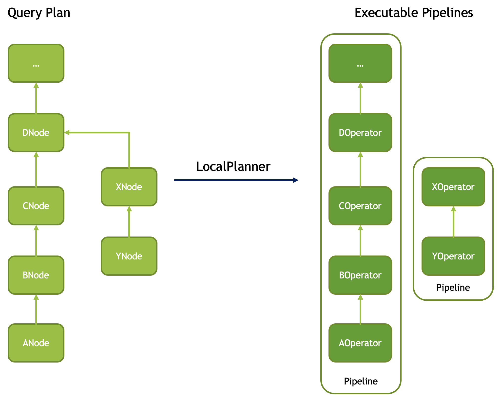
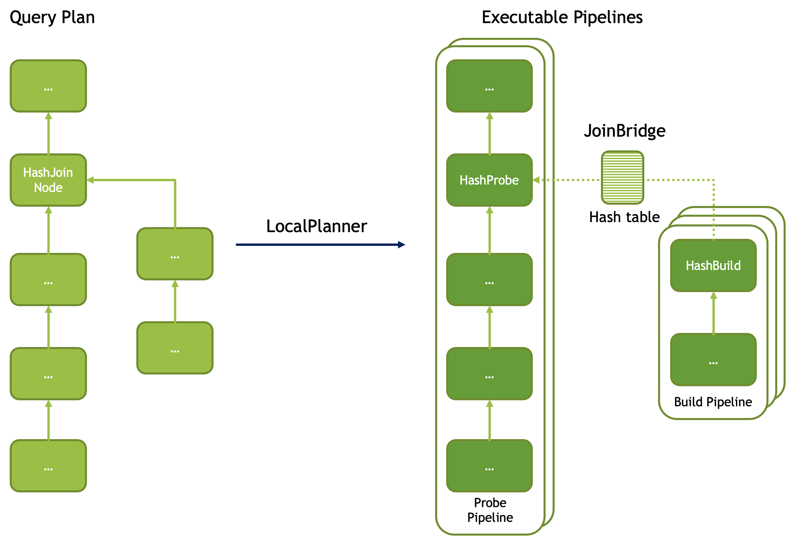
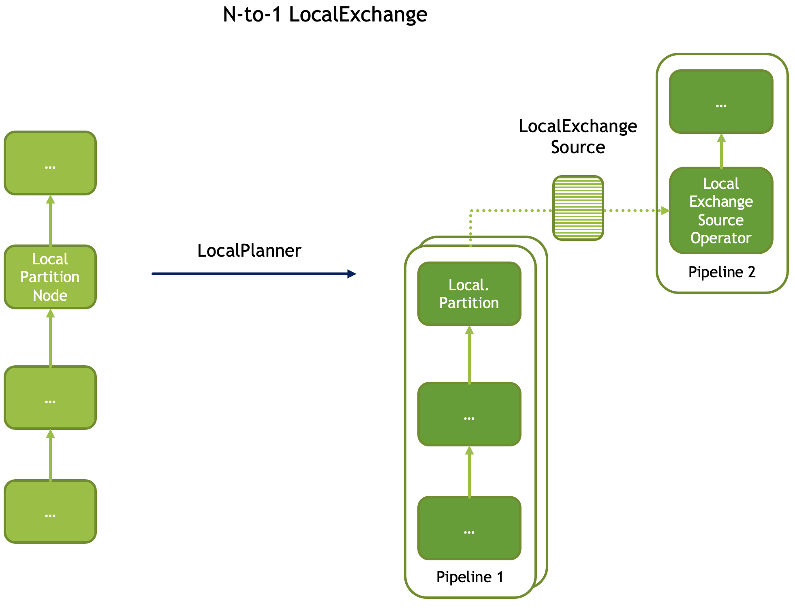
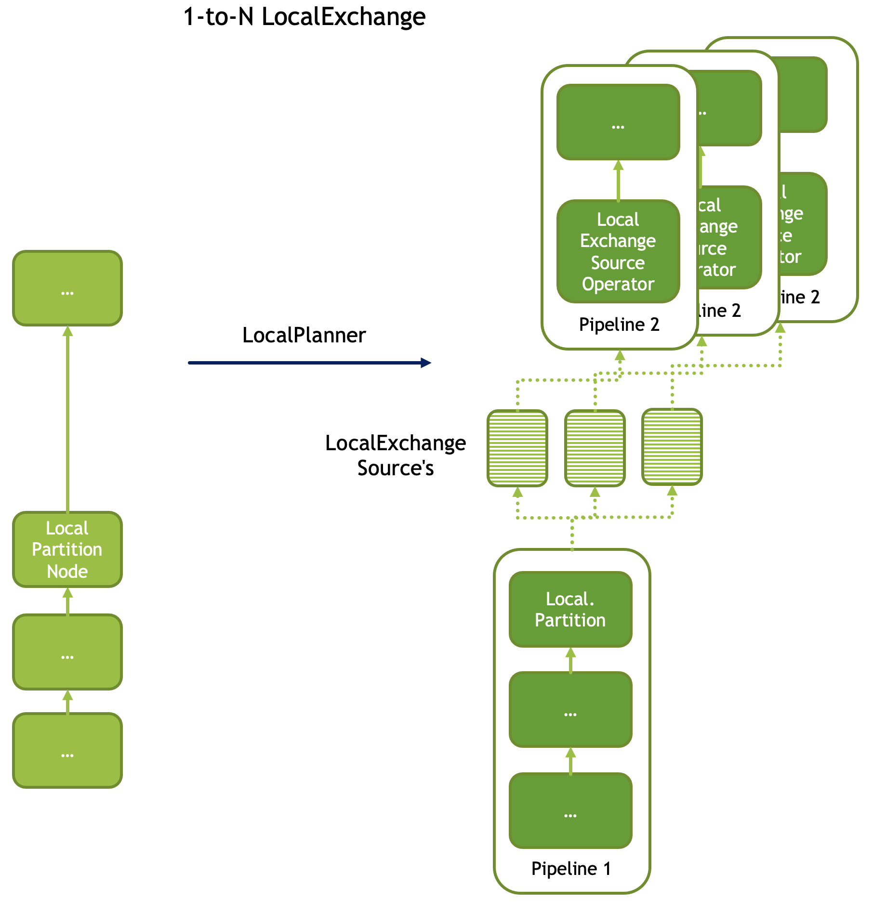
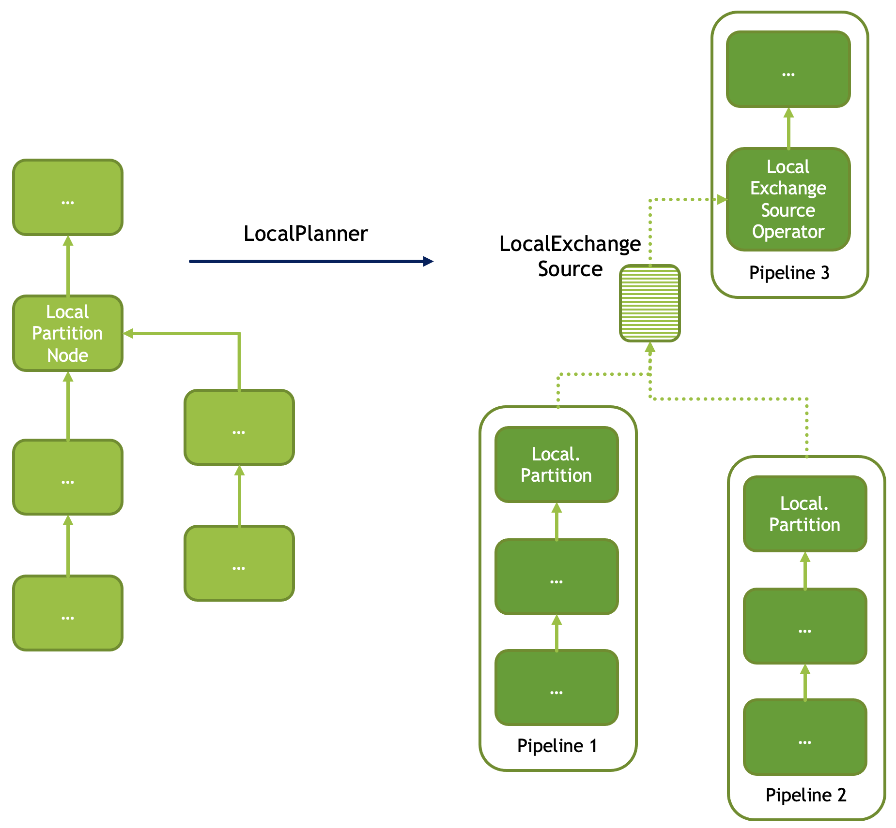

========================
Plan Nodes and Operators
========================

Velox query plan is a tree of PlanNode's. Each PlanNode has zero or more child
PlanNode's. To execute a query plan, Velox converts it into a set of pipelines.
Each pipeline is made of a linear sequence of operators that corresponds to a
linear sub-tree of the plan. The plan tree is broken down into a set of linear
sub-trees by disconnecting all but one child node from each node that has two
or more children.

The conversion of plan nodes to operators is mostly one-to-one. Some exceptions are:

* Filter node followed by Project node is converted into a single operator FilterProject
* Nodes with two or more child nodes are converted to multiple operators, e.g. HashJoin node is converted to a pair of operators: HashProbe and HashBuild.

Operators corresponding to leaf nodes are called source operators. Only a subset
of plan nodes can be located at the leaves of the plan tree. These are:

* TableScanNode
* ValuesNode
* ExchangeNode
* MergeExchangeNode

Here is a list of supported plan nodes and corresponding operators.

==========================  ==============================================   ===========================
Plan Node                   Operator(s)                                      Leaf Node / Source Operator
==========================  ==============================================   ===========================
TableScanNode               TableScan                                        Y
FilterNode                  FilterProject
ProjectNode                 FilterProject
AggregationNode             HashAggregation or StreamingAggregation
GroupIdNode                 GroupId
HashJoinNode                HashProbe and HashBuild
MergeJoinNode               MergeJoin
CrossJoinNode               CrossJoinProbe and CrossJoinBuild
OrderByNode                 OrderBy
TopNNode                    TopN
LimitNode                   Limit
UnnestNode                  Unnest
TableWriteNode              TableWrite
PartitionedOutputNode       PartitionedOutput
ExchangeNode                Exchange                                         Y
MergeExchangeNode           MergeExchange                                    Y
ValuesNode                  Values                                           Y
LocalMergeNode              LocalMerge
LocalPartitionNode          LocalPartition and LocalExchange
EnforceSingleRowNode        EnforceSingleRow
AssignUniqueIdNode          AssignUniqueId
==========================  ==============================================   ===========================

Plan Nodes
----------

TableScanNode
~~~~~~~~~~~~~

The table scan operation reads data from a connector. For example, when used
with HiveConnector, table scan reads data from ORC or Parquet files.

.. list-table::
   :widths: 10 30
   :align: left
   :header-rows: 1

   * - Property
     - Description
   * - outputType
     - A list of output columns. This is a subset of columns available in the underlying table. The order of columns may not match the schema of the table.
   * - tableHandle
     - Connector-specific description of the table. May include a pushed down filter.
   * - assignments
     - Connector-specific mapping from the table schema to output columns.

FilterNode
~~~~~~~~~~

The filter operation eliminates one or more records from the input data based
on a boolean filter expression.

.. list-table::
   :widths: 10 30
   :align: left
   :header-rows: 1

   * - Property
     - Description
   * - filter
     - Boolean filter expression.

ProjectNode
~~~~~~~~~~~

The project operation produces one or more additional expressions based on the
inputs of the dataset. The project operation may also drop one or more of the
input columns.

.. list-table::
   :widths: 10 30
   :align: left
   :header-rows: 1

   * - Property
     - Description
   * - names
     - Column names for the output expressions.
   * - expressions
     - Expressions for the output columns.

AggregationNode
~~~~~~~~~~~~~~~

The aggregate operation groups input data on a set of grouping keys, calculating
each measure for each combination of the grouping keys.

.. list-table::
   :widths: 10 30
   :align: left
   :header-rows: 1

   * - Property
     - Description
   * - step
     - Aggregation step: partial, final, intermediate, single.
   * - groupingKeys
     - Zero or more grouping keys.
   * - preGroupedKeys
     - A subset of the grouping keys on which the input is known to be pre-grouped, i.e. all rows with a given combination of values of the pre-grouped keys appear together one after another. The input is not assumed to be sorted on the pre-grouped keys. If input is pre-grouped on all grouping keys the execution will use the StreamingAggregation operator.
   * - aggregateNames
     - Names for the output columns for the measures.
   * - aggregates
     - Expressions for computing the measures, e.g. count(1), sum(a), avg(b). Expressions must be in the form of aggregate function calls over input columns directly, e.g. sum(c) is ok, but sum(c + d) is not.
   * - aggregationMasks
     - For each measure, an optional boolean input column that is used to mask out rows for this particular measure.
   * - ignoreNullKeys
     - A boolean flag indicating whether the aggregation should drop rows with nulls in any of the grouping keys. Used to avoid unnecessary processing for an aggregation followed by an inner join on the grouping keys.

GroupIdNode
~~~~~~~~~~~

Duplicates the input for each of the specified grouping key sets. Used to
implement aggregations over grouping sets.

.. list-table::
   :widths: 10 30
   :align: left
   :header-rows: 1

   * - Property
     - Description
   * - groupingSets
     - List of grouping key sets. Keys within each set must be unique, but keys can repeat across the sets.
   * - outputGroupingKeyNames
     - Output names for the grouping key columns.
   * - aggregationInputs
     - Input columns to duplicate.
   * - groupIdName
     - The name for the group-id column that identifies the grouping set. Zero-based integer corresponding to the position of the grouping set in the 'groupingSets' list.

HashJoinNode and MergeJoinNode
~~~~~~~~~~~~~~~~~~~~~~~~~~~~~~

The join operation combines two separate inputs into a single output, based on a
join expression. A common subtype of joins is an equality join where the join
expression is constrained to a list of equality (or equality + null equality)
conditions between the two inputs of the join.

HashJoinNode represents an implementation that starts by loading all rows from
the right side of the join into a hash table, then streams left side of the
join probing the hash table for matching rows and emitting results.

MergeJoinNode represents an implementation that assumes that both inputs are
sorted on the join keys and streams both join sides looking for matching rows
and emitting results.

.. list-table::
   :widths: 10 30
   :align: left
   :header-rows: 1

   * - Property
     - Description
   * - joinType
     - Join type: inner, left, right, full, semi, anti. You can read about different join types in this `blog post <https://dataschool.com/how-to-teach-people-sql/sql-join-types-explained-visually/>`_.
   * - leftKeys
     - Columns from the left hand side input that are part of the equality condition. At least one must be specified.
   * - rightKeys
     - Columns from the right hand side input that are part of the equality condition. At least one must be specified. The number and order of the rightKeys must match the number and order of the leftKeys.
   * - filter
     - Optional non-equality filter expression that may reference columns from both inputs.
   * - outputType
     - A list of output columns. This is a subset of columns available in the left and right inputs of the join. The columns may appear in different order than in the input.

CrossJoinNode
~~~~~~~~~~~~~

The cross join operation combines two separate inputs into a single output by
combining each row of the left hand side input with each row of the right hand
side input. If there are N rows in the left input and M rows in the right
input, the output of the cross join will contain N * M rows.

.. list-table::
   :widths: 10 30
   :align: left
   :header-rows: 1

   * - Property
     - Description
   * - outputType
     - A list of output columns. This is a subset of columns available in the left and right inputs of the join. The columns may appear in different order than in the input.

OrderByNode
~~~~~~~~~~~

The sort or order by operation reorders a dataset based on one or more
identified sort fields as well as a sorting order.

.. list-table::
   :widths: 10 30
   :align: left
   :header-rows: 1

   * - Property
     - Description
   * - sortingKeys
     - List of one of more input columns to sort by.
   * - sortingOrders
     - Sorting order for each of the soring keys. The supported orders are: ascending nulls first, ascending nulls last, descending nulls first, descending nulls last.
   * - isPartial
     - Boolean indicating whether the sort operation processes only a portion of the dataset.

TopNNode
~~~~~~~~

The top-n operation reorders a dataset based on one or more identified sort
fields as well as a sorting order. Rather than sort the entire dataset, the
top-n will only maintain the total number of records required to ensure a
limited output. A top-n is a combination of a logical sort and logical limit
operations.

.. list-table::
   :widths: 10 30
   :align: left
   :header-rows: 1

   * - Property
     - Description
   * - sortingKeys
     - List of one of more input columns to sort by.
   * - sortingOrders
     - Sorting order for each of the soring keys. See OrderBy for the list of supported orders.
   * - count
     - Maximum number of rows to return.
   * - isPartial
     - Boolean indicating whether the operation processes only a portion of the dataset.

LimitNode
~~~~~~~~~

The limit operation skips a specified number of input rows and then keeps up to a
specified number of rows and drops the rest.

.. list-table::
   :widths: 10 30
   :align: left
   :header-rows: 1

   * - Property
     - Description
   * - offset
     - Number of rows of input to skip.
   * - count
     - Maximum number of rows to return.
   * - isPartial
     - Boolean indicating whether the operation processes only a portion of the dataset.

UnnestNode
~~~~~~~~~~

The unnest operation expands arrays and maps into separate columns. Arrays are
expanded into a single column, and maps are expanded into two columns
(key, value). Can be used to expand multiple columns. In this case produces as
many rows as the highest cardinality array or map (the other columns are padded
with nulls). Optionally can produce an ordinality column that specifies the row
number starting with 1.

.. list-table::
   :widths: 10 30
   :align: left
   :header-rows: 1

   * - Property
     - Description
   * - replicateVariables
     - Input columns that are returned unmodified.
   * - unnestVariables
     - Input columns of type array or map to expand.
   * - unnestNames
     - Names to use for expanded columns. One name per array column. Two names per map column.
   * - ordinalityName
     - Optional name for the ordinality column.

TableWriteNode
~~~~~~~~~~~~~~

The table write operation consumes one output and writes it to storage via a
connector. An example would be writing ORC or Parquet files. The table write
operation return a single row with a single column containing the number of
rows written to storage.

.. list-table::
   :widths: 10 30
   :align: left
   :header-rows: 1

   * - Property
     - Description
   * - columns
     - A list of input columns to write to storage. This may be a subset of the input columns in different order.
   * - columnNames
     - Column names to use when writing to storage. These can be different from the input column names.
   * - insertTableHandle
     - Connector-specific description of the destination table.
   * - outputType
     - An output column containing a number of rows written to storage.

PartitionedOutputNode
~~~~~~~~~~~~~~~~~~~~~

The partitioned output operation redistributes data based on zero or more
distribution fields.

.. list-table::
   :widths: 10 30
   :align: left
   :header-rows: 1

   * - Property
     - Description
   * - keys
     - Zero or more input fields to use for calculating a partition for each row.
   * - numPartitions
     - Number of partitions to split the data into.
   * - broadcast
     - Boolean flag indicating whether all rows should be sent to all partitions.
   * - replicateNullsAndAny
     - Boolean flag indicating whether rows with nulls in the keys should be sent to all partitions and, in case there are no such rows, whether a single arbitrarily chosen row should be sent to all partitions. Used to provide global-scope information necessary to implement anti join semantics on a single node.
   * - partitionFunctionFactory
     - Factory to make partition functions to use when calculating partitions for input rows.
   * - outputType
     - A list of output columns. This is a subset of input columns possibly in a different order.

ValuesNode
~~~~~~~~~~

The values operation returns specified data.

.. list-table::
   :widths: 10 30
   :align: left
   :header-rows: 1

   * - Property
     - Description
   * - values
     - Set of rows to return.

ExchangeNode
~~~~~~~~~~~~

A receiving operation that merges multiple streams in an arbitrary order. Input
streams are coming from remote exchange or shuffle.

.. list-table::
   :widths: 10 30
   :align: left
   :header-rows: 1

   * - Property
     - Description
   * - type
     - A list of columns in the input streams.

MergeExchangeNode
~~~~~~~~~~~~~~~~~

A receiving operation that merges multiple ordered streams to maintain
orderedness. Input streams are coming from remote exchange or shuffle.

.. list-table::
   :widths: 10 30
   :align: left
   :header-rows: 1

   * - Property
     - Description
   * - type
     - A list of columns in the input streams.
   * - sortingKeys
     - List of one of more input columns to sort by.
   * - sortingOrders
     - Sorting order for each of the soring keys. See OrderBy for the list of supported orders.

LocalMergeNode
~~~~~~~~~~~~~~

An operation that merges multiple ordered streams to maintain orderedness. Input
streams are coming from local exchange.

.. list-table::
   :widths: 10 30
   :align: left
   :header-rows: 1

   * - Property
     - Description
   * - sortingKeys
     - List of one of more input columns to sort by.
   * - sortingOrders
     - Sorting order for each of the soring keys. See OrderBy for the list of supported orders.

LocalPartitionNode
~~~~~~~~~~~~~~~~~~

A local exchange operation that partitions input data into multiple streams or
combines data from multiple streams into a single stream.

.. list-table::
   :widths: 10 30
   :align: left
   :header-rows: 1

   * - Property
     - Description
   * - Type
     - Type of the exchange: gather or repartition.
   * - partitionFunctionFactory
     - Factory to make partition functions to use when calculating partitions for input rows.
   * - outputType
     - A list of output columns. This is a subset of input columns possibly in a different order.

EnforceSingleRowNode
~~~~~~~~~~~~~~~~~~~~

The enforce single row operation checks that input contains at most one row and
returns that row unmodified. If input is empty, returns a single row with all
values set to null. If input contains more than one row raises an exception.

Used for queries with non-correlated sub-queries.

AssignUniqueIdNode
~~~~~~~~~~~~~~~~~~

The assign unique id operation adds one column at the end of the input columns
with unique value per row. This unique value marks each output row to be unique
among all output rows of this operator.

The 64-bit unique id is built in following way:
- first 24 bits - task unique id
- next 40 bits - operator counter value

The task unique id is added to ensure the generated id is unique across all
the nodes executing the same query stage in a distributed query execution.

.. list-table::
   :widths: 10 30
   :align: left
   :header-rows: 1

   * - Property
     - Description
   * - idName
     - Column name for the generated unique id column.
   * - taskUniqueId
     - A 24-bit integer to uniquely identify the task id across all the nodes.

Examples
--------

Join
~~~~

A query plan with a join includes a HashJoinNode. Such a plan is translated into
two pipelines: build and probe. Build pipeline is processing input from the
build side of the join and uses HashBuild operator to build a hash table. Probe
pipeline is processing input from the probe side of the join, probes the hash
table and produces rows that match join criteria. Build pipeline provides the
hash table to the probe pipeline via a special mechanism called JoinBridge.
JoinBridge is like a future, where HashBuild operator completes the future with
a HashTable as a result and HashProbe operator receives the HashTable when
future completes.

Each pipeline can run with different levels of parallelism. In the example
below, the probe pipeline runs on 2 threads, while the build pipeline runs on 3
threads. When the build pipeline runs multi-threaded, each pipeline processes a
portion of the build-side input. The last pipeline to finish processing is
responsible for combining the hash tables from the other pipelines and
publishing the final table to the JoinBridge. When the probe pipeline for the
right outer join runs multi-threaded, the last pipeline to finish processing is
responsible for emitting rows from the build side that didn’t match the join
condition.

Local Exchange
~~~~~~~~~~~~~~

A local exchange operation has multiple uses. It is used to change the
parallelism of the data processing from multi-threaded to single-threaded or
vice versa. For example, local exchange can be used in a sort operation where
partial sort runs multi-threaded and then results are merged on a single
thread. Local exchange operation is also used to combine results of multiple
pipelines. For example to combine multiple inputs of the UNION or UNION ALL.

Here are some examples.

N-to-1 local exchange that could be used for combining partially sorted results
for final merge sort.

1-to-N local exchange to increase parallelism after an operation that must run
single-threaded.

Local exchange used to combine data from multiple pipelines, e.g. for UNION
ALL.

