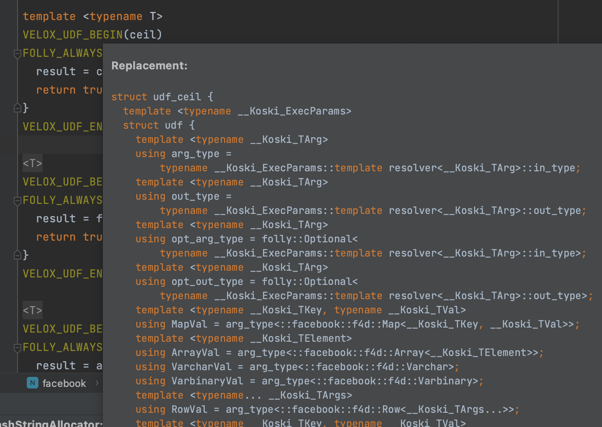

=============================
How to add a scalar function?
=============================

Simple Functions
----------------

A simple function, e.g. a :doc:`mathematical function </functions/math>`, can be added by wrapping a
C++ function in VELOX_UDF_BEGIN and VELOX_UDF_END macros. For example, a ceil
function can be implemented like so:

.. code-block:: c++

        template <typename T>
        VELOX_UDF_BEGIN(ceil)
        FOLLY_ALWAYS_INLINE bool call(T& result, const T& a) {
          result = std::ceil(a);
          return true;
        }
        VELOX_UDF_END();

Here, we are wrapping a template to allow our function to be called on
different input types, e.g. float and double.

It is important to use the name “call” for the function.

The function must return a boolean indicating whether the result of
computation is null or not. True means the result is not null. False means
the result is null. The arguments must start with an output
parameter “result” followed by the function arguments. The “result” argument
must be a reference. Function arguments must be const references. The C++
types of the arguments must match Velox types as specified in the following
mapping:

==========  ==============
Velox Type  C++ Type
==========  ==============
BOOLEAN     bool
TINYINT     int8_t
SMALLINT    int16_t
INTEGER     int32_t
BIGINT      int64_t
REAL        float
DOUBLE      double
VARCHAR     StringView
VARBINARY   StringView
TIMESTAMP   Timestamp
ARRAY       ArrayValReader
MAP         SlowMapVal
ROW         RowReader
==========  ==============

Note: Do not pay too much attention to complex type mappings at the moment.
They are included here for completeness, but require a whole separate
discussion.

VELOX_UDF_BEGIN(ceil) expands to define udf_ceil struct. You can see the
expanded struct in CLion by hovering on the VELOX_UDF_BEGIN macro.

Null Behavior
^^^^^^^^^^^^^

Most functions have default null behavior, e.g. a null value in any of the
arguments produces a null result. The expression evaluation engine
automatically produces nulls for such inputs, eliding a call to the actual
function. If a given function has a different behavior for null inputs, it
must define a “callNullable” function instead of a “call” function. Here is
an artificial example of a ceil function that returns 0 for null input:

.. code-block:: c++

        template <typename T>
        VELOX_UDF_BEGIN(ceil)
        FOLLY_ALWAYS_INLINE bool callNullable(T& result, const T* a) {
          // Return 0 if input is null.
          if (a) {
            result = std::ceil(*a);
          } else {
            result = 0;
          }
          return true;
        }
        VELOX_UDF_END();

Notice that callNullable function takes arguments as raw pointers and not
references to allow for specifying null values.

Determinism
^^^^^^^^^^^

By default simple functions are assumed to be deterministic, e.g. given the
same inputs they always produce the same results. If this is not the case,
the function must define a static constexpr bool is_deterministic:

.. code-block:: c++

	    static constexpr bool is_deterministic = false;

An example of such function is rand():

.. code-block:: c++

        VELOX_UDF_BEGIN(rand)
        static constexpr bool is_deterministic = false;

        FOLLY_ALWAYS_INLINE bool call(double& result) {
          result = folly::Random::randDouble01();
          return true;
        }
        VELOX_UDF_END();

Registration
^^^^^^^^^^^^

Use registerFunction template to register simple functions.

.. code-block:: c++

        template <typename Func, typename TReturn, typename... TArgs>
        void registerFunction(
            const std::vector<std::string>& aliases = {},
            std::shared_ptr<const Type> returnType = nullptr)

The first template parameter is the udf_xxx struct, the next template
parameter is the return type, the remaining template parameters are argument
types. Aliases parameter allows to specify multiple names for the same
function. By default, with empty aliases, the function is registered under
the name used in the VELOX_UDF_BEGIN macro, e.g. “ceil”. If aliases are
specified, the name used in VELOX_UDF_BEGIN is ignored and the function is
registered only under the specified names. E.g. calling registerFunction
with {“ceiling”} registers only the “ceiling” name, not both “ceil”
(default) and “ceiling”. To register both names, call registerFunction like
so:

.. code-block:: c++

        registerFunction<udf_ceil<double>, double, double>({"ceil", "ceiling");

Here, we register the udf_ceil function that takes a double and returns a
double. If we want to allow the ceil function to be called on float inputs,
we need to call registerFunction again:

.. code-block:: c++

        registerFunction<udf_ceil<float>, float, float>({"ceil", "ceiling");

We need to call registerFunction for each signature we want to support.

Codegen
^^^^^^^

To allow the function to be used in the codegen, extract the “kernel” of the
function into a header file and call that from the “call” or “callNullable”.
Here is an example with ceil function.

.. code-block:: c++

        #include "velox/functions/common/ArithmeticImpl.h"

        template <typename T>
        VELOX_UDF_BEGIN(ceil)
        FOLLY_ALWAYS_INLINE bool call(T& result, const T& a) {
          result = ceil(a);
          return true;
        }
        VELOX_UDF_END();

velox/functions/common/ArithmeticImpl.h:

.. code-block:: c++

        template <typename T>
        T ceil(const T& arg) {
          T results = std::ceil(arg);
          return results;
        }

Make sure the header files that define the “kernels” are free of dependencies
as much as possible to allow for faster compilation in codegen.

Complex Types
^^^^^^^^^^^^^

Although it is possible to define simple functions that operate on complex
types, e.g. arrays, maps and structs, it is generally not recommended to do
so. These functions are inefficient because they require each value to be
converted from a compact columnar representation into an STL container
(std::vector, std::map, std::tuple). Also, it is not possible to define
functions that accept generic arrays, maps or structs (e.g. map_keys,
map_values, array_distinct, array_sort) as registerFunction requires all the
signatures to be enumerated explicitly.

Given this recommendation, we will not discuss how to define a simple function
with complex type inputs or results.

Vector Functions
----------------

Simple functions process a single row and produce a single value as a result.
Vector functions process a batch or rows and produce a vector of results.
Some of the defining features of these functions are:

- take vectors as inputs and produce vectors as a result;
- have access to vector encodings and metadata;
- can be defined for generic input types;
- allow for implementing lambda functions;
- allow for pre-processing constant inputs and reusing the results across multiple batches, e.g. compile constant regular expressions once per query or thread of execution.

Vector function interface allows for many optimizations that are not available
to simple functions. These optimizations often leverage different vector
encodings and columnar representations of the vectors. Here are some
examples,

- :func:`map_keys` function takes advantage of the ArrayVector representation and simply returns the inner “keys” vector without doing any computation. Similarly, :func:`map_values` function simply returns the inner “values” vector.
- :func:`map_entries` function takes the pieces of the input vector - “nulls”, “sizes” and “offsets”  buffers and “keys” and “values” vectors - and simply repackages them in the form of a RowVector.
- :func:`cardinality` function takes advantage of the ArrayVector and MapVector representations and simply returns the “sizes” buffer of the input vector.
- :func:`is_null` function copies the “nulls” buffer of the input vector, flips the bits in bulk and returns the result.
- :func:`element_at` function and subscript operator for arrays and maps use dictionary encoding to represent a subset of the input “elements” or “values” vector without copying.
- :func:`substr` function can avoid copying strings by returning StringViews that point to the string buffers in the input vector.

To define a vector function, make a subclass of f4d::exec::VectorFunction and
implement the “apply” method.

.. code-block:: c++

        void apply(
              const SelectivityVector& rows,
              std::vector<VectorPtr>& args,
              Expr* caller,
              EvalCtx* context,
              VectorPtr* result) const

Input rows
^^^^^^^^^^

The “rows” parameter specifies the set of rows in the incoming batch to
process. This set may not include all the rows. By default, a vector function
is assumed to have the default null behavior, e.g. null in any input produces
a null result. In this case, the expression evaluation engine will exclude
rows with nulls from the “rows” specified in the call to “apply”. If a
function has a different behavior for null inputs, it must override the
isDefaultNullBehavior method to return false.

.. code-block:: c++

    bool isDefaultNullBehavior() const override {
      return false;
    }

In this case, the “rows” parameter will include rows with null inputs and the
function will need to handle these. By default, the function can assume that
all inputs are not null for all “rows".

When evaluating a function as part of a conditional expression, e.g. AND, OR,
IF, SWITCH, the set of “rows” represents a subset of the rows that need
evaluating. Consider some examples.

.. code-block:: c++

    a > 5 AND b > 7

Here, a > 5 is evaluated on all rows where “a” is not null, but b > 7 is
evaluated on rows where b is not null and a is either null or not > 5.

.. code-block:: c++

    IF(condition, a + 5, b - 3)

Here, a + 5 is evaluated on rows where a is not null and condition is true,
while b - 3 is evaluated on rows where b is not null and condition is not
true.

In some cases, the values outside of “rows” may be undefined, uninitialized or
contain garbage. This would be the case if an earlier filter operation
produced dictionary-encoded vectors with indices pointing to a subset of the
rows which passed the filter. When evaluating f(g(a)), where a = Dict
(a0), function “g” is evaluated on a subset of rows in “a0” and may produce a
result where only that subset of rows is populated. Then, function “f” is
evaluated on the same subset of rows in the result of “g”. The input to “f”
will have values outside of “rows” undefined, uninitialized or contain
garbage.

Note that SelectivityVector::applyToSelected method can be used to loop over
the specified rows in a way that’s rather similar to a standard for loop.

.. code-block:: c++

    rows.applyToSelected([&] (auto row) {
        // row is the 0-based row number
        // .... process the row
    });

Input vectors
^^^^^^^^^^^^^

The “args” parameter is an std::vector of Velox vectors containing the values
of the function arguments. These vectors are not necessarily flat and may be
dictionary or constant encoded. However, a deterministic function that takes
a single argument is guaranteed to receive its only input as a flat vector.
By default, a function is assumed to be deterministic. If that’s not the
case, the function must override isDeterministic method to return false.

.. code-block:: c++

    bool isDeterministic() const override {
      return false;
    }

Note that DecodedVector can be used to get a flat vector-like interface to any
vector.

Result vector
^^^^^^^^^^^^^

The “result” parameter is a raw pointer to VectorPtr, which is a
std::shared_ptr to BaseVector. It can be null, may point to a scratch vector
that is maybe reusable or a partially populated vector whose contents must be
preserved.

A partially populated vector is specified when evaluating the “else” branch of
an IF. In this case, the results of the “then” branch must be preserved. This
can be easily achieved by following one of the two patterns.

Calculate the result for all or just the specified rows into a new vector,
then use EvalCtx::moveOrCopyResult method to either std::move the vector
into “result” or copy individual rows into partially populated “result”.

Here is an example of using moveOrCopyResult to implement map_keys function:

.. code-block:: c++

    void apply(
        const SelectivityVector& rows,
        std::vector<VectorPtr>& args,
        exec::Expr* /* caller */,
        exec::EvalCtx* context,
        VectorPtr* result) const override {
      auto mapVector = args[0]->as<MapVector>();
      auto mapKeys = mapVector->mapKeys();

      auto localResult = std::make_shared<ArrayVector>(
          context->pool(),
          ARRAY(mapKeys->type()),
          mapVector->nulls(),
          rows.end(),
          mapVector->offsets(),
          mapVector->sizes(),
          mapKeys,
          mapVector->getNullCount());

      context->moveOrCopyResult(localResult, rows, result);
    }

Use BaseVector::ensureWritable method to initialize “result” to a flat
uniquely-referenced vector while preserving values in rows not specified
in “rows”. Then, calculate and fill in the “rows” in “result”.
BaseVector::ensureWritable creates a new vector if “result” is null. If
result is not null, but not-flat or not singly-referenced,
BaseVector::ensureWritable creates a new vector and copies non-”rows” values
from “result” into the newly created vector. If “result” is not null and
flat, BaseVector::ensureWritable checks the inner buffers and copies these if
they are not singly referenced. BaseVector::ensureWritable also recursively
calls itself on inner vectors (elements vector for the array, keys and values
for map, fields for struct) to make sure the vector is “writable” all the way
through.

Here is an example of using BaseVector::ensureWritable to implement
cardinality function for maps:

.. code-block:: c++

    void apply(
        const SelectivityVector& rows,
        std::vector<VectorPtr>& args,
        exec::Expr* /* caller */,
        exec::EvalCtx* context,
        VectorPtr* result) const override {

      BaseVector::ensureWritable(rows, BIGINT(), context->pool(), result);
      BufferPtr resultValues =
          (*result)->as<FlatVector<int64_t>>()->mutableValues(rows.size());
      auto rawResult = resultValues->asMutable<int64_t>();

      auto mapVector = args[0]->as<MapVector>();
      auto rawSizes = mapVector->rawSizes();

      rows.applyToSelected([&](vector_size_t row) {
        rawResult[row] = rawSizes[row];
      });
    }

Simple implementation
^^^^^^^^^^^^^^^^^^^^^

Vector function interface is very flexible and allows for many interesting
optimizations. It may also feel very complicated. Let’s see how we can use
DecodedVector and BaseVector::ensureWritable to implement the “power(a, b)”
function as a vector function in a way that is not much more complicated than
the simple function. To clarify, it is best to implement the “power” function
as a simple function. I’m using it here for illustration purposes only.

.. code-block:: c++

    // Initialize flat results vector.
    BaseVector::ensureWritable(rows, DOUBLE(), context->pool(), result);
    auto rawResults = (*result)->as<FlatVector<int64_t>>()->mutableRawValues();

    // Decode the arguments.
    DecodedArgs decodedArgs(rows, args, context);
    auto base = decodedArgs.decodedVector(0);
    auto exp = decodedArgs.decodedVector(1);

    // Loop over rows and calculate the results.
    rows.applyToSelected([&](int row) {
      rawResults[row] =
          std::pow(base->valueAt<double>(row), exp->valueAt<double>(row));
    });

You may want to optimize for the case when both base and exponent being flat
and eliminate the overhead of calling DecodedVector::valueAt template.

.. code-block:: c++

    if (base->isIdentityMapping() && exp->isIdentityMapping()) {
      auto baseValues = base->values<double>();
      auto expValues = exp->values<double>();
      rows.applyToSelected([&](int row) {
        rawResults[row] = std::pow(baseValues[row], expValues[row]);
      });
    } else {
      rows.applyToSelected([&](int row) {
        rawResults[row] =
            std::pow(base->valueAt<double>(row), exp->valueAt<double>(row));
      });
    }

You may decide to further optimize for the case of flat base and constant
exponent.

.. code-block:: c++

    if (base->isIdentityMapping() && exp->isIdentityMapping()) {
      auto baseValues = base->values<double>();
      auto expValues = exp->values<double>();
      rows.applyToSelected([&](int row) {
        rawResults[row] = std::pow(baseValues[row], expValues[row]);
      });
    } else if (base->isIdentityMapping() && exp->isConstantMapping()) {
      auto baseValues = base->values<double>();
      auto expValue = exp->valueAt<double>(0);
      rows.applyToSelected([&](int row) {
        rawResults[row] = std::pow(baseValues[row], expValue);
      });
    } else {
      rows.applyToSelected([&](int row) {
        rawResults[row] =
            std::pow(base->valueAt<double>(row), exp->valueAt<double>(row));
      });
    }

Hopefully, you can see now that additional complexity in the implementation
comes only from introducing optimization paths. Developers need to decide
whether that complexity is justified on a case by case basis.

TRY expression support
^^^^^^^^^^^^^^^^^^^^^^

A built-in TRY expression evaluates input expression and handles certain types
of errors by returning NULL. It is used for the cases where it is preferable
that queries produce NULL or default values instead of failing when corrupt
or invalid data is encountered. To specify default values, the TRY expression
can be used in conjunction with the COALESCE function.

The implementation of the TRY expression relies on the VectorFunction
implementation to call EvalCtx::setError(row, exception) instead of throwing
exceptions directly.

.. code-block:: c++

    void setError(vector_size_t index, const std::exception_ptr& exceptionPtr);

A typical pattern would be to loop over rows, apply a function wrapped in a
try-catch and call context->setError(row, std::current_exception()); from the
catch block.

.. code-block:: c++

    rows.applyToSelected([&](auto row) {
      try {
        // ... calculate and store the result for the row
      } catch (const std::exception& e) {
        context->setError(row, std::current_exception());
      }
    });

There is an EvalCtx::applyToSelectedNoThrow convenience method that can be used
instead of the explicit try-catch block above:

.. code-block:: c++

    context->applyToSelectedNoThrow(rows, [&](auto row) {
      // ... calculate and store the result for the row
    });

Simple functions are compatible with the TRY expression by default. The framework
wraps the “call” and “callNullable” methods in a try-catch and reports errors
using context->setError.

Registration
^^^^^^^^^^^^

Use f4d::exec::registerVectorFunction to register a stateless vector function.

.. code-block:: c++

    bool registerVectorFunction(
        const std::string& name,
        std::vector<std::shared_ptr<FunctionSignature>> signatures,
        std::unique_ptr<VectorFunction> func,
        bool overwrite = true)

f4d::exec::registerVectorFunction takes a name, a list of supported signatures
and unique_ptr to an instance of the function. An optional “overwrite” flag
specifies whether to overwrite a function if a function with the specified
name already exists.

Use f4d::exec::registerStatefulVectorFunction to register a stateful vector
function.

.. code-block:: c++

    bool registerStatefulVectorFunction(
        const std::string& name,
        std::vector<std::shared_ptr<FunctionSignature>> signatures,
        VectorFunctionFactory factory,
        bool overwrite = true)

f4d::exec::registerStatefulVectorFunction takes a name, a list of supported
signatures and a factory function that can be used to create an instance of
the vector function. Expression evaluation engine uses a factory function to
create a new instance of the vector function for each thread of execution. In
a single-threaded execution, a single instance of the function is used to
process all batches of data. In a multi-threaded execution, each thread makes
a separate instance of the function.

Factory function is called with a function name, types and optionally constant
values for the arguments. For example, regular expressions functions are
often called with constant regular expressions. A stateful vector function
can compile the regular expression once (per thread of execution) and reuse
the compiled expression for multiple batches of data. Similarly, an IN
expression used with a constant IN-list can create a hash set of the values
once and reuse it for all the batches of data.

.. code-block:: c++

    // Represents arguments for stateful vector functions. Stores element type, and
    // the constant value (if supplied).
    struct VectorFunctionArg {
      const TypePtr type;
      const VectorPtr constantValue;
    };

    using VectorFunctionFactory = std::function<std::shared_ptr<VectorFunction>(
        const std::string& name,
        const std::vector<VectorFunctionArg>& inputArgs)>;

Function signature
^^^^^^^^^^^^^^^^^^

It is recommended to use FunctionSignatureBuilder to create FunctionSignature
instances. FunctionSignatureBuilder and FunctionSignature support Java-like
generics, variable number of arguments and lambdas. Here are some examples.

The length function takes a single argument of type varchar and returns a
bigint:

.. code-block:: c++

    // varchar -> bigint
    exec::FunctionSignatureBuilder()
      .returnType("bigint")
      .argumentType("varchar")
      .build()

The substr function takes a varchar and two integers for start and length. To
specify types of multiple arguments, call argumentType() method for each
argument in order.

.. code-block:: c++

    // varchar, integer, integer -> bigint
    exec::FunctionSignatureBuilder()
      .returnType("varchar")
      .argumentType("varchar")
      .argumentType("integer")
      .argumentType("integer")
      .build()

The concat function takes an arbitrary number of varchar inputs and returns a
varchar. FunctionSignatureBuilder allows specifying that the last augment may
appear zero or more times by calling variableArity() method.

.. code-block:: c++

    // varchar... -> varchar
    exec::FunctionSignatureBuilder()
        .returnType("varchar")
        .argumentType("varchar")
        .variableArity()
        .build()

The map_keys function takes any map and returns an array of map keys.

.. code-block:: c++

    // map(K,V) -> array(K)
    exec::FunctionSignatureBuilder()
      .typeVariable("K")
      .typeVariable("V")
      .returnType("array(K)")
      .argumentType("map(K,V)")
      .build()

The transform function takes an array and a lambda, applies the lambda to each
element of the array and returns a new array of the results.

.. code-block:: c++

    // array(T), function(T, U) -> array(U)
    exec::FunctionSignatureBuilder()
      .typeVariable("T")
      .typeVariable("U")
      .returnType("array(U)")
      .argumentType("array(T)")
      .argumentType("function(T, U)")
      .build();

The type names used in FunctionSignatureBuilder can be either lowercase
standard types, a special type “any”, or the ones defined by calling
typeVariable() method. “any” type can be used to specify a printf-like
function which takes any number of arguments of any possibly non-matching
types.

Testing
-------

Add a test using FunctionBaseTest from
velox/functions/common/tests/FunctionBaseTest.h as a base class. Name your test
and the .cpp file <function-name>Test, e.g. CardinalityTest in
CardinalityTest.cpp or IsNullTest in IsNullTest.cpp.

FunctionBaseTest has many helper methods for generating test vectors. It also
provides an evaluate() method that takes a SQL expression and input data,
evaluates the expression and returns the result vector. SQL expression is
parsed using DuckDB and type resolution logic is leveraging the function
signatures specified during registration. assertEqualVectors() method takes
two vectors, expected and actual, and asserts that they represent the same
values. The encodings of the vectors may not be the same.

Here is an example of a test for vector function “contains”:

.. code-block:: c++

    TEST_F(ArrayContainsTest, integerWithNulls) {
      auto arrayVector = makeNullableArrayVector<int64_t>(
          {{1, 2, 3, 4},
           {3, 4, 5},
           {},
           {5, 6, std::nullopt, 7, 8, 9},
           {7, std::nullopt},
           {10, 9, 8, 7}});

      auto testContains = [&](std::optional<int64_t> search,
                              const std::vector<std::optional<bool>>& expected) {
        auto result = evaluate<SimpleVector<bool>>(
            "contains(c0, c1)",
            makeRowVector({
                arrayVector,
                makeConstant(search, arrayVector->size()),
            }));

        assertEqualVectors(makeNullableFlatVector<bool>(expected), result);
      };

      testContains(1, {true, false, false, std::nullopt, std::nullopt, false});
      testContains(3, {true, true, false, std::nullopt, std::nullopt, false});
      testContains(5, {false, true, false, true, std::nullopt, false});
      testContains(7, {false, false, false, true, true, true});
      testContains(-2, {false, false, false, std::nullopt, std::nullopt, false});
    }

Tests for simple functions could benefit from using the evaluateOnce
() template which takes SQL expression and scalar values for the inputs,
evaluates the expression on a vector of length 1 and returns the scalar
result. Here is an example of a test for simple function “sqrt”:

.. code-block:: c++

    TEST_F(ArithmeticTest, sqrt) {
      constexpr double kDoubleMax = std::numeric_limits<double>::max();
      const double kNan = std::numeric_limits<double>::quiet_NaN();

      const auto sqrt = [&](std::optional<double> a) {
        return evaluateOnce<double>("sqrt(c0)", a);
      };

      EXPECT_EQ(1.0, sqrt(1));
      EXPECT_TRUE(std::isnan(sqrt(-1.0).value_or(-1)));
      EXPECT_EQ(0, sqrt(0));

      EXPECT_EQ(2, sqrt(4));
      EXPECT_EQ(3, sqrt(9));
      EXPECT_FLOAT_EQ(1.34078e+154, sqrt(kDoubleMax).value_or(-1));
      EXPECT_EQ(std::nullopt, sqrt(std::nullopt));
      EXPECT_TRUE(std::isnan(sqrt(kNan).value_or(-1)));
    }

Benchmarking
------------

Add a benchmark using folly::Benchmark framework and FunctionBenchmarkBase
from velox/functions/lib/benchmarks/FunctionBenchmarkBase.h as a base class.
Benchmarks are a great way to check if an optimization is working, evaluate
how much benefit it brings and decide whether it is worth the additional
complexity.

Documenting
-----------

If the function implements Presto semantics, document it by adding an entry to
one of the *.rst files in velox/docs/functions. Each file documents a set of
related functions. E.g. math.rst contains all of the mathematical functions,
while array.rst file contains all of the array functions. Within a file,
functions are listed in alphabetical order.
