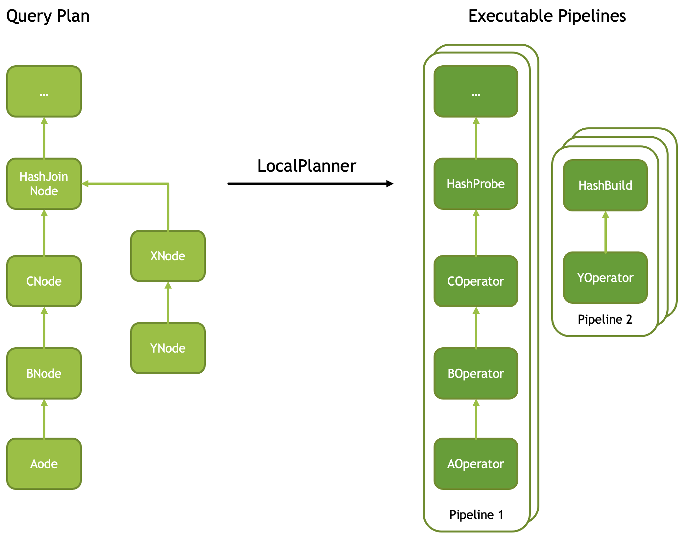
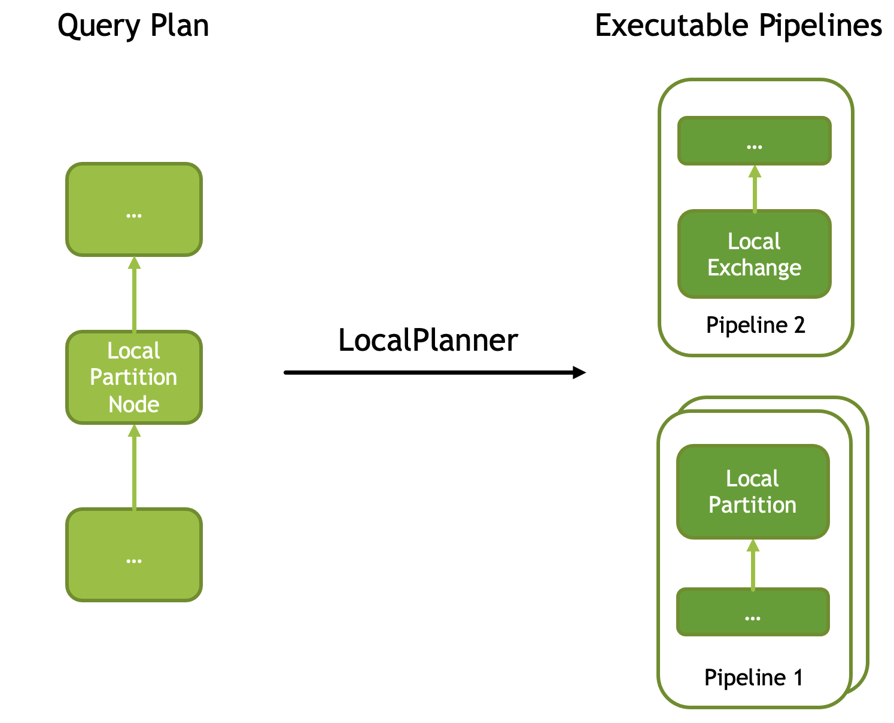
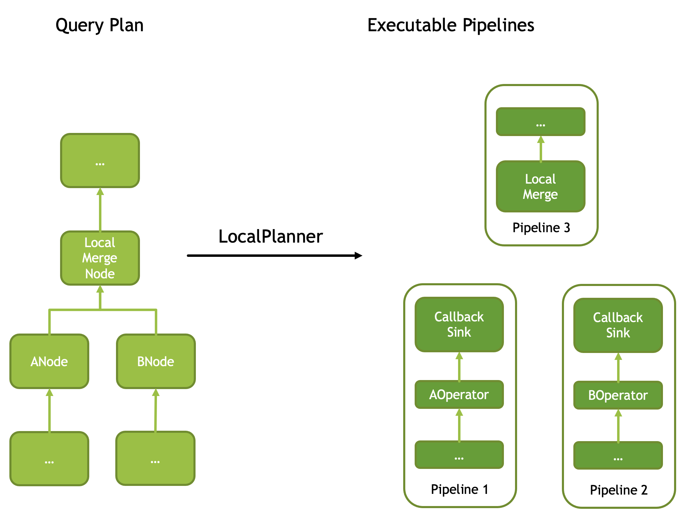
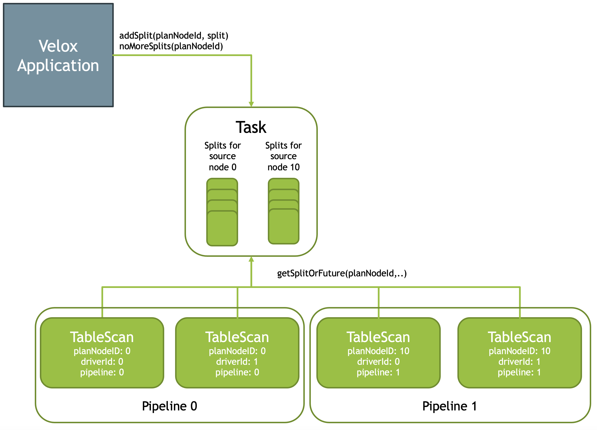
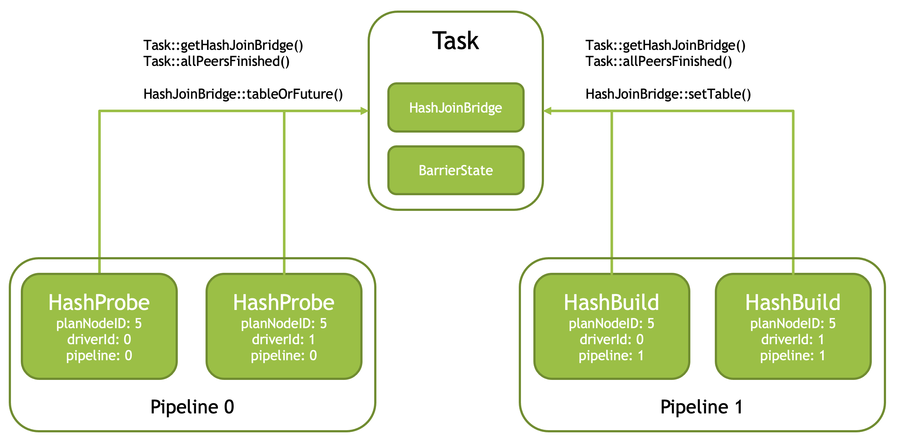
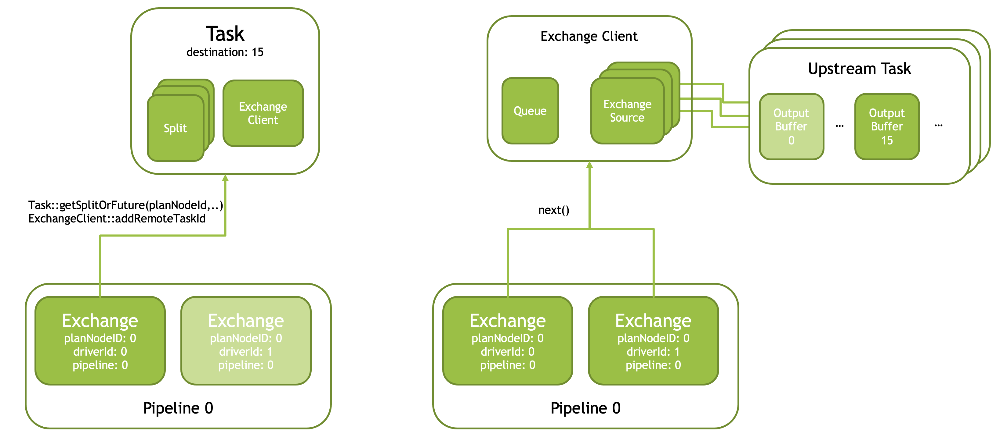
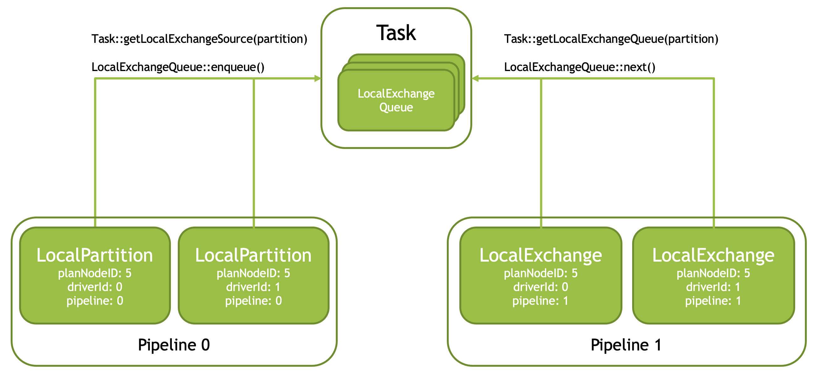

===================
What's in the Task?
===================

Some operators need to coordinate their work with other operators.

* Table scan operators running in parallel need to pull splits from a shared
  queue.
* The HashProbe operator needs to wait for the HashBuild operator to create a
  hash table.
* Multiple HashBuild operators building different sections of the hash table in
  parallel need to coordinate to combine the pieces into one final hash
  table.
* Exchange operators running in parallel need to pull data from shared remote
  sources.
* Local exchange operators need to write and read data into shared data
  partitions.

Task enables coordination between these operators by maintaining a shared
state.

Pipelines and Drivers
---------------------

Task is responsible for converting a query plan into a set of pipelines
consisting of multiple operators stacked on top of each other.
See :doc:`Plan Nodes and Operators <operators>` for the mapping between plan
nodes and operators. Each plan node with multiple sources introduces a new
pipeline or pipelines. These plan nodes include HashJoinNode, CrossJoinNode,
MergeJoinNode, LocalMergeNode, LocalPartitionNode. Join nodes have two sources
and introduce one new pipeline that ends at the right-side source.
LocalMergeNode and LocalPartitionNode introduce one pipeline for each source.
LocalPartitionNode is an exception as it may have a single source in which case
it still introduces a new pipeline to allow for different parallelism before
and after. Each pipeline may run multi-threaded and the number of threads used
for each pipeline can be different.

Driver refers to a single thread of execution of a single pipeline.

Let’s look at a few examples.

A query plan with a HashJoinNode is converted into two pipelines. One pipeline
contains a HashProbe operator. Another pipeline contains a HashBuild operator.
HashBuild operator is the last operator in the pipeline. The number of threads
processing HashBuild pipeline can be different from the number of threads
processing HashProbe pipeline.

LocalPartitionNode is used to (1) repartition the data, or (2) gather data from
multiple threads into a single thread, or (3) split the data produced by a
single thread to allow for multi-threaded processing. A query plan with a
LocalPartitionNode is converted into two pipelines: a producer pipeline that
ends with LocalPartition operator and a consumer pipeline that starts with a
LocalExchange. These pipelines may run with same or different
parallelism allowing for N:1, 1:N and N:M local exchange.

LocalMergeNode is used to combine multiple sorted inputs while preserving
sortedness. A query plan with a LocalMergeNode with two sources is translated
into three pipelines: one producer pipeline per source node and one consumer
pipeline. Producer pipelines end with a CallbackSink operator. Consumer
pipeline starts with a LocalMerge operator. A pipeline with a LocalMerge
operator always runs single-threaded. Consumer pipelines produce sorted output
and typically run single-threaded as well.

To summarize, a query plan is converted into multiple pipelines and each
pipeline is executed using multiple Drivers. A given plan node is converted
into one or more operators. Some plan nodes are converted into multiple
Operators of different types. For example, TableScanNode is converted into
multiple TableScan operators, one per thread of execution (Driver), while
HashJoinNode is converted into multiple HashProbe operators and multiple
HashBuild operators. The number of HashProbe and HashBuild operators may or may
not match.

Task creates Drivers and Operators, then transfers the ownership of Operators to
the corresponding Drivers. Each Driver is assigned a pipeline ID and a driver
ID. Pipeline IDs are zero-based sequential numbers. Driver IDs are also
zero-based sequential numbers scoped to a pipeline. Driver IDs are unique
within a pipeline, but repeat across pipelines. Each Operator is provided with
the plan node ID of the corresponding plan node and a DriverCtx specifying
pipeline ID and driver ID. Operators of the same type with matching pipeline
IDs are called peers. These operators are running concurrently in different
Drivers. Each Operator is assigned a zero-based sequential operator ID unique
within a Driver.

Splits
------

Task is responsible for receiving splits from the application, storing these,
and providing access to the operators.

Splits can be added only for leaf plan nodes. Operators corresponding to leaf
plan nodes fetch and process splits. These operators are called source
operators and include TableScan, Exchange and MergeExchange.

Task::addSplit(planNodeId, split) API allows the application to add a split for
a particular plan node. The application calls addSplit() API multiple times to
add multiple splits for multiple plan nodes. Task::noMoreSplits() API allows
the application to signal that it added all the splits. The Task will complete
once it processed all the splits and received no-more-splits signal.

Task stores the splits in queues: one queue per plan node ID.

Task::getSplitOrFuture(planNodeId) API allows an operator to fetch a split from
the corresponding queue for processing. This API returns a split if one is
available or Future if the queue is empty, but no-more-splits signal hasn’t
arrived yet. The Future completes when a split or no-more-splits message is
received.

Join Bridges and Barriers
-------------------------

HashProbe operators need to wait for the corresponding HashBuild operators to
create a hash table. For each HashJoinNode and CrossJoinNode, the Task creates
a bridge object, either HashJoinBridge or a CrossJoinBridge. HashProbe and
HashBuild operators use Task::getHashJoinBridge() API to get access to a shared
bridge. HashBuild operator adds the hash table to the bridge. HashProbe
operator fetches the hash table from the bridge. Similarly, CrossJoinProbe and
CrossJoinBuild operators use Task::getCrossJoinBridge() API to access a shared
bridge to pass the build-side data to the probe-side.

HashBuilder operators running in parallel need to coordinate among themselves to
wait until all are finished processing input to combine the results into a
single hash table. When an operator finishes processing, it calls
Task::allPeersFinished() API which returns false for all but the last operator.
Last operator receives true and is responsible for assembling the hash table
and sending it over the bridge to the probe side.

Task::allPeersFinished() API uses BarrierState structure to maintain state to
know which operator is the last one.

Similarly, CrossJoinBuild operators running in parallel use
Task::allPeersFinished() API to choose a single operator to combine the results
and send them over the bridge to the probe side.

In addition, in case of RIGHT and FULL OUTER join, HashProbe operators use
Task::allPeersFinished() API to choose a single operator that would emit
build-side rows with no match after all probe rows have been processed.

Exchange Clients
----------------

Exchange operator is designed to fetch a single partition of data from multiple
remote workers. The exact mechanism of how to fetch the data is not included in
the Velox library and expected to be provided by the application. The
application implements an ExchangeSource and an ExchangeSource::Factory. The
factory takes a string identifying the remote worker, a partition number, an
instance of the ExchangeQueue and returns an instance of ExchangeSource that
can fetch partition data from the remote workers and put that data into the
provided queue.

ExchangeClient is responsible for creating ExchangeSources and maintaining the
queue of incoming data. Multiple Exchange operators are pulling data from a
shared ExchangeClient, each operator receiving some subset of the data.

A single Exchange operator (with driverId == 0) is responsible for fetching
splits from the Task and initializing the shared ExchangeClient using task ID
information found in the splits.

Task is responsible for creating and storing shared ExchangeClient instances,
one per ExchangeNode. Task is passing the reference to the shared
ExchangeClient for the corresponding ExchangeNode when creating Exchange
operators.

The following diagram shows the first Exhange operator (driverId == 0) fetching
splits from the Task and initializing ExchangeClient, then all Exchange
operators fetching data from the shared ExchangeClient. For each split,
ExchangeClient creates an ExchangeSource which pulls data for a single
partition (#15 in the diagram) from a single upstream task. All ExchangeSources
pull data for the same partition, but from different upstream tasks. The queue
in ExchangeClient is used to accumulate the data for partition #15 from all the
upstream tasks and distribute it among multiple Exchange operators allowing for
parallel processing.

MergeExchange operator is similar to Exchange operator, but it receives sorted
data from multiple workers and must merge the data to preserve sortedness. This
operator must run single-threaded and therefore doesn’t require any shared
state to be maintained in the task.

Local Exchange Queues
----------------------

Local exchange is used to change parallelism or re-partition data between the
pipelines. The exchange consists of a LocalPartition operator installed at the
end of the producing pipeline, a LocalExchange installed at the source of the
consuming pipelines and one or more LocalExchangeQueues that accumulate data.
LocalExchangeQueues are shared among multiple LocalPartition and
LocalExchangeQueues operators and therefore must be stored in the Task.

For each LocalPartitionNode, Task creates multiple LocalExchangeQueues, as many
as the number of threads used to run the consuming pipeline. LocalPartition and
LocalExchangeQueues operators use Task::getLocalExchangeQueue() API to get
access to shared queues to read and write data to. LocalPartition operator
partitions the data and puts it into LocalExchangeQueues. LocalExchange reads
data from a single LocalExchangeQueue.

Local Merge Sources
-------------------

LocalMerge operator is similar to LocalExchange, but it receives
sorted data from multiple threads and must merge the data to preserve
sortedness. This operator must run single-threaded. It uses
Task::getLocalMergeSources() API to get access to LocalMergeSource instances
the producing pipeline is writing to. For each LocalMergeNode, Task creates
multiple LocalMergeSource instances to match the parallelism of the producing
pipeline. Merge Join Sources

MergeJoin operator needs a way to receive right-side data. It relies on the Task
to create a MergeJoinSource and install a CallbackSink operator at the end of
the right-side pipeline to write data to the MergeJoinSource. MergeJoin
operator uses Task::getMergeJoinSource() API to get access to the
MergeJoinSource() to read right-side data from.

Extensibility
-------------

Velox allows applications to define custom plan nodes and operators. These
operators can access splits and use barriers as these constructs are generic
and not tied to any particular plan node or operator. Exchange clients, local
exchange queues and local merge sources as well as merge join sources are not
generic and therefore not available to custom operators.

Summary
-------

Task is responsible for maintaining shared state and enabling coordination
between operators. The shared state consists of:

* Splits
* Join bridges and barriers
* Exchange clients
* Local exchange queues
* Local merge sources
* Merge join sources

Each piece of shared state is associated with a particular plan node. Operators
use plan node IDs when accessing shared state. Custom operators have access to
splits and barriers. Other pieces of shared state are not available to custom
operators.
