=======
Vectors
=======

Velox vectors is columnar in-memory format for storing query data during
execution. It is similar to Arrow, but features more encodings and different
layout for strings, arrays and maps which support out-of-order writes. Vectors
form the very foundation of the Velox library.

Velox vectors support :doc:`scalar and complex types</develop/types>` and come in a few different
encodings.

Supported encodings are:

* Flat
* Constant
* Dictionary
* Bias
* Sequence

In this guide we’ll discuss flat, constant and dictionary encoding. Bias and
sequence encodings are not in scope for this guide.

A single vector represents multiple rows of a single column. RowVector is used
to represent a set of rows for multiple columns as well as a set of rows for a
single column of type struct.

Each vector has a type, encoding and size. Vector size is the number of rows
stored in the vector. Flat, constant and dictionary encodings can be combined
with any type.

Buffers
-------

Vector data is stored in memory using one or more buffers. A buffer is a
contiguous range of bytes. Buffers are reference counted and must be held by
BufferPtr. Buffers can either own their memory or represent a view into
externally managed memory (BufferView). A buffer that owns its memory
(AlignedBuffer) allocates memory from a MemoryPool. Such a buffer can be in a
mutable state if there is a single reference to it, e.g. the buffer is uniquely
referenced. If there are multiple references to a buffer, the buffer is
read-only.

Buffers themselves are not typed, but they provide type-specific convenience
methods.

AlignedBuffer::allocate<T>(size, pool) static method allocates a buffer that can
hold at least ‘size’ values of type T from the MemoryPool.

To allocate a buffer to store 100 64-bit integers:

.. code-block:: c++

    BufferPtr values = AlignedBuffer::allocate<int64_t>(100, pool);

The resulting buffer is at least sizeof(int64_t) * 100 = 800 bytes long. You can
access the raw buffer for reading via as<T>() template method and for writing
using asMutable<T>() template method:

.. code-block:: c++

    // Read-only access.
    const int64_t* rawValues = values->as<int64_t>();

    // Read-write access.
    int64_t* rawValues = values->asMutable<int64_t>();

To allocate a buffer to store 100 boolean flags:

.. code-block:: c++

    BufferPtr flags = AlignedBuffer::allocate<bool>(100, pool);

The resulting buffer will be at least 100 / 8 = 13 bytes long (Velox uses just 1
bit for each boolean flag). Unlike other types, boolean values cannot be
accessed individually via a bool pointer. Instead, you interpret the buffer as
a contiguous array of unsigned 64-bit integers and access individual values
using helper methods from the “bits” namespace.

.. code-block:: c++

    // Read-only access.
    const uint64_t* rawFlags = flags->as<uint64_t>();

    // Check if flag # 12 is set.
    bool active = bits::isBitSet(rawFlags, 12);

    // Read-write access.
    uint64_t* rawFlags = flags->asMutable<int64_t>();

    // Set flag 15 to true/on.
    bits::setBit(rawFlags, 15);

    // or
    bits::setBit(rawFlags, 15, true);

    // Set flag 16 to false/off.
    bits::clearBit(rawFlags, 16);

    // or
    bits::setBit(rawFlags, 16, false);

Since buffers are not typed, the size of the buffer reflects the number of bytes
in the buffer, not the number of values.

Null Flags
----------

Each vector contains an optional set of null flags which identify rows with null
values. If there are no null values in a given vector, null flags may not be
present. Null flags are bit-packed into an array of 64-bit unsigned integers.
Zero indicates a null value. One indicates a non-null value.
(This counterintuitive choice is motivated by compatibility with Arrow.)

In the following diagram positions 2, 7 and 11 are null.

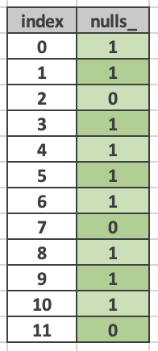

BaseVector is a base class for all kinds of vectors. It contains the type of
values stored in the vector, e.g. INTEGER vs. VARCHAR, nulls buffer, and number
of rows in the vector.

.. code-block:: c++

    std::shared_ptr<const Type> type_;
    BufferPtr nulls_;
    vector_size_t length_ = 0;

Vectors are always held by std::shared_ptr using the VectorPtr alias.

using VectorPtr = std::shared_ptr<BaseVector>;

The “bits” namespace contains a number of convenience functions for working with
a nulls buffer.

.. code-block:: c++

    // Check if position #12 is null.
    bool isNull = bits::isBitNull(rawNulls, 12);

    // Set position #12 to null.
    bits::setNull(rawNulls, 12);
    bits::setNull(rawNulls, 12, true);

    // Set position #12 to non-null.
    bits::clearNull(rawNulls, 12);
    bits::setNull(rawNulls, 12, false);

Flat Vectors - Scalar Types
---------------------------

Flat vectors of scalar types are represented using the FlatVector<T> template,
where T is the C++ type of the scalar type. The values stored in the vector
naturally use the C++ type.

FlatVector<T> contains a values buffer and in case of T = StringView one or more
string buffers. Values buffer is a contiguous byte buffer with sizeof(T) bytes
per value, including null values. The number of bytes per value is different
for different types. Boolean values are bit-packed and use 1 byte per 8
values.

.. code-block:: c++

    BufferPtr values_;
    std::vector<BufferPtr> stringBuffers_;

FlatVector<T> uses BaseVector as the base class and it gets the type, size and
nulls buffer from it. Flat vectors like all other vectors are held by
std::shared_ptr using the FlatVectorPtr alias.

.. code-block:: c++

    template <typename T>
    using FlatVectorPtr = std::shared_ptr<FlatVector<T>>;

The following diagram shows a flat vector of type INTEGER with 11 values. This
vector is represented as FlatVector<int32_t>. The `values_` buffer has space for
at least 11 consecutive entries of 4 bytes each. Nulls buffer has space for at
least 11 consecutive entries of 1 bit each.  Values in positions 2,7, 11 are
null, e.g. bits 2, 7, 11 in `nulls_` buffer are 0. The rest of the bits in the
`nulls_` buffer are 1. Entries 2, 7, 11 in `values_` buffer contain garbage.

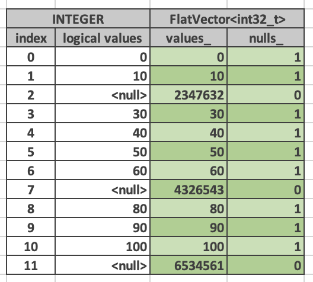

All scalar values including strings are fixed-width, e.g. each value is stored
in a fixed number of bytes. Since strings can be of variable length, the actual
strings are stored in a set of string buffers that are separate from the values
buffer. The values buffer stores 16-byte StringViews which consist of a 4-byte
string size, 4-byte prefix and 8 byte pointer to the full string in one of the
string buffers. Short strings, up to 12 characters, are stored completely
within the StringView struct. They occupy the space that’s overwise is taken by
the prefix and the pointer.

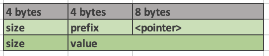

The following diagram illustrates the difference in in-memory representation of
a long and short string. “Yellowstone national park” is a 25-characters long
string which is too long to be inlined. Hence, StringView stores a 4-byte
prefix “Yell” and a pointer to the whole string in a string buffer. The “heavy
rain” string is only 10-characters long and therefore stored inlined in the
StringView. Having prefixes of long strings stored in the StringView allows
optimizing comparison operations.

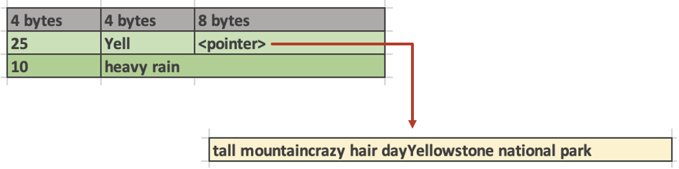

Strings in the string buffers appear not necessarily in order and there can be
gaps between individual strings. A single vector may use one or more string
buffers.

The following diagram shows a vector of type VARCHAR with 7 values. This vector
is represented as FlatVector<StringView>. `values_` buffer has space for at least
7 entries 16 bytes each. `stringBuffers_` array has one entry containing a
concatenation of non-inlined strings. Each entry in `values_` buffer uses 4 bytes
to store the size of the string.

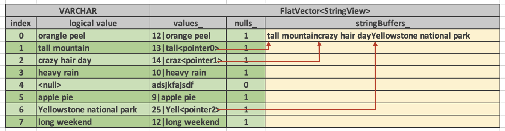

Fixed-width values allow for populating vectors out of order, e.g. writing value
for row 5 before writing value for row 2. This is useful when evaluating
conditional expressions.

.. note::

    Velox vector of any type (scalar or complex) can be written out of order.
    This is the main difference between the Velox vectors and Arrow arrays.

Allowing strings in the string buffers to appear out of order and with gaps
between individual strings allows for zero-copy implementation of functions
like substr and split. The results of these functions consist of substrings of
the original strings and therefore can use StringViews which point to the same
string buffers as the input vectors.

A result of applying substr(s, 2) function to a vector shown above looks like
this:

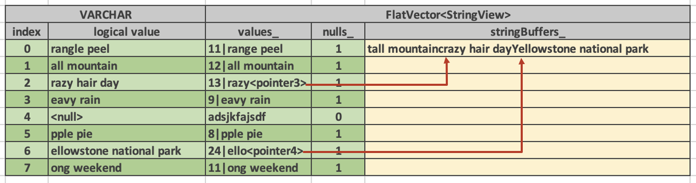

This vector is using the same string buffer as the original one. It simply
references it using std::shared_ptr. The individual StringView entries either
contain strings inline or refer to positions in the original strings buffer.
After applying substr(s, 2) function string in position 1 became short enough
to fit inside the StringView, hence, it no longer contains a pointer to a
position in the string buffer.

Flat vectors of type TIMESTAMP are represented by FlatVector<Timestamp>.
Timestamp struct consists of two 64-bit integers: seconds and nanoseconds. Each
entry uses 16 bytes.

.. code-block:: c++

    int64_t seconds_;
    uint64_t nanos_;

Constant Vector - Scalar Types
------------------------------

Constant vectors are represented using ConstantVector<T> template which contains
a value and a boolean indicating whether the value is null or not. It may
contain a string buffer if T = StringView and the string is longer than 12
characters.

.. code-block:: c++

    T value_;
    bool isNull_ = false;
    BufferPtr stringBuffer_;

BaseVector::wrapInConstant() static method can be used to create a constant
vector from a scalar value.

.. code-block:: c++

    static std::shared_ptr<BaseVector> createConstant(
        variant value,
        vector_size_t size,
        velox::memory::MemoryPool* pool);

Dictionary Vector - Scalar Types
--------------------------------

Dictionary encoding is used to compactly represent vectors with lots of
duplicate values as well as a result of a filter or filter-like operation
without copying the data. Dictionary encoding can also be used to represent a
result of a sorting operation without copying the data.

Dictionary vectors of scalar types are represented by the DictionaryVector<T>
template. Dictionary vectors contain a shared pointer to a base vector which
may or may not be flat and a buffer of indices into the base vector. Indices
are 32-bit integers.

.. code-block:: c++

    BufferPtr indices_;
    VectorPtr dictionaryValues_;

Here is a dictionary vector of type VARCHAR that represents colors. The base
vector contains just 5 entries: red, blue, yellow, pink, purple and golden. The
dictionary vector contains a std::shared_ptr to the base vector plus a buffer
of indices into that vector. Each entry in the dictionary vector points to an
entry in the base vector. Entries 0 and 2 both point to entry 0 in the base
vector which contains “red”. Entries 1, 4, 5, 10 point to the same but
different entry 1 which contains “blue”. This encoding avoids copying the
duplicate strings.

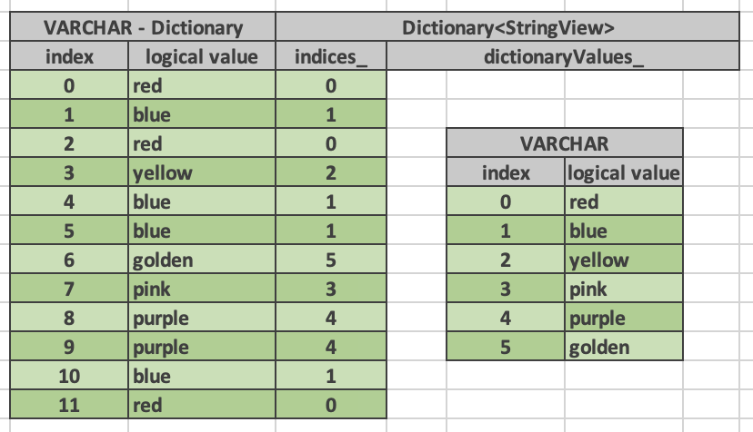

Multiple dictionary vectors can refer to the same base vector. We are saying
that the dictionary vector wraps the base vector.

Here is a dictionary of type INTEGER that represents a result of a filter: n % 2
= 0. The base vector contains 11 entries. Only 5 of these entries passed the
filter, hence, the size of the dictionary vector is 5. The indices buffer
contains 5 entries referring to positions in the original vector that passed
the filter.

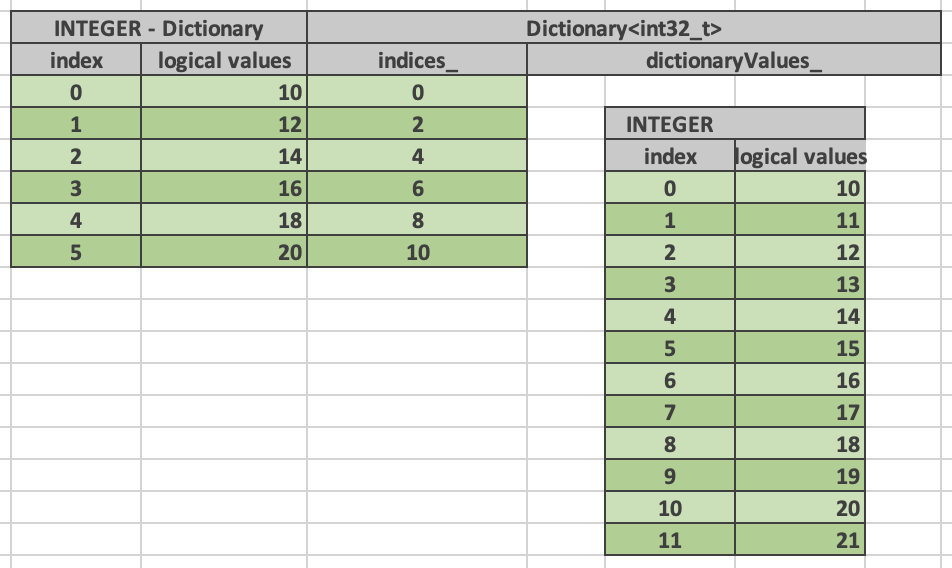

When filter or filter-like operation applies to multiple columns, the results
can be represented as multiple dictionary vectors all sharing the same indices
buffer. This allows to reduce the amount of memory needed for the indices
buffers and enables efficient expression evaluation via peeling of shared
dictionaries.

Dictionary encoding is used to represent the results of a join, where probe side
columns are wrapped into dictionaries to avoid duplicating the rows with
multiple matches in the build side. Dictionary encoding is also used to
represent the results of an unnest.

Dictionary vector can wrap any other vector including another dictionary.
Therefore, it is possible to have multiple layers of dictionaries on top of a
single vector, e.g. Dict(Dict(Dict(Flat))).

BaseVector::wrapInDictionary() static method can be used to wrap any given
vector in a dictionary.

  static std::shared_ptr<BaseVector> wrapInDictionary(
      BufferPtr nulls,
      BufferPtr indices,
      vector_size_t size,
      std::shared_ptr<BaseVector> vector);

**wrappedVector()** virtual method defined in BaseVector provides access to the
innermost vector of a dictionary, e.g. Dict(Dict(Flat))->wrappedVector() return
Flat.

**wrappedIndex(index)** virtual method defined in BaseVector translates index into
the dictionary vector into an index into the innermost vector, e.g.
wrappedIndex(3) returns 6 for the dictionary vector above.

Dictionary vector has its own nulls buffer independent of the nulls buffer of
the base vector. This allows a dictionary vector to represent null values even
if the base vector has no nulls. We say that “dictionary wrapping adds nulls”
to the base vector.

Here is an example. Entry #4 in the dictionary is marked as null. Corresponding
entry in the indices buffer contains garbage and should not be accessed.

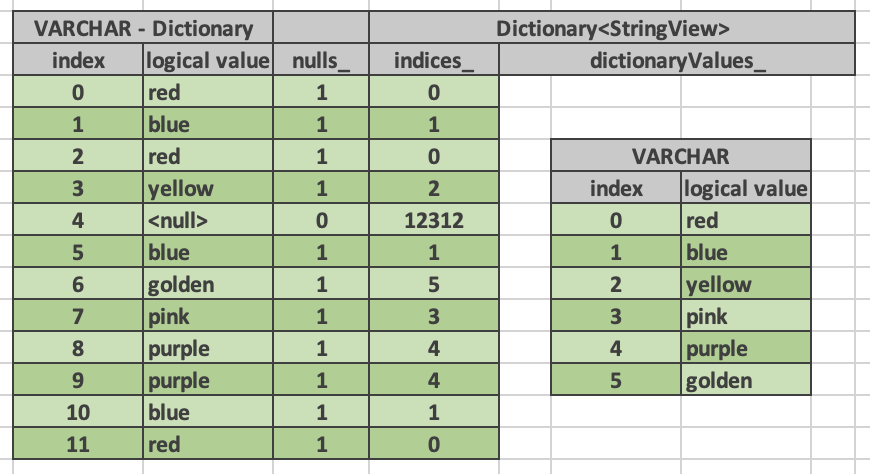

Flat Vectors - Complex Types
----------------------------

Flat vectors of complex types ARRAY, MAP and ROW / STRUCT are represented using
ArrayVector, MapVector and RowVector.

ArrayVector
~~~~~~~~~~~

ArrayVector stores values of type ARRAY. In addition to nulls buffer, it
contains offsets and sizes buffers and an elements vector. Offsets and sizes
are 32-bit integers.

.. code-block:: c++

    BufferPtr offsets_;
    BufferPtr sizes_;
    VectorPtr elements_;

Elements vector contains all the individual elements of all the arrays. Elements
from a specific array appear next to each other in order. Each array entry
contains an offset and size. Offset points to the first element of the array in
the elements vector. Size specifies the number of elements in the array.

Here is an example.

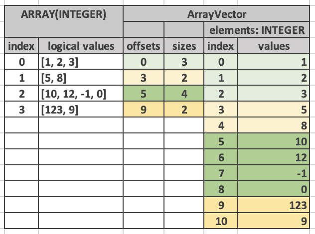

We refer to the array vector as a top-level vector and elements vector as a
nested or inner vector. In the example above, the top-level array has 4
top-level rows and the elements array has 11 nested rows. First 3 nested rows
correspond to the 0th top-level row. Next 2 nested rows correspond to the 1st
top-level row. The following 4 nested rows correspond to the 2nd top-level row.
The remaining 2 nested rows correspond to the 3rd top-level row.

The values in the elements vector may not appear in the same order as in the
array vector. Here is an example of an alternative layout for the same logical
array vector. Here, the values in the elements array appear in a different
order, e.g. first come the elements of the 0th top-level row, followed by the
elements of the 2nd top-level row, followed by the elements of the 1st
top-level rows, followed by the element of the 3rd top-level row. The offsets
are adjusted to point to the right entry in the elements array. The sizes are
unchanged.

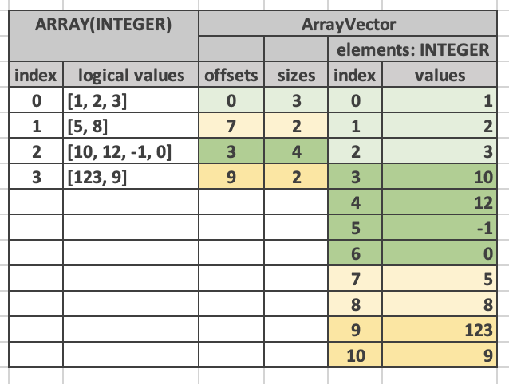

Having both offsets and sizes allows to write array vectors out of order, e.g.
write entry 5 before writing entry 3.

Empty arrays are specified by setting size to zero. The offset for empty arrays
is considered undefined and can be any value. Consider using zero for the
offset of an empty array.

Null array and empty array are not the same.

Elements vector may have a nulls buffer independent of the nulls buffer of the
array vector itself. This allows us to specify non-null arrays with some or all
null elements. Null array and array of all null elements are not the same.

MapVector
~~~~~~~~~

MapVector stores values of type MAP. In addition to nulls buffer, it contains
offsets and sizes buffers, keys and values vectors. Offsets and sizes are
32-bit integers.

.. code-block:: c++

    BufferPtr offsets_;
    BufferPtr sizes_;
    VectorPtr keys_;
    VectorPtr values_;

Here is an example.

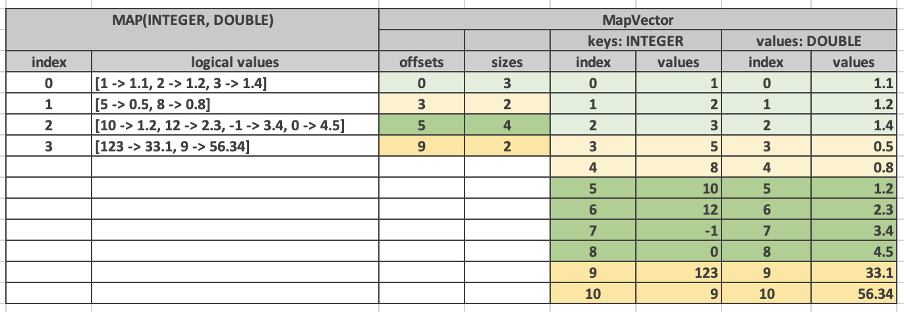

Similarly to the array vector, individual map entries appear in the keys and
values vector together in order. However, map entries for the top-level map #4
do not need to appear just before the map entries for the top-level map #5.

Empty maps are specified by setting size to zero. The offset for an empty map is
considered undefined and can be any value. Consider using zero for the offset
of an empty map.

Null map and empty map are not the same.

Keys and values vectors may have nulls buffer independent of each other and of
the nulls buffer of the map vector itself. This allows us to specify non-null
maps with some or all values being null. Technically speaking a map may have a
null key as well, although this may not be very useful in practice. Null map
and a map with all values being null are not the same.

Map vector layout does not guarantee or require that keys of individual maps are
unique. However, in practice, places which create maps, e.g. ORC and Parquet
readers, :func:`map` function, etc., ensure that map keys are unique.

RowVector
~~~~~~~~~

Finally, RowVector stores values of type ROW (e.g. structs). In addition to the
nulls buffer, it contains a list of child vectors.

.. code-block:: c++

    std::vector<VectorPtr> children_;

Here is an example.

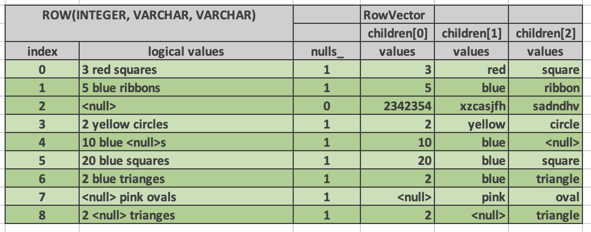

ROW vectors can have any number of child vectors, including zero.

For each top-level row in the ROW vector there is exactly one row in each of the
child vectors.

Child vectors may include nulls buffers of their own, therefore, it is possible
to have a non-null top-level struct value with some or all child fields being
null. A null struct is not the same as a struct with all its fields being null.
Values of child fields for rows where the top-level struct is null are
undefined.

RowVector is used to represent a single column of type struct as well as a
collection of columns that are being passed from one operator to the next
during query execution.

Constant Vector - Complex Types
-------------------------------

Constant vectors of complex types are represented by
ConstantVector<ComplexType>, where ComplexType is a special marker type that is
used for all complex types. Constant vector of type ARRAY(INTEGER) and constant
vector of type MAP(TINYINT, VARCHAR) as represented by the same class:
ConstantVector<ComplexType>.

ConstantVector<ComplexType> identifies a specific complex type value by pointing
to a particular row in another vector.

.. code-block:: c++

    VectorPtr valueVector_;
    vector_size_t index_;

The following diagram shows a complex vector of type ARRAY(INTEGER) representing
an array of 3 integers: [10, 12, -1, 0]. It is defined as a pointer to row 2 in
some other ArrayVector.

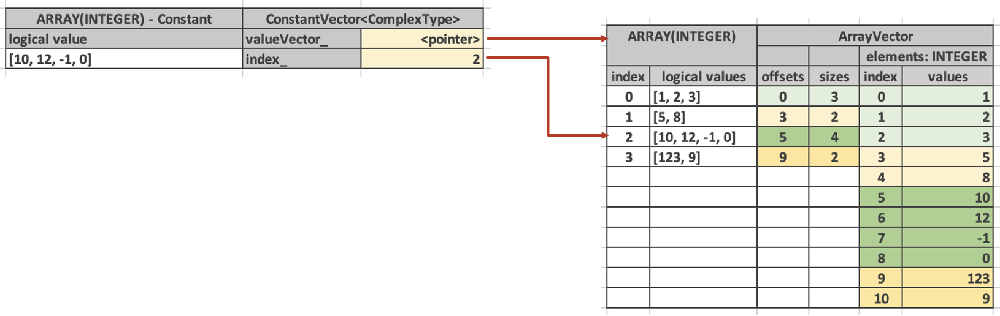

Use BaseVector::wrapInConstant() static method to create a constant vector of
complex type. Any vector can be wrapped in a constant vector. When you use
wrapInConstant() with a non-flat vector, the resulting constant vector ends up
referring to the innermost vector, e.g. wrapInConstant(100, 5, Dict
(Flat)) returns ConstantVector<ComplexType>(100, Dict->wrappedIndex(5), Flat).

.. code-block:: c++

    static std::shared_ptr<BaseVector> wrapInConstant(
        vector_size_t length,
        vector_size_t index,
        std::shared_ptr<BaseVector> vector);

**wrappedVector()** virtual method defined in BaseVector provides access to the
underlying flat vector.

**wrappedIndex(index)** virtual method defined in BaseVector returns the index into
the underlying flat vector that identifies the constant value. This method
returns the same value for all inputs as all rows of the constant vector map to
the same row of the underlying flat vector.

Dictionary Vector - Complex Types
---------------------------------

Similarly to constant vectors, dictionary vectors of complex types are
represented by DictionaryVector<ComplexType>, where ComplexType is a special
marker type that is used for all complex types. Dictionary vector of type ARRAY
(INTEGER) and dictionary vector of type MAP(TINYINT, VARCHAR) as represented by
the same class: DictionaryVector<ComplexType>. Otherwise, dictionary vectors of
complex types are no different than dictionary vectors of scalar types.
