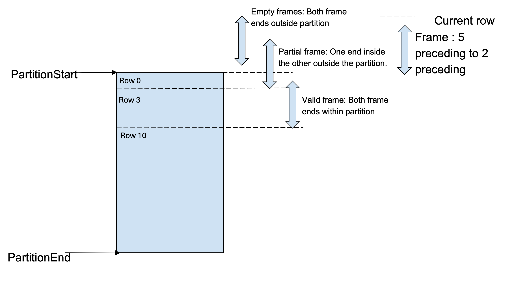

================
Window functions
================

Velox supports window function evaluation using Window operator. In this guide
we will discuss some intricate design problems in this operator.

This doc assumes familiarity with Window functions described in
:doc:`../functions/presto/window`.

Window frames
-------------

Window functions can optionally include a FRAME clause. The FRAME clause
can be thought of as a spec for a sliding window of rows which bound
the window function computation for the given row.

Not all window functions are bound by the FRAME clause.

- Aggregates computed as window functions and value functions :func:`first_value`,
  :func:`last_value` and :func:`nth_value` honor window frames.
- Rank functions :func:`row_number`, :func:`rank`, :func:`dense_rank`,
  :func:`percent_rank`, :func:`ntile`, :func:`cume_dist` and value functions
  :func:`lead` and :func:`lag` are not affected by window frames.

A frame can be ROWS type or RANGE type, and it runs from frame_start to
frame_end. A FRAME clause is one of

.. code-block::

   {RANGE|ROWS} frame_start
   {RANGE|ROWS} BETWEEN frame_start AND frame_end

frame_start and frame_end can be any of:

.. code-block::

   UNBOUNDED PRECEDING
   expression PRECEDING
   CURRENT ROW
   expression FOLLOWING
   UNBOUNDED FOLLOWING

**ROWS mode**

ROWS mode can be interpreted as indices of the rows in the order in which they
appear in the window partition. This ordering is determined by the ORDER BY
clause. In ROWS mode, CURRENT ROW refers to the present row at which the
function is being evaluated. Each consecutive row has increasing frame number.
The frame numbers start at 0 and increase by 1 for each row.

**RANGE mode**

In RANGE mode, all peer rows have the same frame number.
Rows are peers if they have the same values for the ORDER BY field.
A frame start of CURRENT ROW refers to the first peer row of the current row,
while a frame end of CURRENT ROW refers to the last peer row of the current row.
If no ORDER BY is specified, all rows are considered peers of the current row.

**Misc**

UNBOUNDED PRECEDING and UNBOUNDED FOLLOWING always refer to the first and
last rows of the partition in either mode.

Window frame indices
--------------------

As window functions are evaluated for each row, the Window operator provides
each function a buffer of frame_start and frame_end indices at each
WindowFunction::apply call.

**Note**: Its possible during calculations that the frame indices are values
before or after the partition rows. In this case, the frame indices get bound
to the first and last rows of the partition.

As an example, for frame *ROWS BETWEEEN 2 PRECEDING AND 2 FOLLOWING*, the
frame indices will be as follows:

.. code-block::

  row_index    partition_col        order_by_col        frame_start         frame_end
       0            1                     1                   0                 2
       1            1                     2                   0                 3
       2            1                     2                   0                 4
       3            1                     3                   1                 5
       4            1                     4                   2                 6
       5            1                     4                   3                 7
       6            1                     4                   4                 7
       7            1                     5                   5                 7

On the other hand, for frame *RANGE BETWEEEN 2 PRECEDING AND 2 FOLLOWING*,
the frame indices will be as follows

.. code-block::

  row_index    partition_col        order_by_col        frame_start         frame_end
       0            1                     1                   0                 3
       1            1                     2                   0                 6
       2            1                     2                   0                 6
       3            1                     3                   0                 7
       4            1                     4                   1                 7
       5            1                     4                   1                 7
       6            1                     4                   1                 7
       7            1                     5                   3                 7

k Range frames
--------------

K range window frames are a special value based window frame.

An example of a k range frame is *RANGE BETWEEEN 5 PRECEDING AND 2 FOLLOWING*.
This frame includes all rows whose order_by keys are values between
*(current_row order_by key - 5)* to *(current_row order_by key + 2)*.

Elaborating with an example table:

.. code-block::

  row_index    partition_col    order_by_col    start_frame   end_frame    frame_start    frame_end
       0            1                2               -3           4             0             1
       1            1                3               -2           5             0             2
       2            1                5                0           7             0             3
       3            1                5                0           7             0             3
       4            1                9                4           11            2             5
       5            1                10               5           12            2             5
       6            1                15               10          17            5             6
       7            1                21               16          23            7             7
There are some more aspects to consider when calculating the frame indices.

One of the subtle nuances is related to *PRECEDING* and *FOLLOWING* usage.

- *PRECEDING* range means search in the rows from current row to partition start.
- *FOLLOWING* range means search in the rows from current row to partition end.

This implies:

- If an ORDER BY clause is *ASCENDING*,  preceding rows have values < current row
  and following rows have values > current row.
  So the frame *RANGE BETWEEN 5 PRECEDING AND 2 FOLLOWING* is for values
  between [order_by - 5] to [order_by + 2].
  The previous table is an example of such a frame.

- However, if the ORDER BY clause is *DESCENDING* then preceding rows have
  values > current row and following rows have values < current row

  So for the same frame *RANGE BETWEEN 5 PRECEDING AND 2 FOLLOWING* with
  descending the values are between [order_by + 5] to [order_by - 2].

Flipping the previous example for a descending order will result in the following
table.

.. code-block::

  row_index    partition_col    order_by_col    start_frame    end_frame    frame_start    frame_end
       0            1                21              26            19            0             0
       1            1                15              20            13            1             1
       2            1                10              15             8            1             2
       3            1                9               14             7            2             3
       4            1                5               10             3            2             6
       5            1                5               10             3            2             6
       6            1                3               8              1            4             7
       7            1                2               7             -1            4             7

**k** in the range frames can be a constant, column reference or expression (like for date ranges
the bound can be date + some interval). Velox defers computing the start_value and end_value bounds
to a prior project node and expects the user to send these computed values in the column reference
for k range frames. Even if k is a constant value, the user is expected to compute the start_value
and end_value columns for the WindowNode.

In WindowNode a kRange frame would look as follows :

.. code-block::

    struct Frame {
      WindowType type;
      BoundType startType;
      TypedExprPtr startValue;
      BoundType endType;
      TypedExprPtr endValue;
    };
    Frame kRange = { kRange, kPreceding, start_value_col, kFollowing, end_value_col};

The following validations are performed for k Range frames:

- There is a single ORDER BY column to compare the k Range value.

- start(or end)Value in WindowNode::Frame cannot be constants if the bound type is kPreceding
  or kFollowing respectively.

- The type of the start(end)Value TypedExprPtr must be the same type as the ORDER BY column.

The Velox Window operator computes the frame indices buffer by searching start(end)Value in the
ORDER BY column and passes the buffer in the WindowFunction::apply() call.

**Null values in RANGE frames**

The ORDER BY column could have NULL values. NULL values match only other NULLs for Range frames.

NULL values are placed at the beginning or end of the ORDER BY column based on the
*NULLS FIRST/LAST* mode used. So for a row with a NULL value, the frame_start index is first
peer row with a NULL and the frame_end index is the last peer row with a NULL value.

Rows with NULL values do not participate in the frames of the other rows.

Empty frames
------------
Window frames can be valid, partial or empty during window function processing.

Valid frames are the default case when all the rows in the window frame in order
from frame_start to frame_end are within the partition boundaries. However, it is
possible that window frames of certain rows are only partially filled or are empty.
While partial frames don't need any special treatment from the function author,
empty frames need some consideration.

Empty frames occur when :

* Both frame_start and frame_end fall before the first partition row.

  E.g. in frame *ROWS BETWEEN 5 PRECEDING and 2 PRECEDING* the first 2 rows
  have both frame bounds before the first partition row.

* Both frame_start and frame_end fall after the partition end row.

  E.g. in frame *ROWS BETWEEN 2 FOLLOWING and 5 FOLLOWING* the last 2 rows
  have both frame bounds beyond the last partition row.

* frame_start > frame_end row (as frame range is defined from frame_start to
  frame_end).

  E.g. In frame *ROWS BETWEEN UNBOUNDED PRECEDING AND 2 PRECEDING* the intent
  is to compute aggregation from the partition start row to 2 rows prior
  the current one. However, for the first 2 rows the frameStart
  (frame index 0 for unbounded preceding) is ahead of 2 preceding
  (indices -2 and -1).

* For frames like *ROWS BETWEEN 2 PRECEDING AND 5 PRECEDING* or
  *ROWS BETWEEN 5 FOLLOWING AND 2 FOLLOWING*, frame_start > frame_end for
  all rows. So all frames are empty.

**Partial frames**

Like illustrated in the examples above, rows could have partial window frames.

A partial frame occurs when:

- frame_start < frame_end (so it's not an empty frame)
- One frame end is within partition bounds and the other end outside of it.

  This means either :

  - frame_start is before the first partition row while frame_end is within
    the partition. In this case, frame_start is clamped to the first partition
    row.
  - frame_start is within the partition while frame_end is beyond the partition.
    In this case, the frame_end is clamped to the last partition row.

Partial frames usually follow empty frames in a sliding window.

E.g. In frame *ROWS BETWEEN 5 PRECEDING AND 2 PRECEDING*, the first 2 rows have
frame_start and frame_end before the first partition row, so they are empty.
But from 3rd - 5th row, the 5 preceding frame_start bound is outside the
partition, but 2 preceding frame_end is within the partition. So for these
3 rows frame_start is clamped to the first partition row.

Similarly for frame *ROWS BETWEEN 2 FOLLOWING AND 5 FOLLOWING*, the last 3-5th rows
have frame_start within the partition, but frame_end beyond. So they are partial
frames. The last 2 rows have both bounds outside the partition and are empty frames..

Empty, partial and valid window frames can be visualized as below

Frames with constant frame bounds (like 2 preceding) have strict sliding behavior.
So the empty frames, partial frames and valid frames cluster together and follow
(or precede) each other.

Adhoc frames that use column values for bounds (like c1 preceding) can have
empty, partial or valid frames at any points in the partition rows.

**Handling empty frames in window functions**

As mentioned before, only value and aggregate window functions use frames in
their evaluation. Value functions return null values for empty frames.
Aggregate functions return the default aggregate value for empty frames.
Rank functions are not affected by empty frames.

The most naive approach to handle empty frames is to check in the window
function logic if the frame indices are an empty frame (based on the
conditions previously described) and return the null output. However,
this could be repetitive to implement in all functions.

To aid the calculations, the Window operator computes a
*SelectivityVector* for the rows with valid frames in each
WindowFunction::apply(..) call. The function logic can
iterate over the rows with set bits in this SelectivityVector
for evaluations.

This SelectivityVector is passed in the validFrames argument in
the WindowFunction::apply() signature

.. code-block::

    virtual void apply(
       const BufferPtr& peerGroupStarts,
       const BufferPtr& peerGroupEnds,
       const BufferPtr& frameStarts,
       const BufferPtr& frameEnds,
       const SelectivityVector& validFrames,
       vector_size_t resultOffset,
       const VectorPtr& result) = 0;

The Window operator also clamps *partial* window frame indices to
the first or final partition row before passing them to the function.
So the Window function doesn't need any special logic for partial frames.
